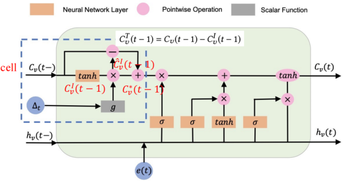
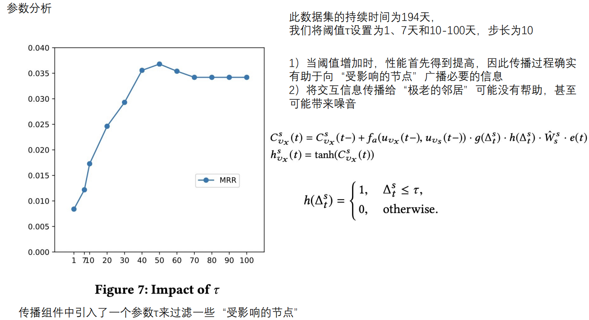

## Streaming Graph Neural Networks 又称 DGNN :Dynamic Graph Neural Networks

基于RNN的连续性网络

## 要解决的问题：新的交互发生时，如何不断的更新图网络的信息 

- ⼀个新的交互不仅可以影响两个交互节点，还可以影响“靠近”交互节点的其他节点，我们称之为“受影响节点”。
- 因此，我们需要将此新交互的信息更新到两个交互节点，并将此信息传播到“受影响节点”。

## 1.The update Component 更新组件

- ### 符号介绍

  - cell：$\large C_{v2}$ 
    - $\large C_{v2}^s$：$\large v_2$作为source(起始)节点的cell特征 
    - $\large C_{v2}^g$：$\large v_2$作为target(终止)节点的cell特征 
  - hidden：$\large h_{v2}$:
    - $\large h_{v2}^s$：$\large v_2$作为source(起始)节点的hidden特征 
    - $\large h_{v2}^g$：$\large v_2$作为target(终止)节点的cell特征 
  - node：$\large u_{v2}$：$v_2$节点的特征
  - 时间相关的概念
    - $\large C_{v2}^s(t_0)$ ：$v2$ 作为source节点在 $t_0$ 时刻的Cell特征
    - $\large C_{v2}^s(t_7-)$ ：$v2$ 节点在$t_7$时刻之前作为source节点的Cell特征   图中：$t_7$时刻之前时刻为 $t_3$ 即：$\large C_{v2}^s(t_3)$
    -  $\large C_{v2}^g(t_7-)$ ：$v2$ 节点在$t_7$时刻之前作为target的Cell特征   图中：$t_7$时刻之前时刻为 $t_3$ 即：$\large C_{v2}^g(t_3)$

- ### 更新流程示例

  - #### 

    - ##### the interact unit： 

      -  $\large e(t) = act( W_1·u_{v_s}(t-) + W_2·u_{v_g}(t-) + b_e)$  包含{$v_s,v_g,t$}交互信息
        - $W_1·u_{v_s}(t-)$ 为source节点特征， $W_2·u_{v_g}(t-)$ 为target节点特征，$b_e$ 为 bias

    - ##### the update unit

      - source和target使用不同更新单元，但结构一致，即共享相同结构但有不同的参数
      - 
        - 其与标准LSTM的不同点就在于蓝色虚线部分，蓝色虚线部分相当于是LSTM的cell部分
        - 

      - 
        - 捕获时间信息，选择遗忘
          - 时间间隔会影响应该如何忘记旧节点。在过去发生的交互对节点的当前信息的影响较小，因此应该"大量"地忘记它们

        - **短时记忆**：$\large C_v^I(t-1) = tanh(W_d · C_v(t-1) + b_d)$
        - **删减之后的短时记忆**：$\large \hat C_v^I(t-1) = C_v^I(t-1)*g(\Delta_t)$
          - $g(\Delta_t)$ 为递减函数，时间间隔越大，短时记忆越少

        - **长时记忆**：$\large C_v^T(t-1) = C_v(t-1) - C_v^I(t-1)$
        - **Cell特征：(组合长短时记忆)**：$\large C_v^*(t-1) = C_v^T(t-1) + \hat C_v^I(t-1)$
        - 当短时记忆被遗忘时，长时记忆没有影响

    - ##### the merge unit

      - 
        - $v_2$​为source节点，所以更新了 $\large h_{v2}^s$ ，没有更新 $\large h_{v2}^g$
        - $v_5$为target节点，所以更新了  $\large h_{v5}^g$

## 2.The propagation Component  传播组件

- ### 在这项工作中，我们选择两个“交互节点”的当前邻居作为“受影响的节点”，主要原因是三方面的:

  - 首先，正如在挖掘流图时所了解的那样，新边缘对整个图的影响通常是局部的
- 其次，在我们将信息传播到邻居之后，一旦受影响的节点与其他节点发生交互，信息将进一步传播
  - 第三，我们凭经验发现，当传播更多的受影响点时，性能不会显着提高，甚至会降低，因为我们也可能在传播过程中引入噪声。

- ### 符号概念

  - 受影响节点
    - $\large N(v_s)$：作为source节点受影响
    - $\large N(v_g)$：作为target节点受影响
    - 在有向图进一步分解为
      - $\large N(v_s) = N^s(v_s)∪N^g(v_s)$
      - $\large N(v_g) = N^s(v_g)∪N^g(v_g)$

  - 示例：以添加（$\large v_2,v_5$) 为例

- ### 传播过程示例

  - #### the interact unit：与更新过程一致

  - #### the prop unit

    - 更新公式
    -  $\large C^s_{vx}(t) = C^s_{vx}(t-) + f_a(u_{v_x}(t-),u_{v_s}(t-))·g(\Delta_t^s)·h(\Delta_t^s)·\hat W^s_s·e(t)$
      - $\large h(\Delta_t^s) = f(n)= \begin{cases} 	1, & \text{$\Delta^s_t ≤ \tau$           ($\tau$为超参数)} \\ 	0,& \text{otherwise} \end{cases}$
        - 将交互信息传播给“⾮常⽼的邻居”可能会引⼊噪声
        - $\large h(\Delta_t^s)$ 作用是过滤一些影响节点，如果时间间隔大于$\large \tau$，将停止向此类邻居传播信息，使进行传播步骤更有效率
      - $\huge f_a(u_{v_x}(t-),u_{v_s}(t-)) = \frac{exp(u_{v_x}(t-)^T u_{v_s}(t-))}{\sum_{v∈N^s(v_s)}exp(u_v(t-)^Tu_{v_s}(t-))}$
    - $\large h^s_{v_x}(t) = tanh(C^s_{vx}(t))$
    - 

  - #### the merge unit：与更新过程一致

## 3.参数学习

- ### 求损失函数

  - 边预测：无监督任务
    - 正样本:正常链接的边，负样本：进行负采样通过函数得到
    - 在已经得到节点特征的情况下，再经过一个网络p，得到更新之后的节点特征
    - 负采样样本分成两个部分
      - 第一个部分是：将正样本的source节点放进来，然后对target节点进行负采样，他们之间链接的边就是负样本
      - 第二个部分是：将正样本的target节点放进来，然后对source节点进行负采样，他们之间链接的边就是负样本
  - 节点分类：图上半监督学习
    - 已知图上的节点信息，经过一个log函数得到损失函数，然后反向传播得到模型的参数，再对未知的节点进行预测

## 实验效果

在节点分类任务上的效果(DyGNN)

消融实验的效果

参数$\large \tau$的分析

