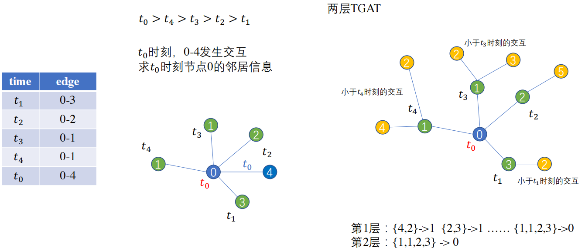
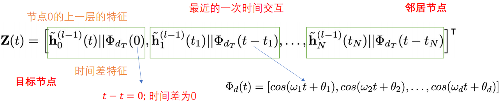
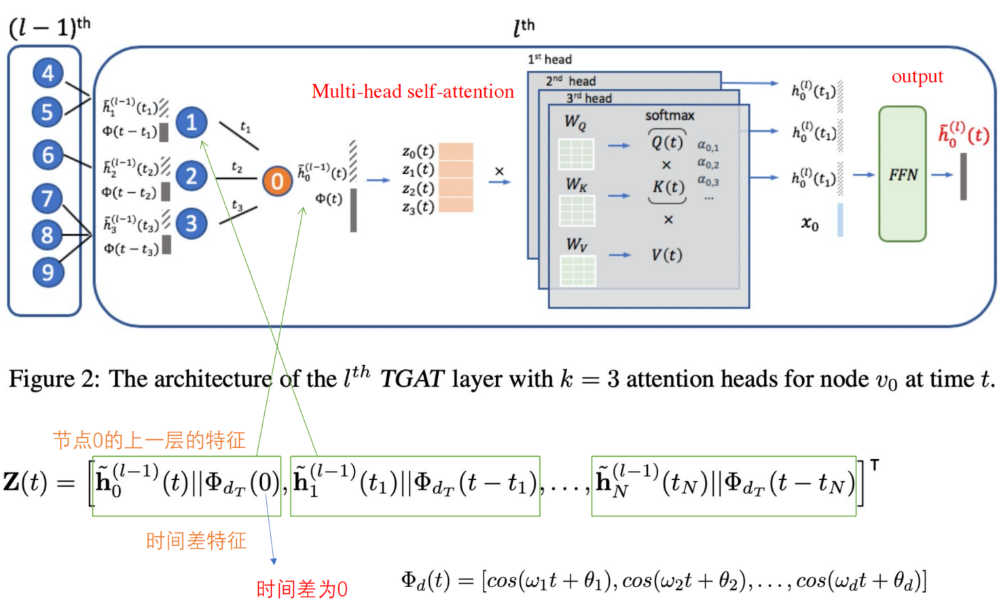
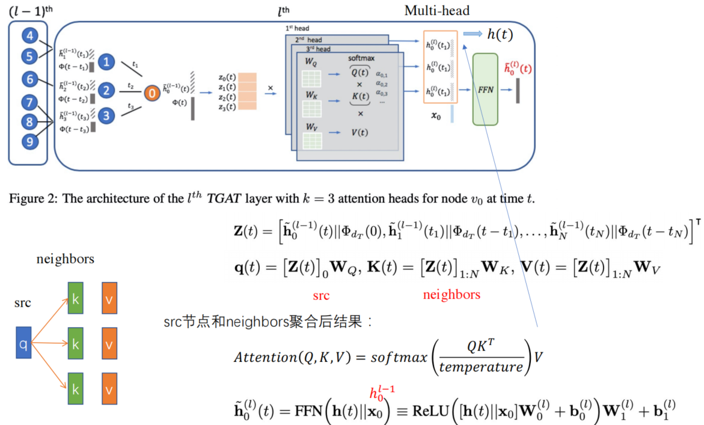
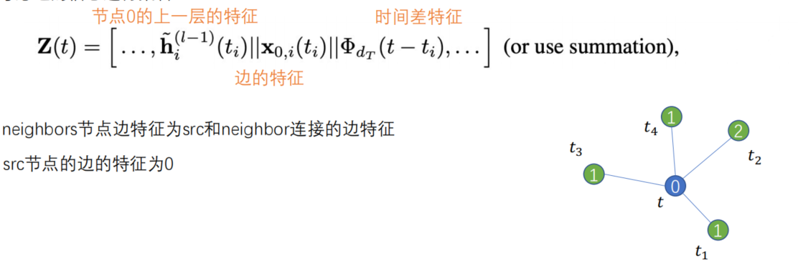
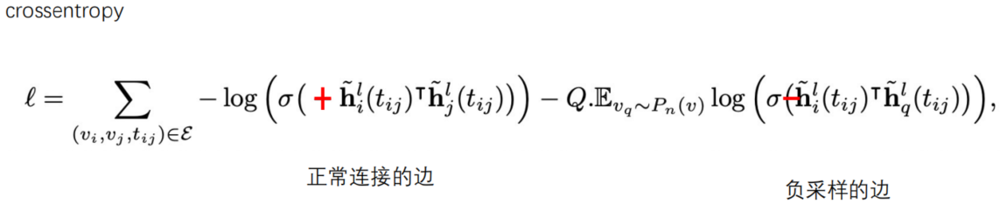
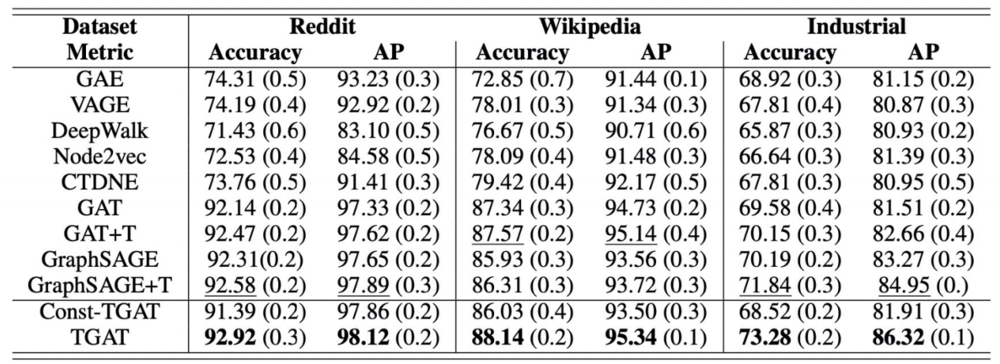
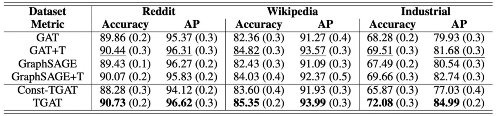

## TGAT: Inductive Representation Learning On Temporal Graphs

## ( Temporal Graphs Attention Network)

基于RNN的连续性网络，不仅考虑邻居节点特征，同时也考虑了时间特征

相较于GAT，它的不同之处在于对邻居定义进行了限制

- 节点与节点之间需要有边交互
- 邻居节点的交互的时间需要小于当前节点的时刻

示例

## 节点特征求解公式

- Z(t)为要求的节点特征
- $\large \phi_d(t) $ :t为邻居节点和节点的时间差 $\Delta_t$，$w_1$ 和 $\theta_1$ 就是需要学习的参数

## 算法流程

- **采用self-attention的方式聚合邻居节点的特征**

  - FFN( h(t) || $x_0$) :   两层的全连接层， $x_0$ 为0节点在上一层的特征表示    

  - $\widetilde h^{(l)}_0(t)$ :t时刻在第 l 层的节点embedding

- **考虑边的信息进行聚合**
  - 上图是作者源码的边信息聚合方式
    - source节点的特征为0，也可采用别的方式：将所有边的加权求和，当做边的特征，拼接到0节点的特征
  - 考虑完后，采用self-attention聚合邻居节点的特征，然后经过FFN求得节点的特征

## 求损失函数Loss

- 再通过反向传播，得到模型的更新参数

## 实验效果

- 直推式任务：在一张图中做分类任务

- 未知节点上的推理任务