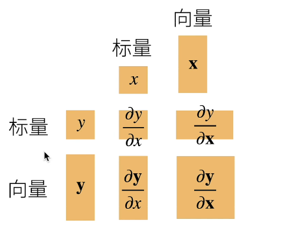
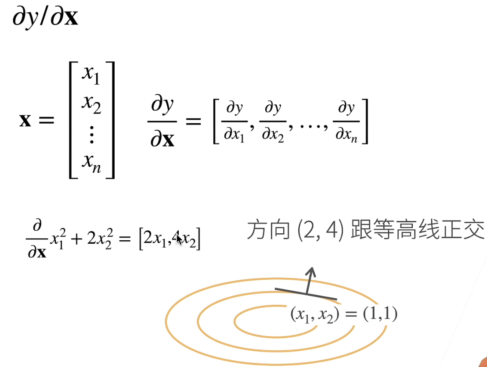
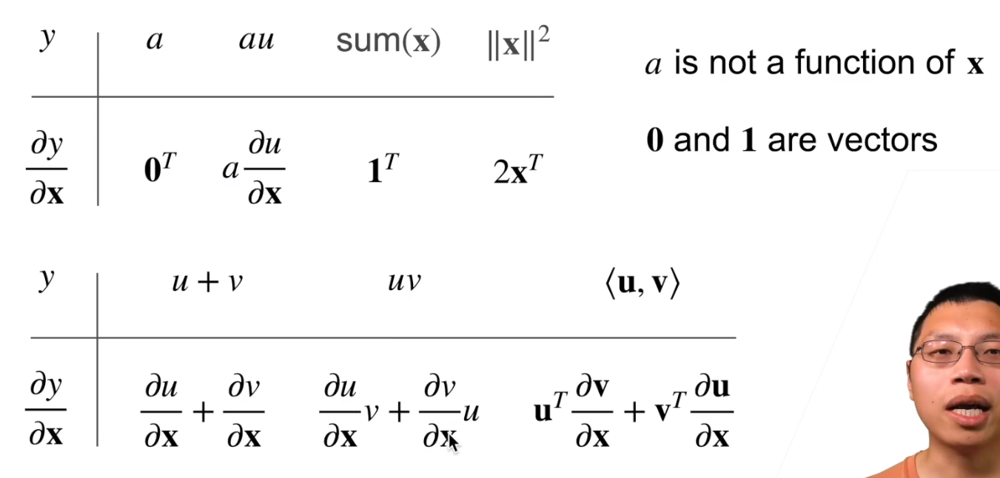
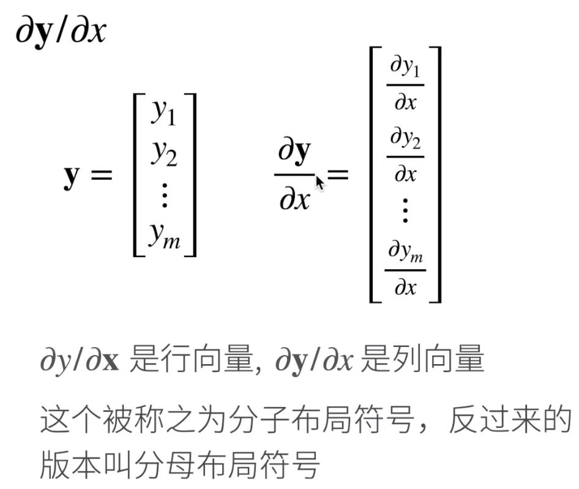
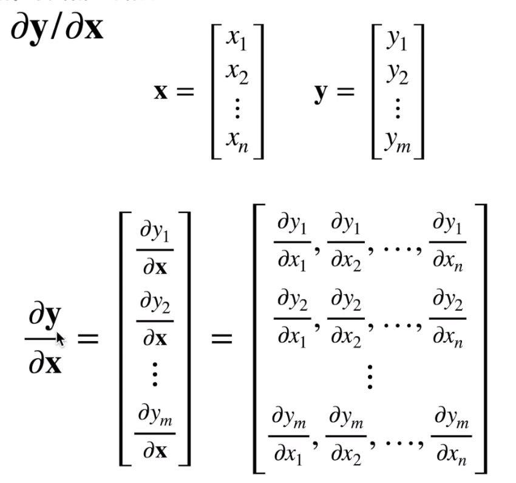
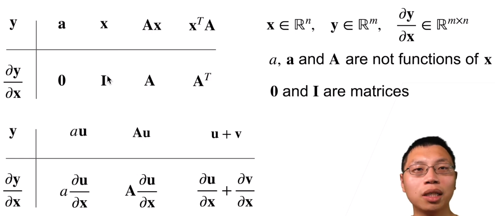
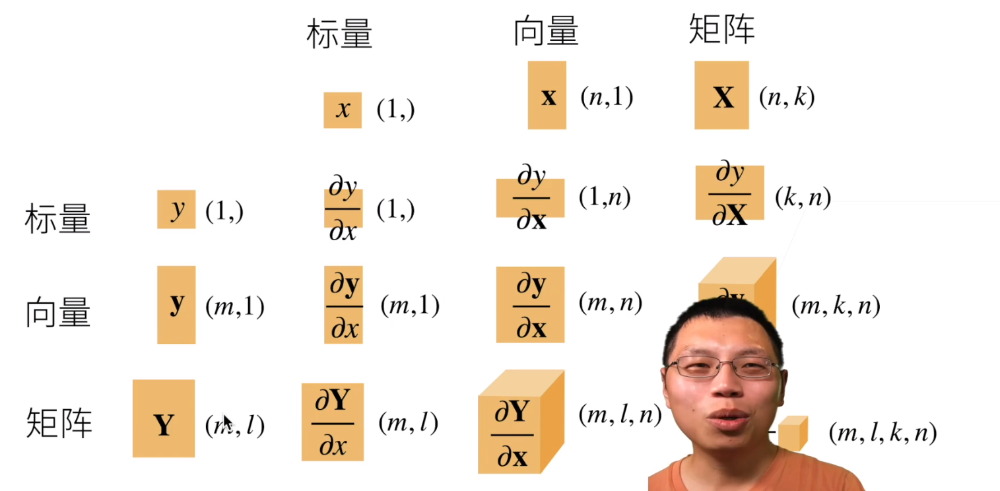

## 将导数拓展到向量  梯度：自变量导数组成的向量  ，梯度指向值变化最大的方向

如果是向量或者矩阵对标量求导，则使用分子布局为准，如果是标量对向量或者矩阵求导，则以分母布局为准。

- **按分子布局的向量对向量求导的结果矩阵，我们求导结果的维度以分子为主**，我们一般叫做**雅克比 (Jacobian)矩阵。**

- **按分母布局的向量对向量求导的结果矩阵，我们求导结果的维度以分母为主**。我们一般叫做**梯度矩阵**
- 

1.y是标量，x是向量   	

- 

