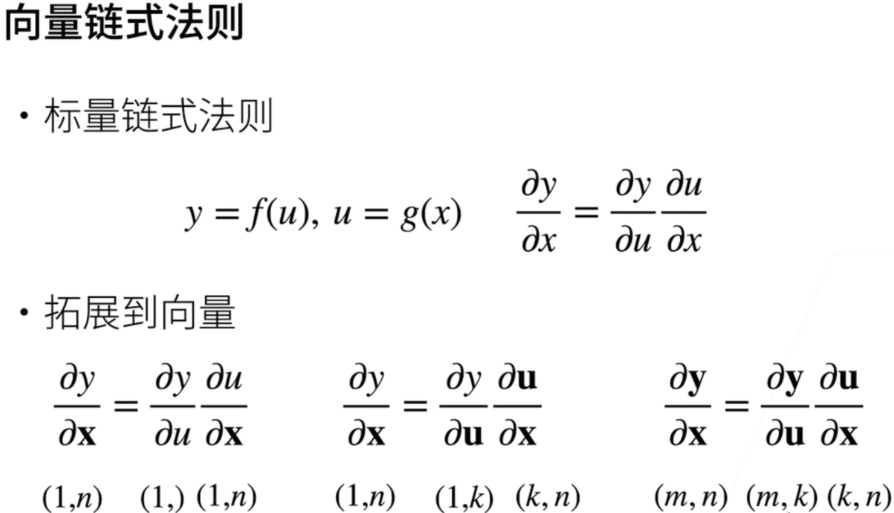

## 向量链式法则




## 自动求导


- 显式构造Tensorflow/ Theano / MXNet

  ```python
  from mxnet import sym
  a = sym.var()
  b = sym.var()
  c = 2 * a * b 
  ```

- 隐式构造 Pytorch / MXNet

  ```python
  from mxnet import autograd, nd
  with autograd.record():
  	a = nd.ones((2,1))
  	b = nd.ones((2,1))
  	c = 2 * a * b
  ```

## 自动求导的两种模式


## 自动求导的实现

- 假设 对 y = $2x^Tx$ 关于列向量 x 求导

  ```python
  import torch
  x = torch.arange(4.0)
  x.require_grad_(True)  # 计算y关于x的梯度之前，需要一个地方存储梯度 
  x.grad  # 默认值为None ，true后可以使用它访问梯度，存放y关于x的导数
  y = 2 * torch.dot(x, x)
  y.backward() # 调用反向传播函数自动计算y关于x每个分量的梯度
  x.grad
  x.grad == 4 * x  # output：[true, true, true, true]
  ```

- 计算x的另一个函数时

  ```python
  #在默认情况下，pytorch会累积梯度，因此需要清零之前的值
  x.grad.zero_() 
  y = x.sum()
  y.backward()
  x.grad  # output：[1., 1., 1., 1.]
  ```

- 深度学习中，目的不是计算微分矩阵，而是批量中每个样本单独计算的偏导数之和

  ```python
  x.grad.zero_()
  y = x * x
  y.sum().backward() # 标量 等价于 y.backward(troch.ones(len(x)))
  x.grad
  ```

  