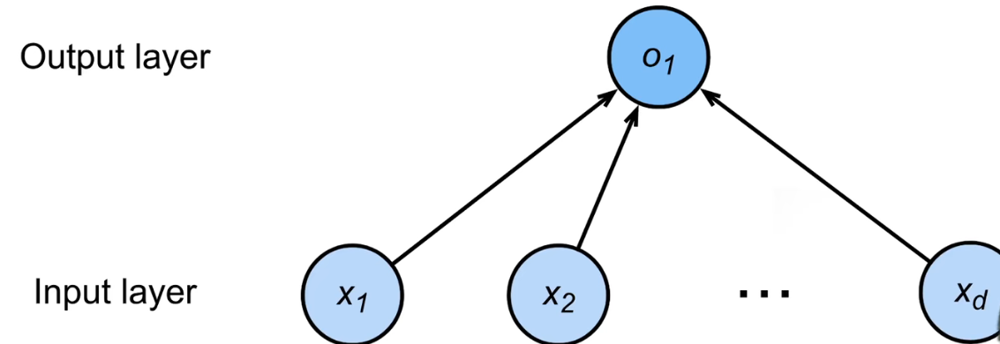
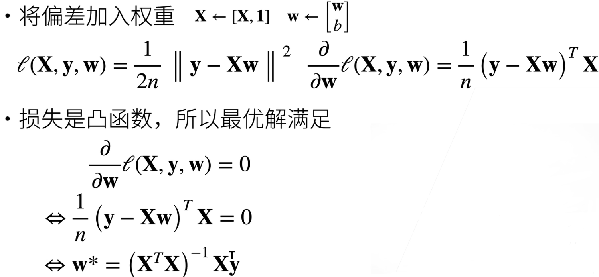
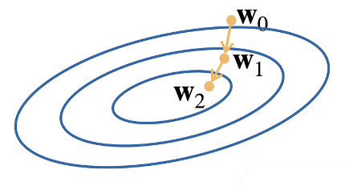

## 1.线性回归

- ### 一个简化模型

  - 假设1：影响房价的关键因素是卧室个数，卫生间个数和居住面积，记为$x_1,x_2,x_3$

  - 假设2：成交价是关键因素的加权和
    - $y=w_1x_1 + w_2x_2 + w_3x_3 +b$
    - 权重和偏差的实际值在后面决定

- ### 线性模型

  - 给定n维输入 $x= [x_1,x_2,...,x_n]^T$

  - 线性模型有一个n为权重和一个标量偏差
    - $w = [w_1,w_2,...,w_n]^T$ ， b

  - 输出是输入的加权和
    - $y=w_1x_1 + w_2x_2 +...+ w_nx_n +b$
    - 向量版本：$y = <w,x> + b$

- ### 线性模型可以看成是单层神经网络

- ### 衡量预估质量

  - 比较真实值和预估值，如房屋售价和估价
  - 假设 y 是真实值，$\hat y$ 是估计值，
    -  $l(y,\hat y) = \frac{1}{2}(y-\hat y)^2$ ，平方损失

- ### 训练数据

  - 收集一些数据点来决定参数值（权重和偏差）
  - 假设有n个样本，记$x= [x_1,x_2,...,x_n]^T，y= [y_1,y_2,...,y_n]^T$

- ### 参数学习

  - 训练损失  $l(X,y,w,b) = \frac{1}{2n}\sum^n_{i=1}(y_i - <x_i,w_i> -b)^2 = \frac{1}{2n}||y-Xw-b||^2$
  - 最小化损失来学习参数  $w^*,b^* = arg\ min_{w,b}\ l(X,y,w,b)$

- ### 显式解

  
  
- ### 总结

  - 线性回归是对n维输入的加权，外加偏差
  - 使用平方损失来衡量预测值和真实值的差异
  - 线性回归有显式解
  - 线性回归看做是单层的神经网络

## 2.基础优化方法

- ### 梯度下降

  - 挑选一个初始值w0
  - 重复迭代参数t = 1,2,3
    - $\large w_t = w_{t-1} - \eta\frac{\delta l}{\delta w_{t-1}}$
    - 沿梯度方向加工增加损失函数值
    - $\eta$学习率：步长的超参数
      - 选择学习率：不能太小也不能太大

- ### 小批量随机梯度下降

  - 随机采样b个样本$i_1,i_2,...,i_b$来近似损失
    - $\large \frac{1}{b} \sum_{i∈I_b} l(x_i,y_i,w)$，b是批量大小
  - 批量选取
    - 太小：每次计算量太小，不适合并行来最大利用计算资源
    - 太大：内存消耗增加浪费计算，如 所有样本都是相同的时，批量多大计算效果都一样

- ### 总结

  - 梯度下降通过不断沿着反梯度方向更新参数求解
  - 小批量随机梯度下降是深度学习默认的求解算法
  - 两个重要的超参数是批量大小和学习率