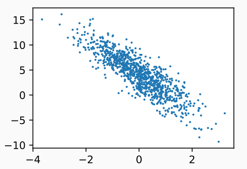

## 导入工具包

```python
%matplotlib inline
import random
import torch
from d2l import torch as d2l
```

## 生成数据集

- 使用线性模型参数w=$[2,−3.4]^⊤$、b=4.2 和噪声项ϵ生成数据集及其标签：

  - y=Xw+b+ϵ.

  - 你可以将ϵ视为模型预测和标签时的潜在观测误差。 在这里我们认为标准假设成立，即ϵ服从均值为0的正态分布

  ```python
  def synthetic_data(w, b, num_examples):  #@save
      """生成y=Xw+b+噪声"""
      X = torch.normal(0, 1, (num_examples, len(w)))
      y = torch.matmul(X, w) + b
      y += torch.normal(0, 0.01, y.shape)  #增加一个随机噪音
      return X, y.reshape((-1, 1))
  
  true_w = torch.tensor([2, -3.4])
  true_b = 4.2
  features, labels = synthetic_data(true_w, true_b, 1000)
  ```

  `features`中的每一行都包含一个二维数据样本， `labels`中的每一行都包含一维标签值（一个标量）

  ```python
  print('features:', features[0],'\nlabel:', labels[0])
  # output： features: tensor([-0.7677,  1.8605])
  #		  label: tensor([-3.6755])
  
  d2l.set_figsize()
  d2l.plt.scatter(features[:, (1)].detach().numpy(), labels.detach().numpy(), 1);
  ```

   

## 读取数据集

定义一个`data_iter`函数， 该函数接收批量大小、特征矩阵和标签向量作为输入，生成大小为`batch_size`的小批量。 每个小批量包含一组特征和标签

```python
def data_iter(batch_size, features, labels):
    num_examples = len(features)
    indices = list(range(num_examples))
    # 这些样本是随机读取的，没有特定的顺序
    random.shuffle(indices)
    for i in range(0, num_examples, batch_size):
        batch_indices = torch.tensor(
            indices[i: min(i + batch_size, num_examples)])
        yield features[batch_indices], labels[batch_indices]
        
batch_size = 10

for X, y in data_iter(batch_size, features, labels):
    print(X, '\n', y)
    break
    
'''output
tensor([[ 0.8373, -1.2476],
        [-0.7091,  0.1945],
        [-0.2718,  0.6863],
        [ 0.3127, -0.4303],
        [ 1.3269,  0.9045],
        [-1.3153,  0.6720],
        [ 0.1420,  0.3393],
        [ 0.3654,  0.9950],
        [ 0.5471, -0.5575],
        [-0.2713, -2.2361]])
 tensor([[10.1172],
        [ 2.1291],
        [ 1.3325],
        [ 6.3048],
        [ 3.7960],
        [-0.7202],
        [ 3.3500],
        [ 1.5589],
        [ 7.1811],
        [11.2465]])
'''
```

## 初始化模型参数

- 从均值为0、标准差为0.01的正态分布中采样随机数来初始化权重， 并将偏置初始化为0

  ```python
  w = torch.normal(0, 0.01, size=(2,1), requires_grad=True) # 随机的正态分布   requires_grad=True计算梯度
  b = torch.zeros(1, requires_grad=True)
  ```

## 定义模型

- 计算线性模型的输出， 我们只需计算输入特征X和模型权重w的矩阵-向量乘法后加上偏置b。 注意，上面的Xw是一个向量，而b是一个标量

- ```python
  def linreg(X, w, b):  #@save
      """线性回归模型"""
      return torch.matmul(X, w) + b
  ```

## 定义损失函数

- 需要计算损失函数的梯度，所以我们应该先定义损失函数

- ```python
  def squared_loss(y_hat, y):  #@save
      """均方损失"""
      return (y_hat - y.reshape(y_hat.shape)) ** 2 / 2
  ```

## 定义优化算法

- 在每一步中，使用从数据集中随机抽取的一个小批量，然后根据参数计算损失的梯度。 

- 接下来，朝着减少损失的方向更新我们的参数。 

- 下面的函数实现小批量随机梯度下降更新。 该函数接受模型参数集合、学习速率和批量大小作为输入。

- 每 一步更新的大小由学习速率`lr`决定。 

- 因为我们计算的损失是一个批量样本的总和，所以我们用批量大小（`batch_size`） 来规范化步长，这样步长大小就不会取决于我们对批量大小的选择

- ```python
  def sgd(params, lr, batch_size):  #@save
      """小批量随机梯度下降"""
      with torch.no_grad():
          for param in params:
              param -= lr * param.grad / batch_size #损失函数求均值
              param.grad.zero_() # 梯度清零
  ```

## 训练

- 初始化参数

- 重复以下训练，直到完成

  - 计算梯度$g←∂(w,b)\frac{1}{|B|}∑_{i∈B}l(x^{(i)},y^{(i)},w,b)$
  - 更新参数(w,b)←(w,b)−ηg

  在每个*迭代周期*（epoch）中，我们使用`data_iter`函数遍历整个数据集， 并将训练数据集中所有样本都使用一次（假设样本数能够被批量大小整除）。 这里的迭代周期个数`num_epochs`和学习率`lr`都是超参数，分别设为3和0.03。

- ```python
  lr = 0.03 # 学习率
  num_epochs = 3 # 执行三轮
  net = linreg  # 模型
  loss = squared_loss  # 均方损失
  
  for epoch in range(num_epochs):
      for X, y in data_iter(batch_size, features, labels):
          l = loss(net(X, w, b), y)  # X和y的小批量损失
          # 因为l形状是(batch_size,1)，而不是一个标量。l中的所有元素被加到一起，
          # 并以此计算关于[w,b]的梯度
          l.sum().backward()
          sgd([w, b], lr, batch_size)  # 使用参数的梯度更新参数
      with torch.no_grad():
          train_l = loss(net(features, w, b), labels)
          print(f'epoch {epoch + 1}, loss {float(train_l.mean()):f}')
          
  ''' output
  epoch 1, loss 0.038337
  epoch 2, loss 0.000138
  epoch 3, loss 0.000050
  '''
  # 比较真实参数和通过训练学到的参数来评估训练的成功程度
  print(f'w的估计误差: {true_w - w.reshape(true_w.shape)}')
  print(f'b的估计误差: {true_b - b}')
  
  '''
  w的估计误差: tensor([ 0.0008, -0.0002], grad_fn=<SubBackward0>)
  b的估计误差: tensor([-0.0003], grad_fn=<RsubBackward1>)
  '''
  ```
