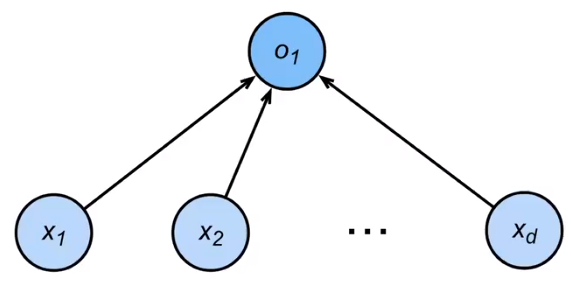
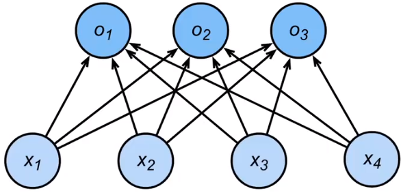

## 回归 vs 分类

- 回归估计是一个连续值
- 分类是预测一个离散类别

## 从回归到多类分类

- 回归
  - 单连续数值输出
  - 自然区间R
  - 跟真实值的区别作为损失
- 分类
  - 多个输出
  - 输出i是预测为第i类的置信度

## 校验比例：Softmax

- 输出匹配概率（非负，和为1）
  - $\hat y = softmax(o)$
  - $\large \hat y_i = \frac{exp(o_i)}{\sum_k exp(o_k)}$
  - 真实概率 y 和预测概率 $\hat y$的区别作为损失
- softmax和交叉熵损失
  - 交叉熵常用来衡量两个概率的区别$H(p,q) = \sum_i - p_i\ log(q_i)$
  - 将它作为损失 ：$\large l(y,\hat y) = -\sum_i\  y_i\ log\hat y_i  = -log\  \hat y_y $
  - 其梯度是真实概率和预测概率的区别-
    - $\large ∂_{O_i}l(y,\hat y) = softmax(o)_i - y_i$

总结

- softmax回归是一个多类分类模型
- 使用softmax操作子得到每个类的预测置信度
- 使用交叉熵来衡量预测和标号的区别

