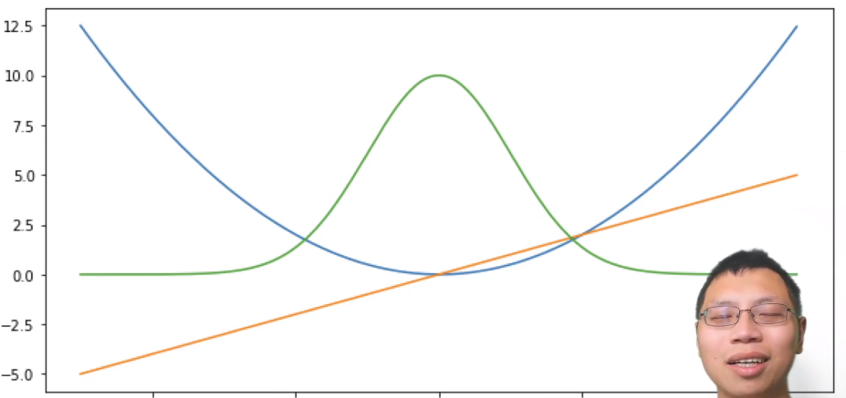
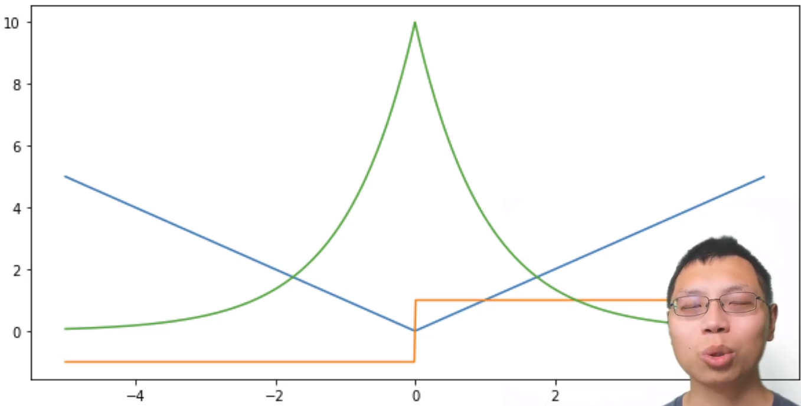
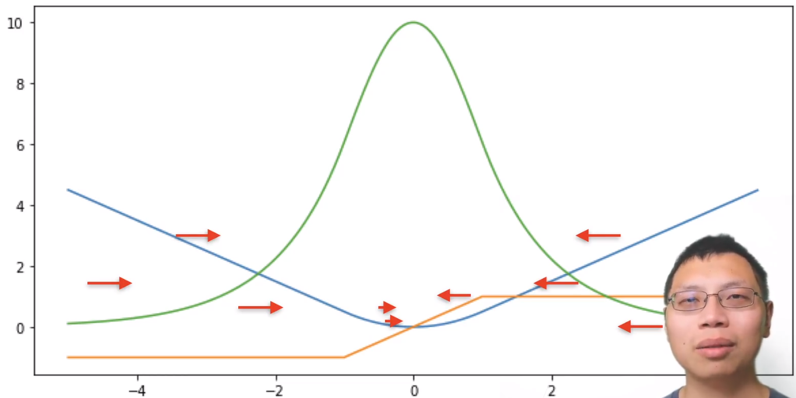

## L2 loss 均方损失

- $l(y,y') = \frac{1}{2}(y,y')^2$
- 真实值y - 预测值y‘  1/2的含义是，当求导时，2与1/2抵消
- 
  - 蓝色：y=0时，y’的函数    ； 绿色：似然函数,符合高斯分布    橙色：损失函数的梯度

## L1 loss 绝对值损失函数  对应拉普拉斯分布

- $l(y,y') = |y-y'|$
- 当预测值与真实值差异较大时，梯度永远是常数，因此权重的更新不会特别大，会比较稳定
- 缺点：零点处不可导，在零点处存在+1，-1的剧烈的变化
- 

## Huber‘s Robust Loss

- $l(y,y')=\begin{cases}|y-y'| -\frac{1}{2}, & \text{if |y-y'|>1}\\\frac{1}{2}(y,y')^2  & \text{otherwise}\end{cases}$
- 

