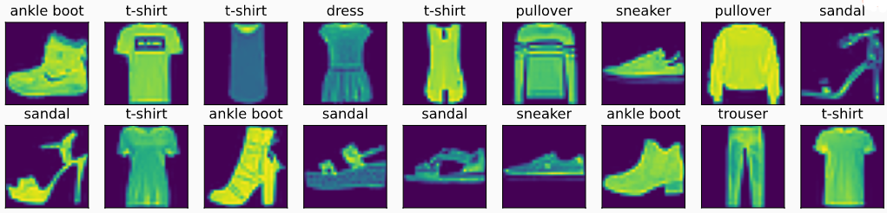

- ### 图像分类数据集

  ```python
  import torch
  import torchvision
  from torch.utils import data
  from torchvision import transforms
  from d2l import torch as d2l
  
  # 1. 读取数据集
  # Fashion-MNIST由10个类别的图像组成， 
  # 每个类别由训练数据集（train dataset）中的6000张图像 和测试数据集（test dataset）中的1000张图像组成
  
  # 通过ToTensor实例将图像数据从PIL类型变换成32位浮点数格式，并除以255使得所有像素的数值均在0到1之间
  trans = transforms.ToTensor()
  mnist_train = torchvision.datasets.FashionMNIST(           
      root=".//data", train=True, transform=trans, download=True)  
  #tarin = true 下载的是训练数据集 ，transform=trans 得到之后是pytroch的tensor而不是图片，download=True 默认从网上下载
  mnist_test = torchvision.datasets.FashionMNIST(
      root=".//data", train=False, transform=trans, download=True)
  len(mnist_train), len(mnist_test)  # output： (60000, 10000)
  mnist_train[0][0].shape   # output：torch.Size([1, 28, 28])
  
  # Fashion-MNIST中包含的10个类别，分别为t-shirt（T恤）、trouser（裤子）、pullover（套衫）、dress（连衣裙）、coat（外套）、sandal（凉鞋）、shirt（衬衫）、sneaker（运动鞋）、bag（包）和ankle boot（短靴）。 
  def get_fashion_mnist_labels(labels):  #@save
      """返回Fashion-MNIST数据集的文本标签"""
      text_labels = ['t-shirt', 'trouser', 'pullover', 'dress', 'coat',
                     'sandal', 'shirt', 'sneaker', 'bag', 'ankle boot']
      return [text_labels[int(i)] for i in labels]
  
  # 可视化这些样本
  def show_images(imgs, num_rows, num_cols, titles=None, scale=1.5):  #@save
      """绘制图像列表"""
      figsize = (num_cols * scale, num_rows * scale)
      _, axes = d2l.plt.subplots(num_rows, num_cols, figsize=figsize)
      axes = axes.flatten()
      for i, (ax, img) in enumerate(zip(axes, imgs)):
          if torch.is_tensor(img):
              # 图片张量
              ax.imshow(img.numpy())
          else:
              # PIL图片
              ax.imshow(img)
          ax.axes.get_xaxis().set_visible(False)
          ax.axes.get_yaxis().set_visible(False)
          if titles:
              ax.set_title(titles[i])
      return axes
  
  X, y = next(iter(data.DataLoader(mnist_train, batch_size=18)))
  show_images(X.reshape(18, 28, 28), 2, 9, titles=get_fashion_mnist_labels(y));
  ```

  - 

  ```python
  # 数据加载读取小批量
  batch_size = 256
  def get_dataloader_workers():  #@save
      """使用4个进程来读取数据"""
      return 4
  
  train_iter = data.DataLoader(mnist_train, batch_size, shuffle=True,
                               num_workers=get_dataloader_workers())
  # 读取训练数据所需的时间
  timer = d2l.Timer()
  for X, y in train_iter:
      continue
  f'{timer.stop():.2f} sec'
  ```

```python
# 组合组件
import sys
from mxnet import gluon
from d2l import mxnet as d2l

def load_data_fashion_mnist(batch_size, resize=None):  #@save
    """下载Fashion-MNIST数据集，然后将其加载到内存中"""
    dataset = gluon.data.vision 
    
    trans = [dataset.transforms.ToTensor()]
    if resize:
        trans.insert(0, dataset.transforms.Resize(resize))
    trans = dataset.transforms.Compose(trans)
    mnist_train = dataset.FashionMNIST(train=True).transform_first(trans)
    mnist_test = dataset.FashionMNIST(train=False).transform_first(trans)
    return (gluon.data.DataLoader(mnist_train, batch_size, shuffle=True,
                                  num_workers=get_dataloader_workers()),
            gluon.data.DataLoader(mnist_test, batch_size, shuffle=False,
                                  num_workers=get_dataloader_workers()))
```