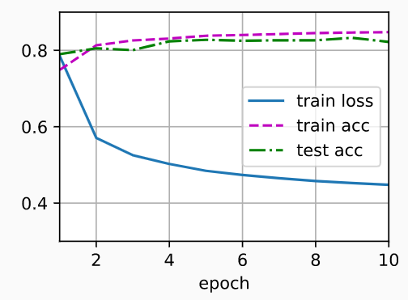

## 导入数据集，设置批量大小

```python
import torch
from IPython import display
from d2l import torch as d2l

batch_size = 256
train_iter, test_iter = d2l.load_data_fashion_mnist(batch_size)
```

## 初始化模型参数

- 数据集有10个类别，所以网络输出维度为10。每个样本都是28×28的图像。我们将展平每个图像，把它们看作长度为784的向量

-  因此，权重将构成一个784×10的矩阵， 偏置将构成一个1×10的行向量。 使用正态分布初始化我们的权重`W`，偏置初始化为0。

- ```python
  num_inputs = 784
  num_outputs = 10
  
  W = torch.normal(0, 0.01, size=(num_inputs, num_outputs), requires_grad=True)
  b = torch.zeros(num_outputs, requires_grad=True)
  ```

## 定义softmax操作

- 给定一个矩阵`X`，我们可以对所有元素求和（默认情况下）

- ```python
  X = torch.tensor([[1.0, 2.0, 3.0], [4.0, 5.0, 6.0]])
  X.sum(0, keepdim=True), X.sum(1, keepdim=True)
  ```

- ### 实现softmax由三个步骤组成：

  1. 对每个项求幂（使用`exp`）；
  2. 对每一行求和（小批量中每个样本是一行），得到每个样本的规范化常数；
  3. 将每一行除以其规范化常数，确保结果的和为1。

- 表达式：$\large softmax(X)_{ij} = \frac{exp(X_{ij})}{\sum_kexp(X_{ik})}$

- ```python
  def softmax(X):
      X_exp = torch.exp(X)
      partition = X_exp.sum(1, keepdim=True)
      return X_exp / partition  # 这里应用了广播机制
  ```

  - 对于任何随机输入，我们将每个元素变成一个非负数。 此外，依据概率原理，每行总和为1

  - ```python
    X = torch.normal(0, 1, (2, 5))
    X_prob = softmax(X)
    X_prob, X_prob.sum(1)
    '''
    output:
    (tensor([[0.0166, 0.0458, 0.0631, 0.7771, 0.0975],
             [0.1894, 0.3230, 0.1702, 0.1802, 0.1372]]),
    tensor([1.0000, 1.0000]))
    '''
    ```

- ### 实现softmax回归模型

- ```python
  def net(X):
      return softmax(torch.matmul(X.reshape((-1, W.shape[0])), W) + b)
  # -1:自动计算需要多少-batchsize  W.shape[0] :784
  ```

## 定义交叉熵损失函数

- 创建一个数据样本`y_hat`，其中包含2个样本在3个类别的预测概率， 以及它们对应的标签`y`。然后使用`y`作为`y_hat`中概率的索引

- ```python
  y = torch.tensor([0, 2]) # 标号
  y_hat = torch.tensor([[0.1, 0.3, 0.6], [0.3, 0.2, 0.5]])
  y_hat[[0, 1], y] # 在第一个样本中，第一类是正确的预测； 而在第二个样本中，第三类是正确的预测
  # output：tensor([0.1000, 0.5000])  
  ```

- ### 交叉熵损失函数

  - ```python
    def cross_entropy(y_hat, y):
        return - torch.log(y_hat[range(len(y_hat)), y])
    
    cross_entropy(y_hat, y)
    # output：tensor([2.3026, 0.6931])
    ```

## 分类精度：正确预测数量与总预测数量之比

- 首先，如果`y_hat`是矩阵，那么假定第二个维度存储每个类的预测分数。 

- 我们使用`argmax`获得每行中最大元素的索引来获得预测类别。 

- 然后我们将预测类别与真实`y`元素进行比较。 

- 由于等式运算符“`==`”对数据类型很敏感， 因此我们将`y_hat`的数据类型转换为与`y`的数据类型一致。

-  结果是一个包含0（错）和1（对）的张量。 最后，我们求和会得到正确预测的数量。

- ```python
  def accuracy(y_hat, y):  #@save
      """计算预测正确的数量"""
      if len(y_hat.shape) > 1 and y_hat.shape[1] > 1:
          y_hat = y_hat.argmax(axis=1)
      cmp = y_hat.type(y.dtype) == y
      return float(cmp.type(y.dtype).sum())
  
  accuracy(y_hat, y) / len(y)
  ```

- 对于任意数据迭代器`data_iter`可访问的数据集， 我们可以评估在任意模型`net`的精度

  - ```python
    def evaluate_accuracy(net, data_iter):  #@save
        """计算在指定数据集上模型的精度"""
        if isinstance(net, torch.nn.Module): # 对于torch.nn提供的模型，不需要计算梯度
            net.eval()  # 将模型设置为评估模式
        metric = Accumulator(2)  # 正确预测数、预测总数
        with torch.no_grad():
            for X, y in data_iter:
                metric.add(accuracy(net(X), y), y.numel())
        return metric[0] / metric[1]
    ```

- 定义一个实用程序类`Accumulator`，用于对多个变量进行累加。 在上面的`evaluate_accuracy`函数中， 我们在`Accumulator`实例中创建了2个变量， 分别用于存储正确预测的数量和预测的总数量

  - ```python
    class Accumulator:  #@save
        """在n个变量上累加"""
        def __init__(self, n):
            self.data = [0.0] * n
    
        def add(self, *args):
            self.data = [a + float(b) for a, b in zip(self.data, args)]
    
        def reset(self):
            self.data = [0.0] * len(self.data)
    
        def __getitem__(self, idx):
            return self.data[idx]
        
    evaluate_accuracy(net, test_iter)
    ```

## 训练

- `updater`是更新模型参数的常用函数，它接受批量大小作为参数，可以是`d2l.sgd`函数，也可以是框架的内置优化函数

- ```python
  def train_epoch_ch3(net, train_iter, loss, updater):  #@save
      """训练模型一个迭代周期（定义见第3章）"""
      # 将模型设置为训练模式
      if isinstance(net, torch.nn.Module):
          net.train()
      # 训练损失总和、训练准确度总和、样本数
      metric = Accumulator(3)
      for X, y in train_iter:
          # 计算梯度并更新参数
          y_hat = net(X)
          l = loss(y_hat, y)
          if isinstance(updater, torch.optim.Optimizer):
              # 使用PyTorch内置的优化器和损失函数
              updater.zero_grad()
              l.mean().backward()
              updater.step()
          else:
              # 使用定制的优化器和损失函数
              l.sum().backward()
              updater(X.shape[0])
          metric.add(float(l.sum()), accuracy(y_hat, y), y.numel()) # 将样本数，正确的样本数等放进累加器
      # 返回训练损失和训练精度
      return metric[0] / metric[2], metric[1] / metric[2]
  ```

- 一个在动画中绘制数据的实用程序类`Animator`

  - ```python
    class Animator:  #@save
        """在动画中绘制数据"""
        def __init__(self, xlabel=None, ylabel=None, legend=None, xlim=None,
                     ylim=None, xscale='linear', yscale='linear',
                     fmts=('-', 'm--', 'g-.', 'r:'), nrows=1, ncols=1,
                     figsize=(3.5, 2.5)):
            # 增量地绘制多条线
            if legend is None:
                legend = []
            d2l.use_svg_display()
            self.fig, self.axes = d2l.plt.subplots(nrows, ncols, figsize=figsize)
            if nrows * ncols == 1:
                self.axes = [self.axes, ]
            # 使用lambda函数捕获参数
            self.config_axes = lambda: d2l.set_axes(
                self.axes[0], xlabel, ylabel, xlim, ylim, xscale, yscale, legend)
            self.X, self.Y, self.fmts = None, None, fmts
    
        def add(self, x, y):
            # 向图表中添加多个数据点
            if not hasattr(y, "__len__"):
                y = [y]
            n = len(y)
            if not hasattr(x, "__len__"):
                x = [x] * n
            if not self.X:
                self.X = [[] for _ in range(n)]
            if not self.Y:
                self.Y = [[] for _ in range(n)]
            for i, (a, b) in enumerate(zip(x, y)):
                if a is not None and b is not None:
                    self.X[i].append(a)
                    self.Y[i].append(b)
            self.axes[0].cla()
            for x, y, fmt in zip(self.X, self.Y, self.fmts):
                self.axes[0].plot(x, y, fmt)
            self.config_axes()
            display.display(self.fig)
            display.clear_output(wait=True)
    ```

  - 利用`Animator`类来可视化训练进度

    - ```python
      def train_ch3(net, train_iter, test_iter, loss, num_epochs, updater):  #@save
          """训练模型（定义见第3章）"""
          animator = Animator(xlabel='epoch', xlim=[1, num_epochs], ylim=[0.3, 0.9],
                              legend=['train loss', 'train acc', 'test acc'])
          for epoch in range(num_epochs):
              train_metrics = train_epoch_ch3(net, train_iter, loss, updater)
              test_acc = evaluate_accuracy(net, test_iter)
              animator.add(epoch + 1, train_metrics + (test_acc,))
          train_loss, train_acc = train_metrics
          assert train_loss < 0.5, train_loss
          assert train_acc <= 1 and train_acc > 0.7, train_acc
          assert test_acc <= 1 and test_acc > 0.7, test_acc
      ```

  - 小批量随机梯度下降来优化模型的损失函数，设置学习率为0.1

    - ```python
      lr = 0.1
      
      def updater(batch_size):
          return d2l.sgd([W, b], lr, batch_size)
      ```

  - 训练模型10个迭代周期。 迭代周期（`num_epochs`）和学习率（`lr`）都是可调节的超参数。 通过更改它们的值，我们可以提高模型的分类精度

    - ```python
      num_epochs = 10
      train_ch3(net, train_iter, test_iter, cross_entropy, num_epochs, updater)
      ```

    - 

## 预测

- 对图像进行分类预测

- ```python
  def predict_ch3(net, test_iter, n=6):  #@save
      """预测标签（定义见第3章）"""
      for X, y in test_iter:
          break
      trues = d2l.get_fashion_mnist_labels(y)
      preds = d2l.get_fashion_mnist_labels(net(X).argmax(axis=1))
      titles = [true +'\n' + pred for true, pred in zip(trues, preds)]
      d2l.show_images(
          X[0:n].reshape((n, 28, 28)), 1, n, titles=titles[0:n])
  
  predict_ch3(net, test_iter)
  ```