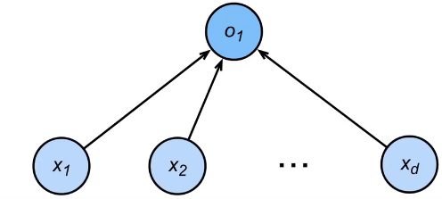
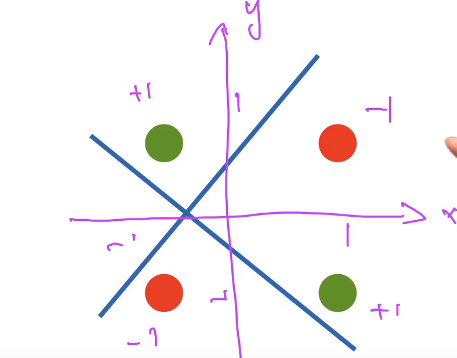

## 感知机

- 给定输入x，权重w，和偏移b，感知机输出 $o = \sigma(<w,x> + b) $
  - $\sigma(x) =\begin{cases}1, & \text{if x>0}\\ 0,  & \text{otherwise}\end{cases}$
  - 
- 可以看做是二分类问题： 0，1，输出离散的类
  - 线性回归输出实数
  - softmax回归输出概率

## 训练感知机

- 训练过程
  - 初始化w =0，b=0
  - 循环 if $y_i(<w,x> + b ) ≤ 0$    
  -  注 ：≤0相当于感知机的预测样本错了，$(<w,x> + b )<0$为负类，因此$y_i$也应为负，正号同理， y与$(<w,x> + b )要同号
    - $w \leftarrow w+y_ix_i，b \leftarrow b + y_i$
    - 注：  $w=w+y_ix_i$ 标号乘样本 做权重更新,  $b = b+y_i $ ，b加上标号，
  - 直到所有分类正确
- 等价于使用批量大小为1的梯度下降，并使用如下损失函数：$l(y,x,w) = max(0, -y<w,x>)$
  - 损失函数求导，w导数为$y_ix_i$，b导数为$y_i$
  - max()对应上面if的语句 分类对了，就 = 0不更新，分类错了就会存在梯度，因此损失函数会进行更新

## 收敛定理

- 假设数据在半径 r 内
- 余量ρ分类两类  $y(x^Tw+b)≥ρ$     对于$||w||^2+b^2≤1$
- 感知机保证在 $\large \frac{r^2+1}{ρ^2}$ 步后收敛

## XOR 异或 问题

- 感知机不能拟合XOR函数，它只能产生线性分割面
- 

## 总结

- 感知机是二分类模型

- 求解算法等价于使用批量大小为1的梯度下降

- 不能拟合XOR函数