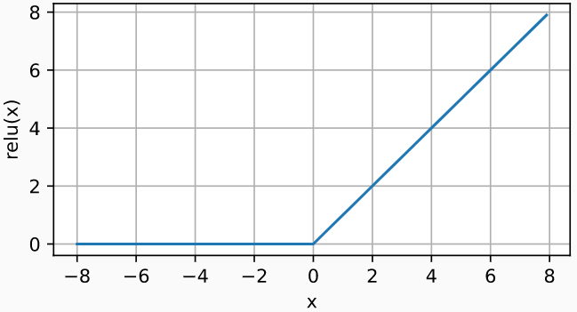

## 多层感知机

### 学习XOR

- 在网络中加入隐藏层
  - 

## 单隐藏层-单分类

- 输入$x∈R^n$
- 隐藏层$W_1 ∈ R^{m×n},b_1∈R^m$
- 隐藏层$W_2 ∈ R^m,b_2∈R$
- $h =\sigma(W_1x+b_1)$   ，$\sigma$ 是按元素的激活函数
- $o = w^T_2 h +b_2$ 

- ### 为什么需要非线性的激活函数

  - 假设 $h =W_1x+b_1$，那么$o = w^T_2 h +b_2 = w_2^TW_1x+w_2^Tb_1+b_2$    仍然是线性的 ,相当于单层感知机

## sigmodi激活函数

- 对于一个定义域在R中的输入， *sigmoid函数*将输入变换为区间(0, 1)上的输出。$\sigma(x) =\begin{cases}1, & \text{if x>0}\\ 0,  & \text{otherwise}\end{cases}$
- 因此，sigmoid通常称为*挤压函数*（squashing function）： 它将范围（-inf, inf）中的任意输入压缩到区间（0, 1）中的某个值：
  - $sigmoid(x) = \frac{1}{1+exp(-x)}$
-  

## Tanh激活函数

- 将输入投影到(-1,1)
- $tanh(x) = \frac{1-exp(-2x)}{1+exp(-2x)}$
-  

## ReLU激活函数：rectified linear unit   修正线性单元

- ReLU(x) = max(x,0) 
-  

## 多类分类：在softmax回归中加了一层隐藏层

- 输入$x∈R^n$
- 隐藏层$W_1 ∈ R^{m×n},b_1∈R^m$
- 隐藏层$W_2 ∈ R^{m×k},b_2∈R^k$
- $h =\sigma(W_1x+b_1)$   ，$\sigma$ 是按元素的激活函数
- $o = w^T_2 h +b_2$ 
- y = softmax(o)

- 可以有多隐藏层： $h_1 =\sigma(W_1x+b_1)$    $h_2 =\sigma(W_2h_1+b_2)$   $h_3 =\sigma(W_3h_2+b_3)$   $o =W_4h_3+b_4$ 
  - 超参数：隐藏层数 每层隐藏层的大小
-  

## 注：

- 层数越多 模型越复杂，第一层隐藏层设得稍微大一点，取决于输入的复杂度有多少，

- 假设数据比较复杂，
  - 使用单隐藏层，将隐藏层设的大一些，假设输入维度是128，隐藏层可设64.128.256，
  - 单隐藏层当其设的过大时，容易过拟合，且不好训练
  - 使用多隐藏层，设的相对于单隐藏层较小，且越深是越来越小
-  多隐藏层，假设第一层设的相对输入较小，那么可能会损失很多信息，需要注意

## 总结

- 多层感知机在输出层和输入层之间增加一个或多个全连接隐藏层，并通过激活函数转换隐藏层的输出。
- 常用的激活函数包括ReLU函数、sigmoid函数和tanh函数
- 使用Softmax来处理多类分类
- 超参数为隐藏层数 和 每层隐藏层的大小
- 激活函数的本质 是引入非线性性

