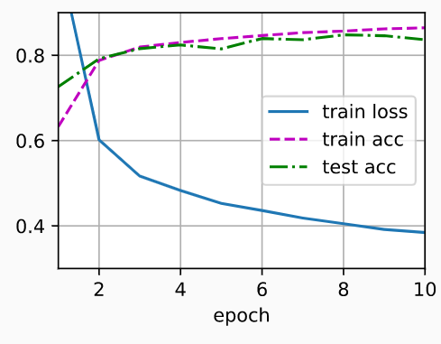

## 导入

```python
import torch
from torch import nn
from d2l import torch as d2l
```

## 模型

- 与softmax回归的简洁实现相比， 唯一的区别是我们添加了2个全连接层（之前我们只添加了1个全连接层）。 

- 第一层是隐藏层，它包含256个隐藏单元，并使用了ReLU激活函数。 第二层是输出层。

- ```python
  net = nn.Sequential(nn.Flatten(),  # Flatten成2维
                      nn.Linear(784, 256),
                      nn.ReLU(),
                      nn.Linear(256, 10))
  
  def init_weights(m):
      if type(m) == nn.Linear:
          nn.init.normal_(m.weight, std=0.01)
  
  net.apply(init_weights);
  ```

## 训练过程

- 实现与我们实现softmax回归时完全相同， 这种模块化设计使我们能够将与和模型架构有关的内容独立出来

- ```python
  batch_size, lr, num_epochs = 256, 0.1, 10
  loss = nn.CrossEntropyLoss(reduction='none')
  trainer = torch.optim.SGD(net.parameters(), lr=lr)
  
  train_iter, test_iter = d2l.load_data_fashion_mnist(batch_size)
  d2l.train_ch3(net, train_iter, test_iter, loss, num_epochs, trainer)
  ```

-  