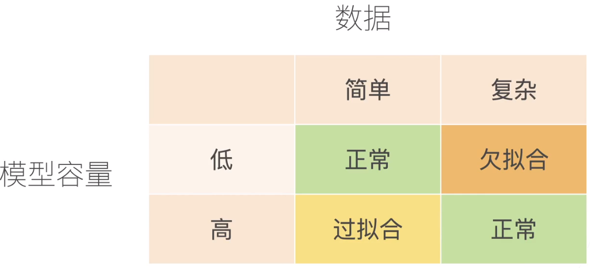
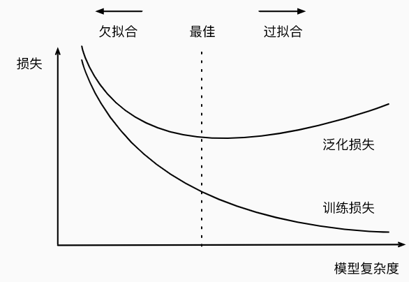
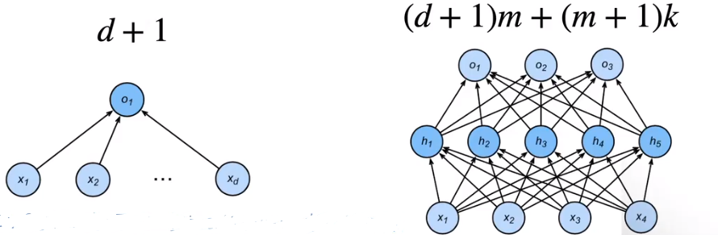

## 训练误差和泛化误差

- 训练误差（training error）是指， 模型在训练数据集上计算得到的误差。 
- 泛化误差（generalization error）：模型在新数据上的误差
- 例：根据模考成绩来预测未来考试分数
  - 在过去考试中表现很好（训练误差） 不代表未来考试一定会好（泛化误差）
  - 学生A通过背书在模考中拿到好成绩
  - 学生B知道答案后面的原因

## 验证数据集和测试数据集

- 训练数据集：  +》 **训练模型参数**

- 验证数据集：一个用来评估模型好坏的数据集    +》**选择模型超参数**

  - 例如拿出50%的训练数据

  - **不要跟训练数据混在一起**

- 测试数据集：只用一次的数据集      
  - 未来的考试
  - 房子的实际成交价
  - 用在Kaggle私有排行榜中的数据集

## K-折交叉验证  

- 在没有足够多数据时使用（非大数据集）
- 算法： 
  - 将训练数据分割成k块
  - For i = 1， ...， k
    - 使用第 i 块作为验证数据集，其余作为训练数据集
    - 报告K个验证集误差的平均
- 常用：K=5或10 ，相当于将数据训练K次，然后求得K的平均误差
- 可以用于确定超参数，取其中均值效果较好的，也可用随机森林将进行预测选择

## 过拟合和欠拟合

 

## 模型容量：模型的复杂度，拟合各种函数的能力

- 低容量的模型难以拟合训练数据
- 高容量的模型可以记住所有的训练数据

-  

## 估计模型容量

- 难以在不同的种类算法之间比较
  - 例如树模型和神经网络
- 给定一个模型种类，将有两个主要因素
  - 参数的个数  （d+1：d个输入的权重，加1个偏差）（ (d+1)m+(m+1)k：m层个d+1，加上(m+1)*输出k ）
  - 参数值得选择范围
- 

## VC维

- 对于一个分类模型，VC等于一个最大的数据集的大小，不管如何给定标号，都存在一个模型来对它进行完美分类

- 例：线性分类器的VC维

  - 2维输入的感知机 VC维 = 3

    - 能够分类任何三个点，但不是4个(xor)

      这种情况是不行的： 

  - 支持N为输入的感知机的VC维是N+1

  - 一些多层感知机的VC维O(N$log_2N$)

- ### VC维的用处

  - 提供为什么一个模型好的理论依据
    - 他可以衡量训练误差和泛化误差之间的间隔
  - 在深度学习中很少使用
    - 衡量不是很准确
    - 计算深度学习模型的VC维很困难

## 数据复杂度

- 样本个数
- 每个样本的元素个数
- 时间、空间结果
- 多样性

