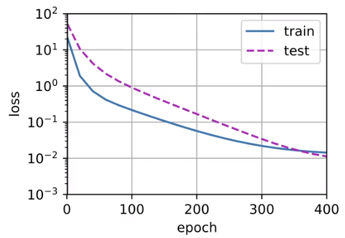
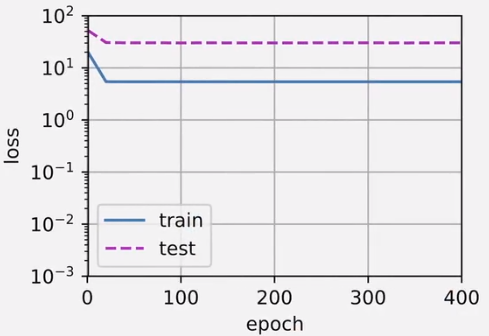
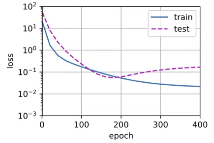

## 多项式回归

```python
import math
import numpy as np
import torch
from torch import nn
from d2l import torch as d2l
```

## 生成数据集

- 给定x，我们将使用以下三阶多项式来生成训练和测试数据的标签：

  - $\large y=5+1.2x−3.4\frac{x^2}{2!}+5.6{x^3}{3!}+ϵ ,其中 ϵ∼N(0,0.1^2).$

  - 噪声项 ϵ 服从均值为0且标准差为0.1的正态分布。 在优化的过程中，我们通常希望避免非常大的梯度值或损失值。 这就是我们将特征从$\large x^i$调整为$\huge \frac{x^i}{i!}$的原因， 这样可以避免很大的i带来的特别大的指数值。 我们将为训练集和测试集各生成100个样本。

  - ```python
    max_degree = 20  # 多项式的最大阶数
    n_train, n_test = 100, 100  # 训练和测试数据集大小
    true_w = np.zeros(max_degree)  # 分配大量的空间  , 除了下面给定的权重。其余均为噪音
    true_w[0:4] = np.array([5, 1.2, -3.4, 5.6])
    
    features = np.random.normal(size=(n_train + n_test, 1))
    np.random.shuffle(features)
    poly_features = np.power(features, np.arange(max_degree).reshape(1, -1))  # np.power用于数组元素求n次方
    for i in range(max_degree):
        poly_features[:, i] /= math.gamma(i + 1)  # gamma(n)=(n-1)!
    # labels的维度:(n_train+n_test,)
    labels = np.dot(poly_features, true_w)
    labels += np.random.normal(scale=0.1, size=labels.shape)
    ```

- 存储在`poly_features`中的单项式由gamma函数重新缩放， 其中 Γ(n)=(n−1)!。

  - ```python
    # NumPy ndarray转换为tensor
    true_w, features, poly_features, labels = [torch.tensor(x, dtype=
        torch.float32) for x in [true_w, features, poly_features, labels]]
    
    features[:2], poly_features[:2, :], labels[:2]
    '''
    output：
    (tensor([[-0.5491],
             [ 0.6516]]),
     tensor([[ 1.0000e+00, -5.4909e-01,  1.5075e-01, -2.7592e-02,  3.7876e-03,
              -4.1595e-04,  3.8066e-05, -2.9860e-06,  2.0495e-07, -1.2504e-08,
               6.8657e-10, -3.4272e-11,  1.5682e-12, -6.6238e-14,  2.5979e-15,
              -9.5099e-17,  3.2636e-18, -1.0541e-19,  3.2156e-21, -9.2931e-23],
             [ 1.0000e+00,  6.5162e-01,  2.1230e-01,  4.6113e-02,  7.5120e-03,
               9.7898e-04,  1.0632e-04,  9.8971e-06,  8.0614e-07,  5.8366e-08,
               3.8032e-09,  2.2529e-10,  1.2234e-11,  6.1321e-13,  2.8541e-14,
               1.2399e-15,  5.0494e-17,  1.9355e-18,  7.0065e-20,  2.4029e-21]]),
     tensor([3.5591, 5.3161]))
     '''
    ```

##  对模型进行训练和测试

- 评估模型在给定数据集上的损失

  - ```python
    def evaluate_loss(net, data_iter, loss):  #@save
        """评估给定数据集上模型的损失"""
        metric = d2l.Accumulator(2)  # 损失的总和,样本数量
        for X, y in data_iter:
            out = net(X)
            y = y.reshape(out.shape)
            l = loss(out, y)
            metric.add(l.sum(), l.numel())   # l.numel()用于计算数组中满足指定条件的元素个数
        return metric[0] / metric[1]  # 计算平均损失
    ```

- 定义训练函数

  - ```python
    def train(train_features, test_features, train_labels, test_labels, num_epochs=400):
        loss = nn.MSELoss(reduction='none')
        input_shape = train_features.shape[-1]
        # 不设置偏置，因为我们已经在多项式中实现了它
        net = nn.Sequential(nn.Linear(input_shape, 1, bias=False)) # 线性网络
        # 进行线性回归
        batch_size = min(10, train_labels.shape[0])
        train_iter = d2l.load_array((train_features, train_labels.reshape(-1,1)),
                                    batch_size)
        test_iter = d2l.load_array((test_features, test_labels.reshape(-1,1)),
                                   batch_size, is_train=False)
        trainer = torch.optim.SGD(net.parameters(), lr=0.01)
        animator = d2l.Animator(xlabel='epoch', ylabel='loss', yscale='log',
                                xlim=[1, num_epochs], ylim=[1e-3, 1e2],
                                legend=['train', 'test'])
        for epoch in range(num_epochs):
            d2l.train_epoch_ch3(net, train_iter, loss, trainer)
            if epoch == 0 or (epoch + 1) % 20 == 0:
                animator.add(epoch + 1, (evaluate_loss(net, train_iter, loss),
                                         evaluate_loss(net, test_iter, loss)))
        print('weight:', net[0].weight.data.numpy())
    ```

## 三阶多项式函数拟合(正常)

- 使用三阶多项式函数，它与数据生成函数的阶数相同。 结果表明，该模型能有效降低训练损失和测试损失。 学习到的模型参数也接近真实值w=[5,1.2,−3.4,5.6]。

- ```python
  # 从多项式特征中选择前4个维度，即1,x,x^2/2!,x^3/3!
  train(poly_features[:n_train, :4], poly_features[n_train:, :4],
        labels[:n_train], labels[n_train:])
  # output: weight: [[ 4.993906   1.2246284 -3.3686247  5.452925 ]]
  ```

   

## 线性函数拟合(欠拟合)

- 线性函数拟合，减少该模型的训练损失相对困难。 在最后一个迭代周期完成后，训练损失仍然很高。 

- 当用来拟合非线性模式（如这里的三阶多项式函数）时，线性模型容易欠拟合

- ```python
  # 从多项式特征中选择前2个维度，即1和x
  train(poly_features[:n_train, :2], poly_features[n_train:, :2],
        labels[:n_train], labels[n_train:])
  # output: weight: [[3.5880713 3.1436489]]
  ```

   

##  高阶多项式函数拟合(过拟合)

- 在这种情况下，没有足够的数据用于学到高阶系数应该具有接近于零的值。 

- 因此，这个过于复杂的模型会轻易受到训练数据中噪声的影响。 

- 虽然训练损失可以有效地降低，但测试损失仍然很高。 结果表明，复杂模型对数据造成了过拟合

- ```python
  # 从多项式特征中选取所有维度
  train(poly_features[:n_train, :], poly_features[n_train:, :],
        labels[:n_train], labels[n_train:], num_epochs=1500)
  ''' output:
  weight: [[ 5.0002198e+00  1.2467500e+00 -3.3591731e+00  5.1664433e+00
    -2.0427971e-01  1.3719110e+00  1.4664979e-01  2.0325291e-01
     2.2558092e-01  9.9882804e-02 -1.2002296e-01  6.2667161e-02
     1.2657876e-01  5.9042003e-02  1.0403855e-01  1.8731797e-01
    -4.1237131e-02 -1.6897091e-01 -9.8454226e-03 -4.6975882e-04]]
  '''
  ```

   

## 小结

- 欠拟合是指模型无法继续减少训练误差。过拟合是指训练误差远小于验证误差。
- 由于不能基于训练误差来估计泛化误差，因此简单地最小化训练误差并不一定意味着泛化误差的减小。机器学习模型需要注意防止过拟合，即防止泛化误差过大。
- 验证集可以用于模型选择，但不能过于随意地使用它。
- 我们应该选择一个复杂度适当的模型，避免使用数量不足的训练样本。