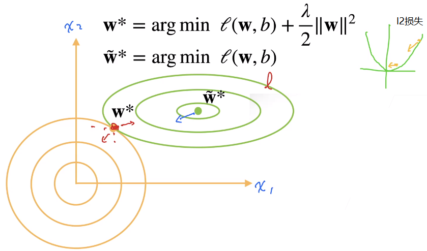

## 权重衰退：处理过拟合

- ### 使用均方范数作为硬性限制

  - 通过限制参数值的选择范围来控制模型容量
    - min l(w,b)  ，受限于 $|| w ||^2 ≤ θ$
  - 通常不限制偏移b  (限不限制都差不多)
  - 小的θ意味着更强的正则项（限制条件）

- ### 使用均方范数作为柔性限制

  - 对于每个θ，都可以找到 λ 使得之前的目标函数等价于：$min\ l(w,b)+\frac{λ}{2}||w||^2$

    - 可以通过拉格朗日乘子来证明

  - 超参数λ控制了正则项的重要程度

    - λ = 0：无作用
    - λ → ∞，最优解 w*→0

  - #### 对损失的影响

    - L2正则项会对大数值的权值进行乘法，估计权值分散，将所有特征运用起来
    - 惩罚项就是为了限制参数的取值范围，加入惩罚项会对最优解产生影响
    - 正则项就是防止损失函数最优导致过拟合
    -  
      - 绿色圆是l，橙色圆是惩罚项
      - l2损失在原点处的拉力会小于在曲线上方的拉力 =》也就是梯度大小
      - 因此惩罚对于$\widetilde W*$的拉力会大于W *，而W再往橙色靠，惩罚项弥补不了损失项，因此 W * 在惩罚和损失的情况最优

- ### 参数更新法则

  - 计算梯度
    - $\huge \frac{∂}{∂w}(\mathcal l(w,b)+\frac{λ}{2}||w||^2) = \frac{∂l(w,b)}{∂w} + λw$
  - 时间 t 更新参数   $\huge  w_{t+1}= w_t-\eta\frac{∂}{∂w_t}$
    - $\huge w_{t+1} = (1-\eta λ)w_t-\eta\frac{∂l(w_t,b_t)}{∂w_t}$
    - 通常 $\eta λ$ < 1 ，在深度学习中叫做权重衰退
    - 想要让损失函数降低就要往梯度的反方向走，因此需要减去梯度  =》梯度下降

## 总结

- 权重衰退通过L2正则项使得模型参数不会过大，从而控制模型的复杂度
- 正则项权重是控制模型复杂度的超参数