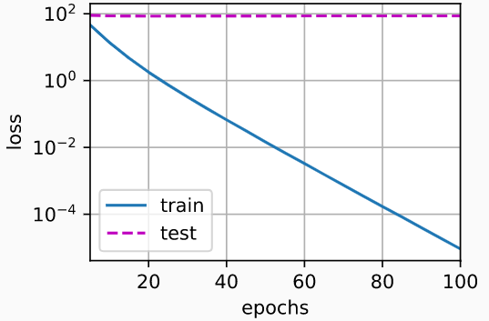
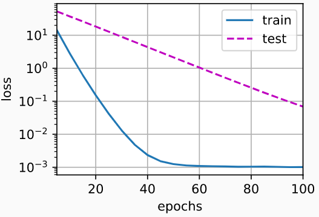

## 权重衰退

```python
%matplotlib inline
import torch
from torch import nn
from d2l import torch as d2l
```

- 给定x，我们生成训练和测试数据的标签：$\large y=0.05+\sum^d_i0.01x_i+ϵ ,其中 ϵ∼N(0,0.01^2).$

- 0.05为偏置，0.01为权重，$x_i$ 为输入 ，ϵ 为噪音

- 标签是关于输入的线性函数。 标签同时被均值为0，标准差为0.01高斯噪声破坏。 

- 为了使过拟合的效果更加明显，我们可以将问题的维数增加到d=200

- ```python
  n_train, n_test, num_inputs, batch_size = 20, 100, 200, 5
  true_w, true_b = torch.ones((num_inputs, 1)) * 0.01, 0.05
  train_data = d2l.synthetic_data(true_w, true_b, n_train)
  train_iter = d2l.load_array(train_data, batch_size)
  test_data = d2l.synthetic_data(true_w, true_b, n_test)
  test_iter = d2l.load_array(test_data, batch_size, is_train=False)
  ```

  

## 从头开始实现权重衰减，只需将L2的平方惩罚添加到原始目标函数中

## 初始化模型参数

- 定义一个函数来随机初始化模型参数

  - ```python
    def init_params():
        w = torch.normal(0, 1, size=(num_inputs, 1), requires_grad=True)
        b = torch.zeros(1, requires_grad=True)
        return [w, b]
    ```

- 定义L2范数惩罚

  - ```python
    def l2_penalty(w):
        return torch.sum(w.pow(2)) / 2
    ```

## 定义训练代码实现

- 线性网络和平方损失没有变化， 所以我们通过`d2l.linreg`和`d2l.squared_loss`导入它们。 唯一的变化是损失现在包括了惩罚项。

  - ```python
    def train(lambd):
        w, b = init_params()
        net, loss = lambda X: d2l.linreg(X, w, b), d2l.squared_loss
        num_epochs, lr = 100, 0.003
        animator = d2l.Animator(xlabel='epochs', ylabel='loss', yscale='log',
                                xlim=[5, num_epochs], legend=['train', 'test'])
        for epoch in range(num_epochs):
            for X, y in train_iter:
                # 增加了L2范数惩罚项，
                # 广播机制使l2_penalty(w)成为一个长度为batch_size的向量
                l = loss(net(X), y) + lambd * l2_penalty(w)
                l.sum().backward()
                d2l.sgd([w, b], lr, batch_size)
            if (epoch + 1) % 5 == 0:
                animator.add(epoch + 1, (d2l.evaluate_loss(net, train_iter, loss),
                                         d2l.evaluate_loss(net, test_iter, loss)))
        print('w的L2范数是：', torch.norm(w).item())
    ```

## 忽略正则化直接训练

- 用`lambd = 0`禁用权重衰减后运行这个代码。 注意，这里训练误差有了减少，但测试误差没有减少，意味着出现了严重的过拟合。

  - ```python
    train(lambd=0)
    # output ：w的L2范数是： 14.305890083312988
    ```

    

## 使用权重衰减

- 训练误差增大，但测试误差减小

  - ```python
    train(lambd=3)
    # output ：w的L2范数是： 0.35748809576034546
    ```

    

## 权重衰减简洁实现

- 由于更新的权重衰减部分仅依赖于每个参数的当前值， 因此优化器必须至少接触每个参数一次。

- 实例化优化器时直接通过`weight_decay`指定weight decay超参数。 默认情况下，PyTorch同时衰减权重和偏移。 这里我们只为权重设置了`weight_decay`，所以偏置参数b不会衰减

  - ```python
    def train_concise(wd):
        net = nn.Sequential(nn.Linear(num_inputs, 1))
        for param in net.parameters():
            param.data.normal_()
        loss = nn.MSELoss(reduction='none')
        num_epochs, lr = 100, 0.003
        # 偏置参数没有衰减
        trainer = torch.optim.SGD([
            {"params":net[0].weight,'weight_decay': wd},
            {"params":net[0].bias}], lr=lr)
        animator = d2l.Animator(xlabel='epochs', ylabel='loss', yscale='log',
                                xlim=[5, num_epochs], legend=['train', 'test'])
        for epoch in range(num_epochs):
            for X, y in train_iter:
                trainer.zero_grad()
                l = loss(net(X), y)
                l.mean().backward()
                trainer.step()
            if (epoch + 1) % 5 == 0:
                animator.add(epoch + 1,
                             (d2l.evaluate_loss(net, train_iter, loss),
                              d2l.evaluate_loss(net, test_iter, loss)))
        print('w的L2范数：', net[0].weight.norm().item())
        
    train_concise(0)
    # output：w的L2范数： 13.08244800567627
    train_concise(3)
    # output：w的L2范数： 13.08244800567627
    ```