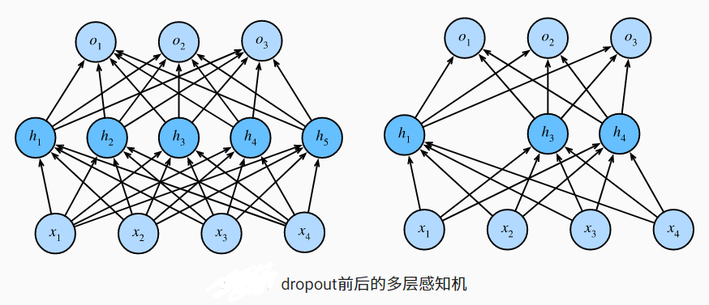

## 动机

- 一个好的模型需要对输入数据的扰动鲁棒
  - 使用有噪音的数据等价于Tikhonov正则
  - 丢弃法：在层之间加入噪音

## 无偏差的加入噪音

- 对于x加入噪音得到x，我们希望 E[ x' ] = x   =》 $\large E[ x' ] = p·0+(1-p)\frac{x_i}{1-p} = x_i$
- 丢弃法对每个元素进行如下扰动：$$\large x'_i= \begin{cases} 	0, & \text{给定概率p}\\ 	\frac{x_i}{1-p},& \text{otherwise} \end{cases} $$

## 使用Dropout

- 通常将其作用在隐藏全连接层的输出上
- $h = \sigma(W_1x+b_1)$    h' = dropout(h)         $o =W_2h' + b_2 $      y = softmax(o)
- 

## 推理（预测）中的丢弃法

- 正则项只在训练中使用：他们影响模型参数的更新
- 在推理过程中，dropout直接返回输入 h = dropout( h )  ，能保证准确性的输出

## 总结

- 丢弃法将一些输出项随机置为0来控制模型复杂度
- 肠作用域多层感知机的隐藏层输出上
- dropout概率是控制模型复杂度的超参数