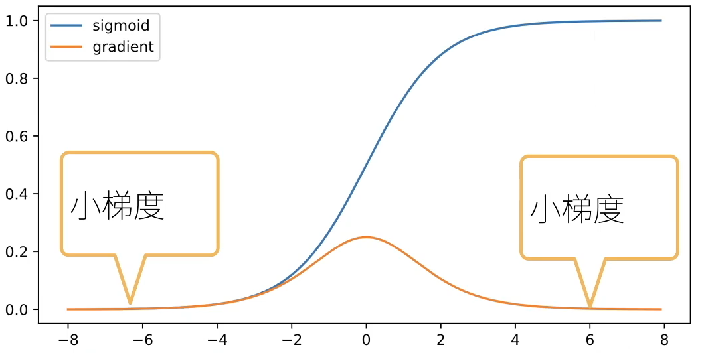
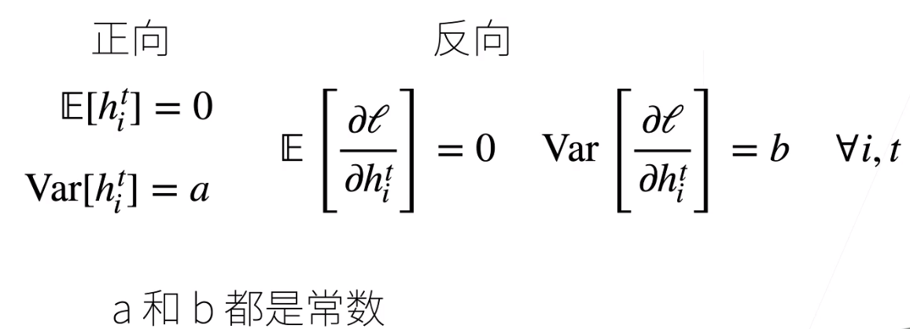
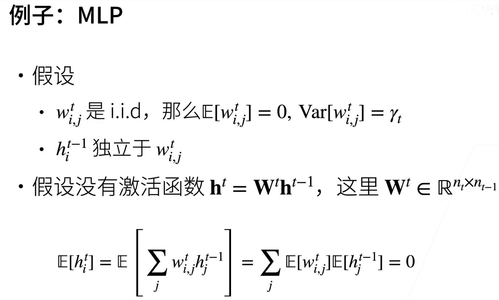
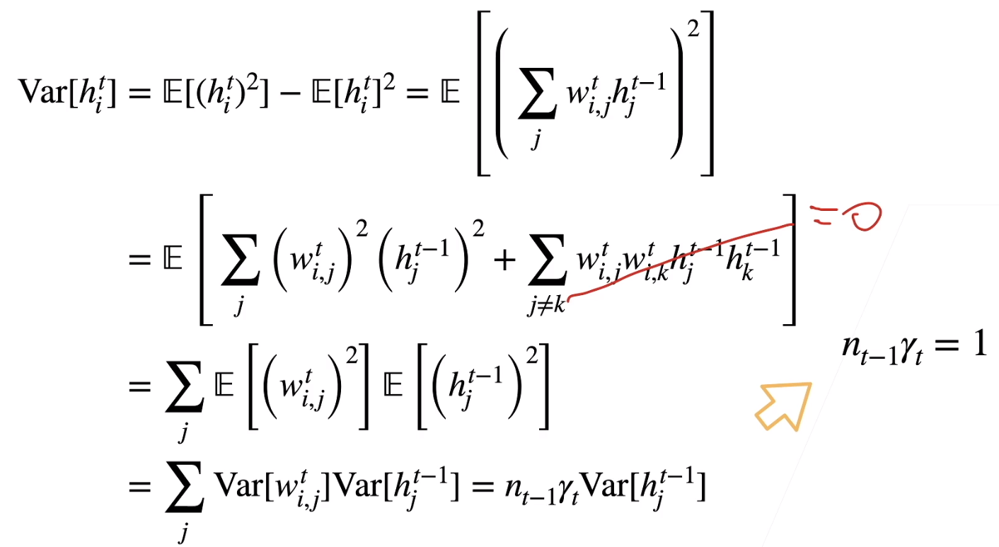
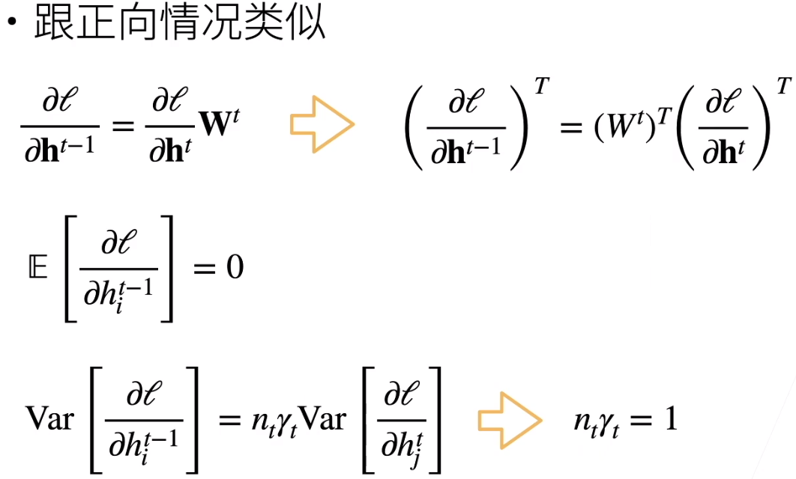
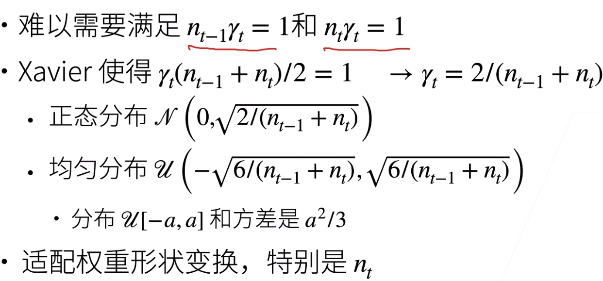
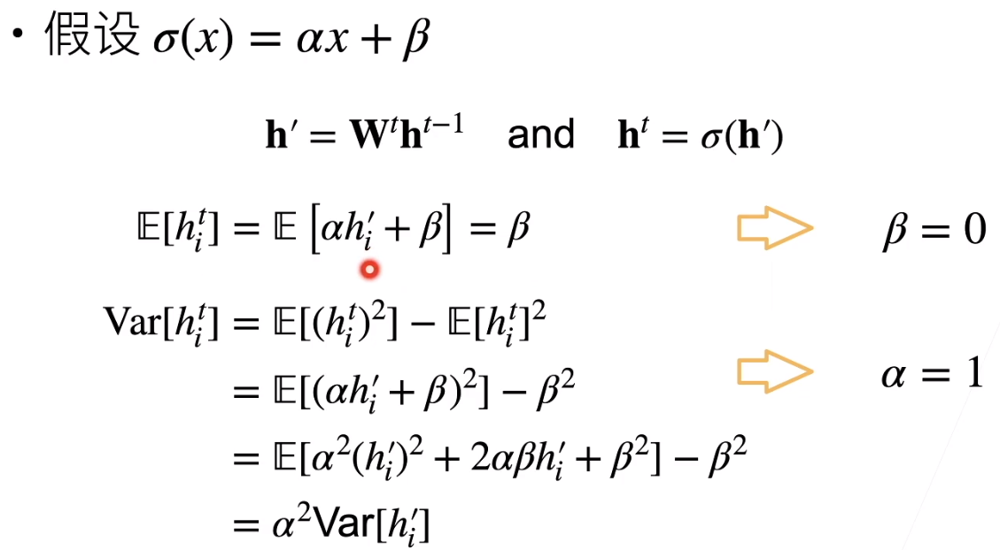
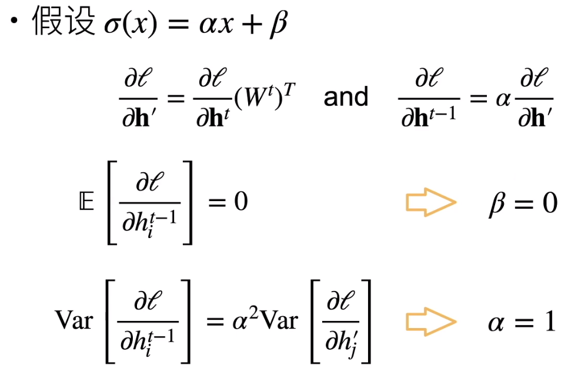

## 神经网络的梯度

- 考虑一个具有L层、输入x和输出o的深层网络。 每一层l由变换fl定义， 该变换的参数为权重W(l)， 其隐藏变量是h(l)（令 h(0)=x）。 我们的网络可以表示为：$h^t = f_t(h^{t-1}) and y =\mathcal l ○f_d○...○f_1(x)$
- 计算损失 l 关于参数 $W_t$ 的梯度
  - $\large \frac{\partial l}{\partial W^t} = \underbrace {\frac{\partial l}{\partial h^d} \frac{\partial h^d}{\partial h^{d-1}} ... \frac{\partial h^{t+1}}{\partial h^t}\frac{\partial h^{t}}{\partial W^t}}_{d-t次矩阵乘法}$

## 稳定性的常见两个问题

- 梯度下降
- 梯度消失
- 例子：MLP
  - $f_t(h^{t-1}) = \sigma(W^th^{t-1})$   $\sigma$ 是激活函数
  - $\large \frac{\partial h^t}{\partial h^{t-1}} = diag(\sigma'(W^th^{t-1}))(W^t)^T$  $\sigma'$是$\sigma$ 的导数函数
  - $\prod^{d-1}_{i = t} \frac{\partial h^{i+1}}{\partial h^{ti}} = \prod^{d-1}_{i = t} diag(\sigma'(W^ih^{i-1}))(W^i)$

## 梯度爆炸的问题

- 值超出值域
  - 对于16位浮点数尤为严重(6e-5 - 6e4)
- 对学习率敏感
  - 如果学习率太大->打参数值->更大的梯度
  - 如果学习率太小->训练无进展
  - 我们可能需要在训练过程不断调整学习率

## 梯度消失的问题

- 使用sigmoid作为激活函数
  - $\sigma(x) =\frac{1}{1+e^{-x}}$   $\sigma'(x) = \sigma(x)(1-\sigma(x))$
  -  
  - $\large \prod^{d-1}_{i = t} \frac{\partial h^{i+1}}{\partial h^{ti}} = \prod^{d-1}_{i = t} diag(\sigma'(W^ih^{i-1}))(W^i)$的元素值是d-t个小数值的乘积
- 梯度值变为0
  - 对16位浮点数尤为严重
- 训练没有进展
  - 不管如何选择学习率
- 对于底部层尤为严重
  - 仅仅顶部层训练的较好
  - 无法让神经网络更深

## 总结

- 当数值过大或过小时会导致数值问题
- 常发生在深度模型中，因为其会对n个数累乘

## 让训练更加稳定

- 目标：让梯度值在合理的范围内，如[1e-6,1e3]
- 将乘法变加法，ResNet，LSTM
- 归一化： 梯度归一化，梯度裁剪
- 合理的权重初始和激活函数

## 让每层的方差是一个常数

- 将每层的输出和梯度看做是随机变量
- 让他们的均值和方差都保持一致
- 

## 权重初始化

- 在合理值区间随机初始参数
- 训练开始的时候更容易有数值不稳定
  - 原理最优解的地方损失函数表变可能很复杂
  - 最优解附近表面会比较平
- 使用$\mathcal N(0,0.01)$ 来初始可能对小网络没问题，但不能保证深度神经网络

 

- wt是独立同分布的随机变量

## 正向方差

## 反向均值和方差

## Xavier初始

 

## 假设线性的激活函数

反向：

## 总结

- 合理的权重初始值和激活函数的选取可以提升数值稳定性

