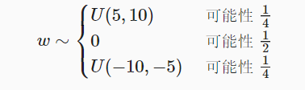

## 参数管理

- 具有单隐藏层的多层感知机

- ```python
  import torch
  from torch import nn
  
  net = nn.Sequential(nn.Linear(4, 8), nn.ReLU(), nn.Linear(8, 1))
  X = torch.rand(size=(2, 4))
  net(X)
  ```

### 参数访问

- 当通过`Sequential`类定义模型时， 我们可以通过索引来访问模型的任意层。 这就像模型是一个列表一样，每层的参数都在其属性中。 如下所示，我们可以检查第二个全连接层的参数。

  - ```python
    print(net[2].state_dict())
    # output：OrderedDict([('weight', tensor([[ 0.0743,  0.1876,  0.0571,  0.3447,  0.3483, -0.2867,  0.3273, -0.1527]])), ('bias', tensor([0.1162]))])
    ```

- ### 目标参数

  - ```python
    print(type(net[2].bias))
    print(net[2].bias)
    print(net[2].bias.data)
    net[2].weight.grad == None   # output: True,因为还未进行梯度计算
    ''' output:
    <class 'torch.nn.parameter.Parameter'>
    Parameter containing:
    tensor([0.1162], requires_grad=True)
    tensor([0.1162])
    '''
    
    #一次性访问所有参数
    print(*[(name, param.shape) for name, param in net[0].named_parameters()])
    print(*[(name, param.shape) for name, param in net.named_parameters()])
    '''
    ('weight', torch.Size([8, 4])) ('bias', torch.Size([8]))
    ('0.weight', torch.Size([8, 4])) ('0.bias', torch.Size([8])) 
    ('2.weight', torch.Size([1, 8])) ('2.bias', torch.Size([1]))
    '''
    net.state_dict()['2.bias'].data  # output： tensor([0.1162])
    ```

- 从嵌套块收集参数

  ```python
  def block1():
      return nn.Sequential(nn.Linear(4, 8), nn.ReLU(),
                           nn.Linear(8, 4), nn.ReLU())
  
  def block2():
      net = nn.Sequential()
      for i in range(4):
          # 在这里嵌套
          net.add_module(f'block {i}', block1())
      return net
  
  rgnet = nn.Sequential(block2(), nn.Linear(4, 1))
  rgnet(X)  # output：tensor([[0.0359],[0.0358]], grad_fn=<AddmmBackward0>)
  print(rgnet)
  ''' output:
  Sequential(
    (0): Sequential(
      (block 0): Sequential(
        (0): Linear(in_features=4, out_features=8, bias=True)
        (1): ReLU()
        (2): Linear(in_features=8, out_features=4, bias=True)
        (3): ReLU()
      )
      (block 1): Sequential(
        (0): Linear(in_features=4, out_features=8, bias=True)
        (1): ReLU()
        (2): Linear(in_features=8, out_features=4, bias=True)
        (3): ReLU()
      )
      (block 2): Sequential(
        (0): Linear(in_features=4, out_features=8, bias=True)
        (1): ReLU()
        (2): Linear(in_features=8, out_features=4, bias=True)
        (3): ReLU()
      )
      (block 3): Sequential(
        (0): Linear(in_features=4, out_features=8, bias=True)
        (1): ReLU()
        (2): Linear(in_features=8, out_features=4, bias=True)
        (3): ReLU()
      )
    )
    (1): Linear(in_features=4, out_features=1, bias=True)
  )
  '''
  ```

## 初始化参数

- ### 内置初始化

  - 将所有权重参数初始化为标准差为0.01的高斯随机变量， 且将偏置参数设置为0

  - ```python
    def init_normal(m):
        if type(m) == nn.Linear:
            nn.init.normal_(m.weight, mean=0, std=0.01)  # _结尾说明是一个替换函数，直接替换值，不返回值
            nn.init.zeros_(m.bias)
    net.apply(init_normal) # apply 对于所有net里的layer 进行递归遍历 对所有都执行init_normal
    net[0].weight.data[0], net[0].bias.data[0]  
    # output：(tensor([ 0.0031,  0.0125,  0.0014, -0.0121]), tensor(0.))
    ```

  - 可以将所有参数初始化为给定的常数，比如初始化为1

    - ```python
      def init_constant(m):
          if type(m) == nn.Linear:
              nn.init.constant_(m.weight, 1)
              nn.init.zeros_(m.bias)
      net.apply(init_constant)
      net[0].weight.data[0], net[0].bias.data[0]  # output：(tensor([1., 1., 1., 1.]), tensor(0.))
      ```

  - 还可以对某些块应用不同的初始化方法。 使用Xavier初始化第一个神经网络层， 第三个神经网络层初始化为常量值42。

    - ```python
      def xavier(m):
          if type(m) == nn.Linear:
              nn.init.xavier_uniform_(m.weight)
      def init_42(m):
          if type(m) == nn.Linear:
              nn.init.constant_(m.weight, 42)
      
      net[0].apply(xavier)
      net[2].apply(init_42)
      print(net[0].weight.data[0])  # output：tensor([-0.3261, -0.5587,  0.0063, -0.3914])
      print(net[2].weight.data)  # output：tensor([[42., 42., 42., 42., 42., 42., 42., 42.]])
      ```

- ### 自定义初始化

  - 我们使用以下的分布为任意权重参数w定义初始化方法：

    - ```python
      def my_init(m):
          if type(m) == nn.Linear:
              print("Init", *[(name, param.shape)
                              for name, param in m.named_parameters()][0])
              nn.init.uniform_(m.weight, -10, 10)  # uniform 均匀初始化
              m.weight.data *= m.weight.data.abs() >= 5  # 保留w*w绝对值大于5的权重
      # output：
      # Init weight torch.Size([8, 4])
      # Init weight torch.Size([1, 8])
      net.apply(my_init)
      net[0].weight[:2]
      # output：tensor([[-0.0000,  8.0813, -0.0000, -6.7370],
      #                 [-9.4638, -7.5112, -5.1031,  0.0000]], grad_fn=<SliceBackward0>)
      ```

  - 直接替换参数

    - ```python
      net[0].weight.data[:] += 1
      net[0].weight.data[0, 0] = 42
      net[0].weight.data[0]
      # output：tensor([42.0000,  9.0813,  1.0000, -5.7370])
      ```

- ### 参数绑定

  - 希望在多个层间共享参数： 我们可以定义一个稠密层，然后使用它的参数来设置另一个层的参数

    - ```python
      # 我们需要给共享层一个名称，以便可以引用它的参数
      shared = nn.Linear(8, 8)
      net = nn.Sequential(nn.Linear(4, 8), nn.ReLU(),
                          shared, nn.ReLU(),
                          shared, nn.ReLU(), 
                          nn.Linear(8, 1))
      net(X)
      # 检查参数是否相同
      print(net[2].weight.data[0] == net[4].weight.data[0])
      net[2].weight.data[0, 0] = 100
      # 确保它们实际上是同一个对象，而不只是有相同的值
      print(net[2].weight.data[0] == net[4].weight.data[0])
      # output
      # tensor([True, True, True, True, True, True, True, True])
      # tensor([True, True, True, True, True, True, True, True])
      ```