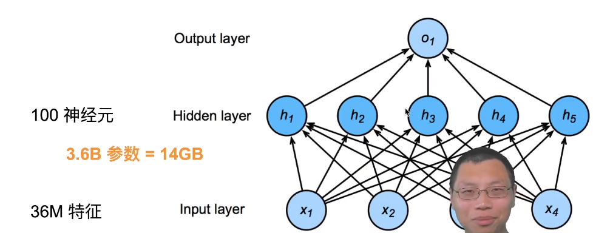
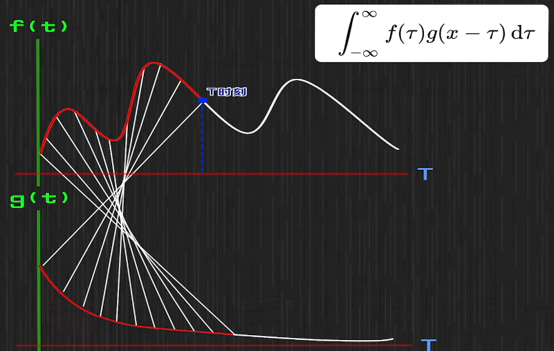
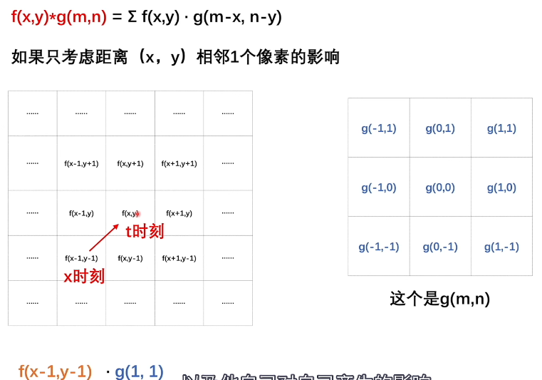

## 分类猫和狗的图片

- 使用相机采集图片
- RGB图片36Million
- 使用100大小的单隐藏层MLP，模型有3.6Billion元素
  - 远多于世界上所有猫和狗的总数(900M狗，600M猫)

## 单隐藏层MLP

 

## 重新考察全连接层

- 将输入和输出变形为矩阵（宽度，高度）
- 将权重变形为4-D张量(h,w) 到 （h‘，w’）
  - $\huge h_{i,j} = \sum_{k,l}w_{i,j,k,l}x_{k,l} = \sum_{a,b}v_{i,j,a,b}x_{i+a,j+b}$
  - V是W的重新索引$\huge v_{i,j,a,b}  = w_{i,j,k,l}$

## 两个原则

- **平移不变性**：不管检测对象出现在图像中的哪个位置，神经网络的前面几层应该对相同的图像区域具有相似的反应
  - x的平移导致h的平移 $\huge h_{i,j} = \sum_{a,b}\limits v_{i,j,a,b}x_{i+a,j+b}$
  - v不应该依赖于(i,j)
  - 因此$\huge v_{i,j,a,b} = v_{a,b}$
  - $\huge h_{i,j} = \sum_{a,b}\limits v_{a,b}x_{i+a,j+b}$
  - 这就是二维交叉相关
- **局部性**：神经网络的前面几层应该只探索输入图像中的局部区域，而不过度在意图像中相隔较远区域的关系
  - $\huge h_{i,j} = \sum_{a,b}\limits v_{a,b}x_{i+a,j+b}$
  - 当评估$h_{i,j}$时，我们不应该用远离$x_{i,j}$的参数
  - 解决方案：当|a|，|b|＞$\Delta$,使得$v_{a,b} = 0$
  - $\huge h_{i,j} = \sum_{a= -\Delta}^{\Delta} \limits \sum_{b= -\Delta}^{\Delta} \limits v_{a,b}x_{i+a,j+b}$  
  - **即：用一个卷积核进行限制**

## 卷积是特殊的全连接层，对全连接层使用平移不变形和局部性得到卷积层

- $\huge h_{i,j} = \sum_{a,b}\limits v_{a,b}x_{i+a,j+b}$   ===> $\huge h_{i,j} = \sum_{a= -\Delta}^{\Delta} \limits \sum_{b= -\Delta}^{\Delta} \limits v_{a,b}x_{i+a,j+b}$  

## 卷积的含义 

- ###  https://www.bilibili.com/video/BV1VV411478E?from=search&seid=1725700777641154181

- 卷积公式 $\int_{-∞}^∞ f(τ)g(t-τ)$:    以人体消化为例：

  - f(x) 当前的总量 ，g(t-x)：t时刻后，所消耗的比例  因此 计算t时刻后   $\int_0^t f(x)g(t-x)$
  - 

- 总结：一个系统，输入不稳定 f()，输出稳定g()，就可以用卷积求系统存量

- ### 卷积神经网络

  - 取一个卷积核(3*3) ，将卷积核映射在图像的点阵上，
  - 然后进行点阵与卷积核相乘后结果相加得到一个新的像素值然后得到一个新的图像，
  - 因为映射会少一圈，因此会在图像的最外层加一圈0，最后就可以得到一个新的同样大小的图片
  - 
  - $\int_{-∞}^∞ f(τ)g(t-τ)$

  - 卷积核：规定了周围的像素点是如何对当前像素点产生影响的，
  - 图像的卷积操作：通过卷积核对周围像素点的主动试探和选择，通过卷积核把周围有用的特征保留下来
    - 
    -  
  - 总结
    - 不稳定输入、稳定输出 =》求系统存量  （信号系统应用）
    - 周围像素点如何产生影响   （图像处理应用）
    - 一个像素点如何试探   （图像识别应用）