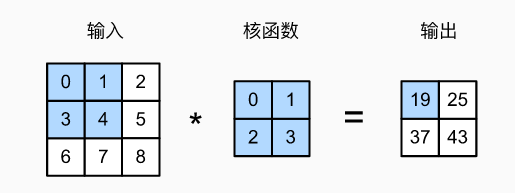

## 二维卷积层

 

- 输入X:$n_h × n_w$
- 核W：$k_h × k_w$
- 偏差b∈R
- 输出Y ： $(n_h - k_h +1) × (n_w - k_w + 1)$       Y=X×W+b
- W和b是可学习的参数

## 二维交叉相关 VS 卷积

- 二维交叉相关
  - $\huge h_{i,j} = \sum_{a= 1}^{h} \limits \sum_{b= 1}^{w} \limits w_{a,b}x_{i+a,j+b}$  
- 二维卷积
  - $\huge h_{i,j} = \sum_{a= 1}^{h} \limits \sum_{b= 1}^{w} \limits w_{-a,-b}x_{i+a,j+b}$ 
- 由于对称性，在实际使用中没有区别

## 一维和三维交叉相关

- 一维：$\huge y_{i} = \sum_{a= 1}^{h} \limits  w_{a}x_{i+a}$
  - 文本、语言、时序序列
- 三维：$\huge y_{i,j,k} = \sum_{a= 1}^{h} \limits \sum_{b= 1}^{w} \limits \sum_{c= 1}^{h} \limits w_{a,b,c}x_{i+a,j+b,k+c}$
  - 视频、医学图像、气象地图

## 总结

- 卷积层将输入和核矩阵进行交叉相关，加上偏移后得到输出
- 核矩阵和偏移是可学习参数
- 核矩阵的大小是超参数