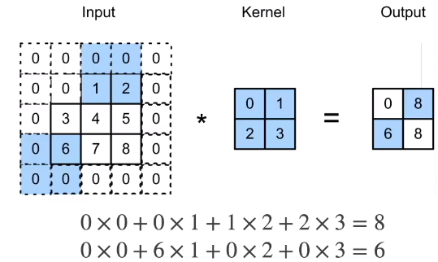

## 填充

- 填充$p_h$ 行 和$p_w$列，输出形状为 $(n_h-k_h+p_h + 1) × (n_w- k_w+ p_w +1)$
- 通常取 $p_h = k_h -1,p_w = k_w-1$
  - 当$k_h$ 为奇数时，在上下两侧填充$p_h/2$
  - 当$k_h$ 为偶数时，在上下两侧填充$p_h/2$，在左右两侧填充$p_h/2$

## 步幅

- 填充减小的输出大小与层数线性相关
  - 给定数大小224x224，在使用5x5卷积核的情况下，需要55层将输出降低到4x4
  - 需要大量计算才能得到较小输出
- 步幅是指行/列的滑动步长
  - 例：高度3宽度2的步幅
- 给定高度$s_h$,和宽度$s_w$ 的步幅，输出形状是 $[(n_h-k_h+p_h + s_h)/s_h] × [(n_w- k_w+ p_w +s_w)/s_w]$
- 如果 $p_h = k_h -1,p_w = k_w-1$，
  - $[(n_h+ s_h-1)/s_h] × [(n_w +s_w-1)/s_w]$   # [ ] 内数值向上取整
- 如果输入高度和宽度可以被步幅整除 $(n_h/s_h)×(n_w/s_w)$

## 总结

- 填充和步幅是卷积层的超参数
- 填充在输入周围添加额外的行/列，来控制输出形状的减少量
- 步幅是每次滑动核窗口时的行/列的步长，可以成倍的减少输出形状