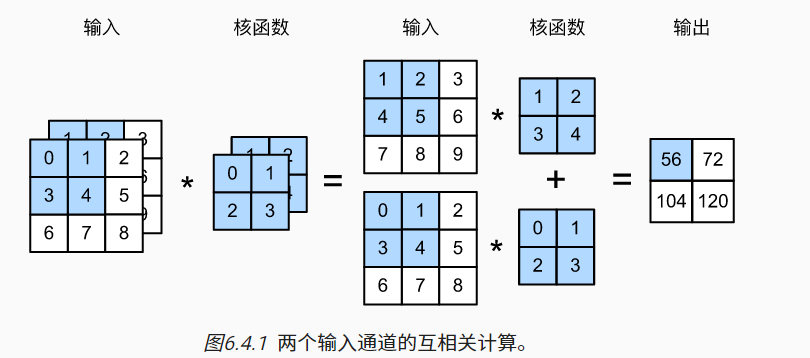

## 多输入通道互相关运算

- ```python
  import torch
  from d2l import torch as d2l
  
  def corr2d_multi_in(X, K):
      # 先遍历“X”和“K”的第0个维度（通道维度），再把它们加在一起
      return sum(d2l.corr2d(x, k) for x, k in zip(X, K))
  
  # 值相对应的输入张量X和核张量K，以验证互相关运算的输出
  X = torch.tensor([[[0.0, 1.0, 2.0], [3.0, 4.0, 5.0], [6.0, 7.0, 8.0]],
                 [[1.0, 2.0, 3.0], [4.0, 5.0, 6.0], [7.0, 8.0, 9.0]]])
  K = torch.tensor([[[0.0, 1.0], [2.0, 3.0]], [[1.0, 2.0], [3.0, 4.0]]])
  
  corr2d_multi_in(X, K)   
  # tensor([[ 56.,  72.],
  #         [104., 120.]])
  ```

## 多输出通道互相关

- ```python
  def corr2d_multi_in_out(X, K):
      # 迭代“K”的第0个维度，每次都对输入“X”执行互相关运算。
      # 最后将所有结果都叠加在一起
      return torch.stack([corr2d_multi_in(X, k) for k in K], 0)
  
  # 将核张量K与K+1（K中每个元素加）和K+2连接起来，构造了一个具有3个输出通道的卷积核
  K = torch.stack((K, K + 1, K + 2), 0)
  K.shape # torch.Size([3, 2, 2, 2])
  
  # 对输入张量X与卷积核张量K执行互相关运算。现在的输出包含3个通道
  corr2d_multi_in_out(X, K)
  '''
  tensor([[[ 56.,  72.],
           [104., 120.]],
  
          [[ 76., 100.],
           [148., 172.]],
  
          [[ 96., 128.],
           [192., 224.]]])
  '''
  ```

## 1x1的卷积

- ```python
  def corr2d_multi_in_out_1x1(X, K):
      c_i, h, w = X.shape
      c_o = K.shape[0]
      X = X.reshape((c_i, h * w))
      K = K.reshape((c_o, c_i))
      # 全连接层中的矩阵乘法
      Y = torch.matmul(K, X)
      return Y.reshape((c_o, h, w))
      
  X = torch.normal(0, 1, (3, 3, 3))
  K = torch.normal(0, 1, (2, 3, 1, 1))
  
  Y1 = corr2d_multi_in_out_1x1(X, K)
  Y2 = corr2d_multi_in_out(X, K)
  assert float(torch.abs(Y1 - Y2).sum()) < 1e-6
  ```