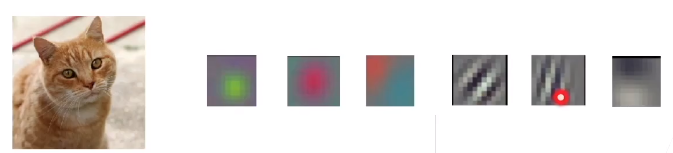

## 多输入通道

- 彩色图片有RGB三个通道
- 转换为灰度会丢失信息
- 多通道情况：每个通道都有一个卷积核，结果是所有通道卷积结果的和
  - 输入X:$c_i× n_h × n_w$
  - 核W：$ c_i× k_h × k_w$
  - 输出Y ： $m_h × m_w$ 

## 多个输出通道

- 无论有多输入通道，都只用到单输出通道
- 我们可以有多个三维卷积核，每个核生成一个输出通道
- 输入X:$c_i× n_h × n_w$
- 核W：$ c_i×  c_o× k_h × k_w$
- 输出Y ： $c_o× m_h × m_w$ 

## 多个输入和输出通道

- 每个输出通道可以识别特定模式
  -  
- 输入通道核识别并组合输入中的模式

## 1x1卷积层

$k_h = k_w = 1$是一个受欢迎的选择，不识别空间模式，只是融合通道

相当于输入形状$n_h n_w × c_j$，权重为$c_o×c_j$的全连接