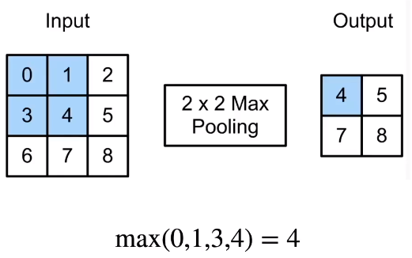

## 池化层：返回窗口中的最大或平均值

- 卷积对位置敏感，不是一个特别好的事情
- 需要一定程度的平移不变性
- 缓解卷积层对位置的敏感性

## 最大池化：每个窗口中最强的模式信号

- 返回滑动窗口中的最大值
- 

## 填充、步幅和多个通道

- 池化层与卷积层类似，都具有填充和步幅
- 没有可学习参数
- 每个输入通道应用池化层以获得相应的输出通道
- 输出通道数=输入通道数

## 平均池化层：柔和化

- 返回滑动窗口中的平均值