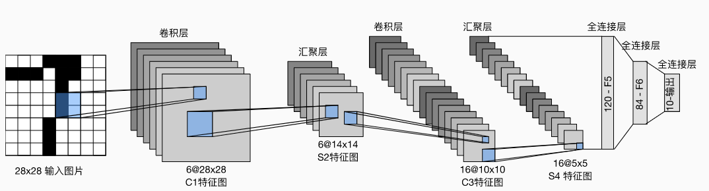
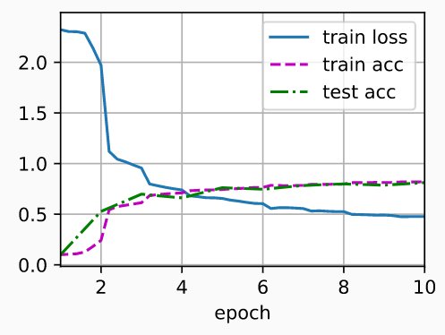

## LeNet（LeNet-5）由两个部分组成：

- 卷积编码器：由两个卷积层组成;
- 全连接层密集块：由三个全连接层组成。
- 
- 每个卷积块中的基本单元是一个卷积层、一个sigmoid激活函数和平均汇聚层（池化层）
- 每个卷积层使用5×5卷积核和一个sigmoid激活函数，这些层将输入映射到多个二维特征输出，通常同时增加通道的数量
- 第一卷积层有6个输出通道，而第二个卷积层有16个输出通道。
- 每个进行平均池化操作，2×2的核 通过空间下采样将像素 减少4倍。卷积的输出形状由批量大小、通道数、高度、宽度决定
- 为了将卷积块的输出传递给稠密块，我们必须在小批量中展平每个样本。即 将这个四维输入转换成全连接层所期望的二维输入。
  - 这里的二维表示的第一个维度索引小批量中的样本，第二个维度给出每个样本的平面向量表示。

- LeNet的稠密块有三个全连接层，分别有120、84和10个输出。
- 因为我们在执行分类任务，所以输出层的10维对应于最后输出结果的数量。

## 总结

- 先用卷积层来学习图片空间信息，
- 通过池化层降低图片敏感度
- 然后用全连接层来转换到类别空间

## 代码实现

- ### 实例化一个`Sequential`块并将需要的层连接在一起

- ```python
  import torch
  from torch import nn
  from d2l import torch as d2l
  
  class Reshape(torch.nn.Module):
      def forward(self, x):
          return x.view(-1, 1, 28, 28)  # 批量数自适应，通道数为1，输入输出 28x28
  
  net = nn.Sequential(
      Reshape(),
      nn.Conv2d(1, 6, kernel_size=5, padding=2), nn.Sigmoid(), # 输入通道1，输出 6 ，核5x5 ，填充 2，sigmoid非线性性
      nn.AvgPool2d(kernel_size=2, stride=2),  # 平均池化，核2x2，   步幅 2，不重叠的窗口
      nn.Conv2d(6, 16, kernel_size=5), nn.Sigmoid(),  # 输入6，输出16，核5x5
      nn.AvgPool2d(kernel_size=2, stride=2),
      nn.Flatten(),  #将4D转成2D,第一维 ：批量保持住，后面所有的都拉成一个向量
      nn.Linear(16 * 5 * 5, 120), nn.Sigmoid(),  # 根据最后一层的pooling 计算输入 16*5*5
      nn.Linear(120, 84), nn.Sigmoid(),  # 将120降到84
      nn.Linear(84, 10)) # 将84降到10
  
  X = torch.rand(size=(1, 1, 28, 28), dtype=torch.float32)
  for layer in net:
      X = layer(X)
      print(layer.__class__.__name__,'output shape: \t',X.shape)
  ''' 
  在整个卷积块中，与上一层相比，每一层特征的高度和宽度都减小了。 
  第一个卷积层使用2个像素的填充，来补偿卷积核导致的特征减少。 
  相反，第二个卷积层没有填充，因此高度和宽度都减少了4个像素。 
  随着层叠的上升，通道的数量从输入时的1个，增加到第一个卷积层之后的6个，再到第二个卷积层之后的16个。 
  同时，每个汇聚层的高度和宽度都减半。
  最后，每个全连接层减少维数，最终输出一个维数与结果分类数相匹配的输出。
  Conv2d output shape:         torch.Size([1, 6, 28, 28])
  Sigmoid output shape:        torch.Size([1, 6, 28, 28])
  AvgPool2d output shape:      torch.Size([1, 6, 14, 14])
  Conv2d output shape:         torch.Size([1, 16, 10, 10])
  Sigmoid output shape:        torch.Size([1, 16, 10, 10])
  AvgPool2d output shape:      torch.Size([1, 16, 5, 5])
  Flatten output shape:        torch.Size([1, 400])
  Linear output shape:         torch.Size([1, 120])
  Sigmoid output shape:        torch.Size([1, 120])
  Linear output shape:         torch.Size([1, 84])
  Sigmoid output shape:        torch.Size([1, 84])
  Linear output shape:         torch.Size([1, 10])
  '''
  ```

- ### 模型训练

  - LeNet在Fashion-MNIST数据集上的表现

    - ```python
      batch_size = 256
      train_iter, test_iter = d2l.load_data_fashion_mnist(batch_size=batch_size)
      ```

  - 由于完整的数据集位于内存中，因此在模型使用GPU计算数据集之前，我们需要将其复制到显存中

    - ```python
      def evaluate_accuracy_gpu(net, data_iter, device=None): #@save
          """使用GPU计算模型在数据集上的精度"""
          if isinstance(net, nn.Module):
              net.eval()  # 设置为评估模式
              if not device:
                  device = next(iter(net.parameters())).device
          # 正确预测的数量，总预测的数量
          metric = d2l.Accumulator(2)
          with torch.no_grad():
              for X, y in data_iter:
                  if isinstance(X, list):
                      # BERT微调所需的
                      X = [x.to(device) for x in X]
                  else:
                      X = X.to(device)
                  y = y.to(device)
                  metric.add(d2l.accuracy(net(X), y), y.numel())
          return metric[0] / metric[1]
      ```

  - Xavier随机初始化模型参数。 与全连接层一样，我们使用交叉熵损失函数和小批量随机梯度下降

    - 在进行正向和反向传播之前，我们需要将每一小批量数据移动到我们指定的设备（例如GPU）上

    - ```python
      #@save
      def train_ch6(net, train_iter, test_iter, num_epochs, lr, device):
          """用GPU训练模型"""
          def init_weights(m):
              if type(m) == nn.Linear or type(m) == nn.Conv2d:
                  nn.init.xavier_uniform_(m.weight)
          net.apply(init_weights)
          print('training on', device)
          net.to(device)
          optimizer = torch.optim.SGD(net.parameters(), lr=lr)
          loss = nn.CrossEntropyLoss()
          animator = d2l.Animator(xlabel='epoch', xlim=[1, num_epochs],
                                  legend=['train loss', 'train acc', 'test acc'])
          timer, num_batches = d2l.Timer(), len(train_iter)
          for epoch in range(num_epochs):
              # 训练损失之和，训练准确率之和，样本数
              metric = d2l.Accumulator(3)
              net.train()
              for i, (X, y) in enumerate(train_iter):
                  timer.start()
                  optimizer.zero_grad()
                  X, y = X.to(device), y.to(device)
                  y_hat = net(X)
                  l = loss(y_hat, y)
                  l.backward()
                  optimizer.step()
                  with torch.no_grad():
                      metric.add(l * X.shape[0], d2l.accuracy(y_hat, y), X.shape[0])
                  timer.stop()
                  train_l = metric[0] / metric[2]
                  train_acc = metric[1] / metric[2]
                  if (i + 1) % (num_batches // 5) == 0 or i == num_batches - 1:
                      animator.add(epoch + (i + 1) / num_batches,
                                   (train_l, train_acc, None))
              test_acc = evaluate_accuracy_gpu(net, test_iter)
              animator.add(epoch + 1, (None, None, test_acc))
          print(f'loss {train_l:.3f}, train acc {train_acc:.3f}, '
                f'test acc {test_acc:.3f}')
          print(f'{metric[2] * num_epochs / timer.sum():.1f} examples/sec '
                f'on {str(device)}')
          
      # 训练和评估LeNet-5    
      lr, num_epochs = 0.9, 10
      train_ch6(net, train_iter, test_iter, num_epochs, lr, d2l.try_gpu())
      ''' output:
      loss 0.476, train acc 0.820, test acc 0.812
      103100.0 examples/sec on cuda:0
      '''
      ```

 