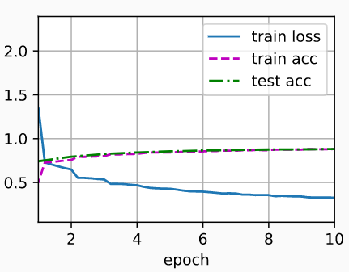

## 代码实现

- 容量控制和预处理

  - ```python
    import torch
    from torch import nn
    from d2l import torch as d2l
    
    net = nn.Sequential(
        # 这里，我们使用一个11*11的更大窗口来捕捉对象。
        # 同时，步幅为4，以减少输出的高度和宽度。
        # 另外，输出通道的数目远大于LeNet
        nn.Conv2d(1, 96, kernel_size=11, stride=4, padding=1), nn.ReLU(),
        nn.MaxPool2d(kernel_size=3, stride=2),
        # 减小卷积窗口，使用填充为2来使得输入与输出的高和宽一致，且增大输出通道数
        nn.Conv2d(96, 256, kernel_size=5, padding=2), nn.ReLU(),
        nn.MaxPool2d(kernel_size=3, stride=2),
        # 使用三个连续的卷积层和较小的卷积窗口。
        # 除了最后的卷积层，输出通道的数量进一步增加。
        # 在前两个卷积层之后，汇聚层不用于减少输入的高度和宽度
        nn.Conv2d(256, 384, kernel_size=3, padding=1), nn.ReLU(),
        nn.Conv2d(384, 384, kernel_size=3, padding=1), nn.ReLU(),
        nn.Conv2d(384, 256, kernel_size=3, padding=1), nn.ReLU(),
        nn.MaxPool2d(kernel_size=3, stride=2),
        nn.Flatten(),
        # 这里，全连接层的输出数量是LeNet中的好几倍。使用dropout层来减轻过拟合
        nn.Linear(6400, 4096), nn.ReLU(),nn.Dropout(p=0.5),
        nn.Linear(4096, 4096), nn.ReLU(),nn.Dropout(p=0.5),
        # 最后是输出层。由于这里使用Fashion-MNIST，所以用类别数为10，而非论文中的1000
        nn.Linear(4096, 10))
    ```

- 构造一个高度和宽度都为224的单通道数据，来观察每一层输出的形状

  - ```python
    X = torch.randn(1, 1, 224, 224)
    for layer in net:
        X=layer(X)
        print(layer.__class__.__name__,'output shape:\t',X.shape)
    
    ''' output:
    Conv2d output shape:         torch.Size([1, 96, 54, 54])
    ReLU output shape:   torch.Size([1, 96, 54, 54])
    MaxPool2d output shape:      torch.Size([1, 96, 26, 26])
    Conv2d output shape:         torch.Size([1, 256, 26, 26])
    ReLU output shape:   torch.Size([1, 256, 26, 26])
    MaxPool2d output shape:      torch.Size([1, 256, 12, 12])
    Conv2d output shape:         torch.Size([1, 384, 12, 12])
    ReLU output shape:   torch.Size([1, 384, 12, 12])
    Conv2d output shape:         torch.Size([1, 384, 12, 12])
    ReLU output shape:   torch.Size([1, 384, 12, 12])
    Conv2d output shape:         torch.Size([1, 256, 12, 12])
    ReLU output shape:   torch.Size([1, 256, 12, 12])
    MaxPool2d output shape:      torch.Size([1, 256, 5, 5])
    Flatten output shape:        torch.Size([1, 6400])
    Linear output shape:         torch.Size([1, 4096])
    ReLU output shape:   torch.Size([1, 4096])
    Dropout output shape:        torch.Size([1, 4096])
    Linear output shape:         torch.Size([1, 4096])
    ReLU output shape:   torch.Size([1, 4096])
    Dropout output shape:        torch.Size([1, 4096])
    Linear output shape:         torch.Size([1, 10])
    '''
    ```

- 读取数据集进行训练

  - ```python
    batch_size = 128
    # Fashion-MNIST图像的分辨率（像素）低于ImageNet图像。 为了解决这个问题，我们将它们增加到224x224
    train_iter, test_iter = d2l.load_data_fashion_mnist(batch_size, resize=224)  # 拉大分辨率
    
    lr, num_epochs = 0.01, 10
    d2l.train_ch6(net, train_iter, test_iter, num_epochs, lr, d2l.try_gpu())
    # output：loss 0.327, train acc 0.881, test acc 0.882
    #			3910.3 examples/sec on cuda:0
    ```

  - 

