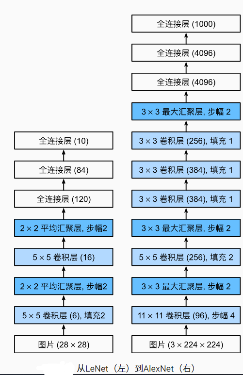

## 机器学习

- 特征提取
- 选择核函数来计算相关性
- 凸优化问题
- 漂亮的定理

## 几何学

- 抽取特征
- 描述几何（例如多相机）
- （非）凸优化
- 漂亮定理
- 如果假设满足了，效果很好

## 特征工程

- 特征工程是关键
- 特征描述子：SIFT,SURF
- 视觉词袋、聚类
- 最后用SVM

## 主要改进

- dropout：模型的控制
- ReLU：梯度更大，比sigmoid支持更深的模型
- MaxPooling：

## AlexNet架构

- 更大的核窗口和步长，因为图片更大了 5x5，2  =》11x11，4
- 更大的池化窗口，使用最大池化层  2x2 =》3x3
- 更多的输出通道 16 =》256
- 新添加了三层卷积层
- 从隐藏层 120 =》4096， 类别10=》1000
- **更多细节**
  - 激活函数从sigmoid变味了ReLU（缓解梯度消失）
  - 隐藏全连接层后加入dropout层
  - 数据增强：在输入图片中增加大量地变种，(局部放大，修改色温。。)

## 总结

- AlexNet是更大更深的LeNet，10倍参数个数、260倍计算复杂度
- 新加入dropout、ReLU，最大池化层和数据增强