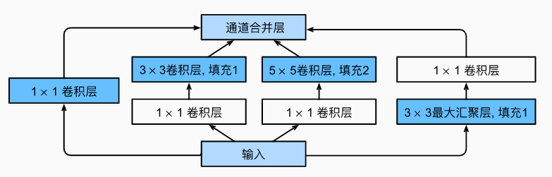
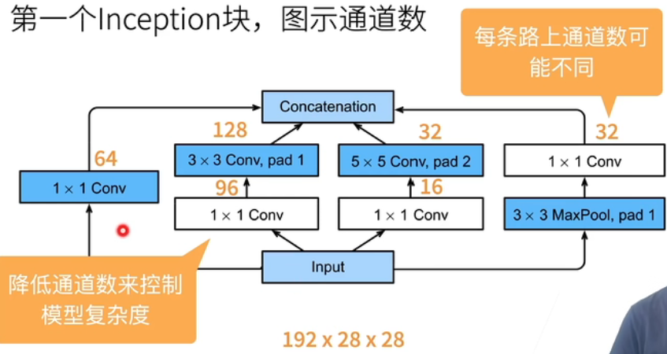
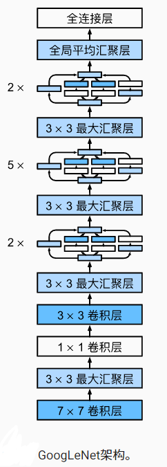
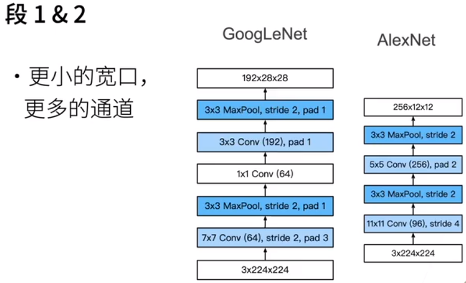
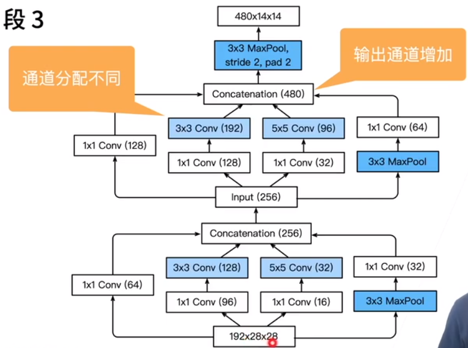
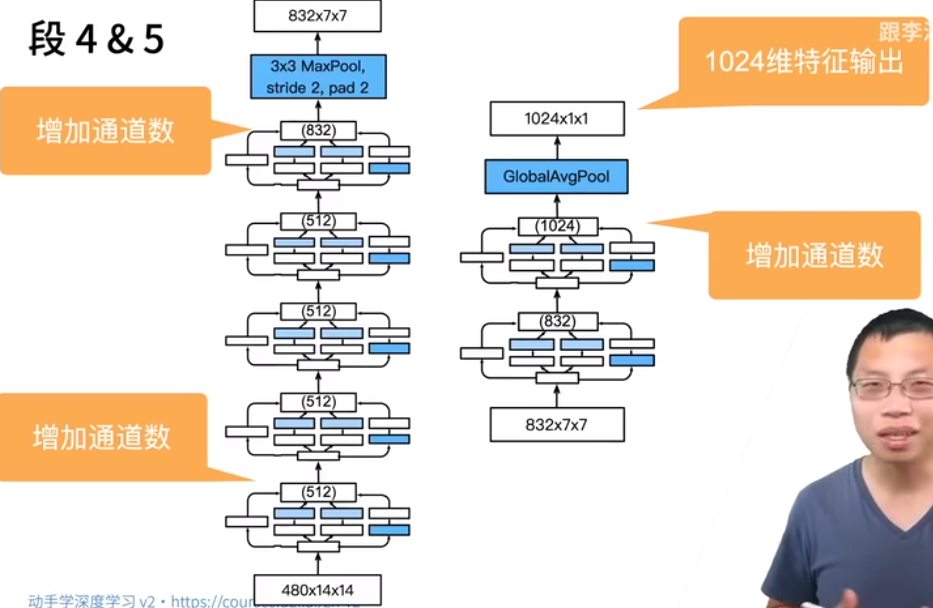

## 含并行连结的网络（GoogLeNet）

- 解决了什么样大小的卷积核最合适的问题

- ## Inception块

  - ## 

  - 4个路径从不同层面抽取信息，然后再输出通道维合并

  - 

  - 跟单3x3或5x5卷积层比，inception块有更少的参数个数和计算复杂度

## GoogleNet

 

 

 

  

## Inception各种后续变种

- Inception-BN(v2)-使用batch normalization
- Inception-v3- 修改了Incepption块
  - 替换5x5为多个3x3卷积层
  - 替换5x5为1x7和7x1卷积层
  - 替换3x3为1x3和3x1卷积层
  - 更深
- Inception-v4- 使用残差连接

## 总结

- Inception块相当于一个有4条路径的子网络。
  - 它通过不同窗口形状的卷积层和最大池化层来并行抽取信息，并使用1×1卷积层减少每像素级别上的通道维数从而降低模型复杂度。
  - 优点：模型参数小，计算复杂度低