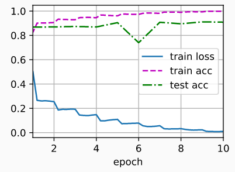

## 残差块

- 残差块里首先有2个有相同输出通道数的3×3卷积层，每个卷积层后接一个批量规范化层和ReLU激活函数
- 然后我们通过跨层数据通路，跳过这2个卷积运算，将输入直接加在最后的ReLU激活函数前。 这样的设计要求2个卷积层的输出与输入形状一样，从而使它们可以相加
-  如果想改变通道数，就需要引入一个额外的1×1卷积层来将输入变换成需要的形状后再做相加运算

- ```python
  import torch
  from torch import nn
  from torch.nn import functional as F
  from d2l import torch as d2l
  
  class Residual(nn.Module):  #@save
      def __init__(self, input_channels, num_channels,
                   use_1x1conv=False, strides=1):
          super().__init__()
          self.conv1 = nn.Conv2d(input_channels, num_channels,
                                 kernel_size=3, padding=1, stride=strides)
          self.conv2 = nn.Conv2d(num_channels, num_channels,
                                 kernel_size=3, padding=1)
          if use_1x1conv:
              self.conv3 = nn.Conv2d(input_channels, num_channels,
                                     kernel_size=1, stride=strides)
          else:
              self.conv3 = None
          self.bn1 = nn.BatchNorm2d(num_channels)
          self.bn2 = nn.BatchNorm2d(num_channels)
  
      def forward(self, X):
          Y = F.relu(self.bn1(self.conv1(X)))
          Y = self.bn2(self.conv2(Y))
          # 此代码生成两种类型的网络： 一种是当use_1x1conv=False时，应用ReLU非线性函数之前，将输入添加到输出。
          # 另一种是当use_1x1conv=True时，添加通过卷积调整通道和分辨率
          if self.conv3:
              X = self.conv3(X)
          Y += X
          return F.relu(Y)
      
  # 查看输入和输出形状一致的情况
  blk = Residual(3,3)
  X = torch.rand(4, 3, 6, 6)
  Y = blk(X)
  Y.shape  # output：torch.Size([4, 3, 6, 6])
  
  # 也可以增加输出通道数的同时，减半输出的高和宽。
  blk = Residual(3,6, use_1x1conv=True, strides=2)
  blk(X).shape # output：torch.Size([4, 6, 3, 3])
  ```

  ## ResNet模型

  - 在输出通道数为64、步幅为2的7×7卷积层后，接步幅为2的3×3的最大汇聚层。 不同之处在于ResNet每个卷积层后增加了批量规范化层。

  - ```python
    b1 = nn.Sequential(nn.Conv2d(1, 64, kernel_size=7, stride=2, padding=3),
                       nn.BatchNorm2d(64), nn.ReLU(),
                       nn.MaxPool2d(kernel_size=3, stride=2, padding=1))
    
    # ResNet则使用4个由残差块组成的模块，每个模块使用若干个同样输出通道数的残差块。 
    # 第一个模块的通道数同输入通道数一致。 由于之前已经使用了步幅为2的最大汇聚层，所以无须减小高和宽。 
    # 之后的每个模块在第一个残差块里将上一个模块的通道数翻倍，并将高和宽减半
    def resnet_block(input_channels, num_channels, num_residuals,
                     first_block=False):
        blk = []
        for i in range(num_residuals):
            if i == 0 and not first_block:
                blk.append(Residual(input_channels, num_channels,
                                    use_1x1conv=True, strides=2))
            else:  # 
                blk.append(Residual(num_channels, num_channels))
        return blk
    
    # 接着在ResNet加入所有残差块，这里每个模块使用2个残差块。
    b2 = nn.Sequential(*resnet_block(64, 64, 2, first_block=True))
    b3 = nn.Sequential(*resnet_block(64, 128, 2))
    b4 = nn.Sequential(*resnet_block(128, 256, 2))
    b5 = nn.Sequential(*resnet_block(256, 512, 2))
    
    # 在ResNet中加入全局平均汇聚层，以及全连接层输出。
    net = nn.Sequential(b1, b2, b3, b4, b5,
                        nn.AdaptiveAvgPool2d((1,1)),
                        nn.Flatten(), nn.Linear(512, 10))
    
    # 在训练ResNet之前，让我们观察一下ResNet中不同模块的输入形状是如何变化的。 在之前所有架构中，分辨率降低，通道数量增加，直到全局平均汇聚层聚集所有特征
    X = torch.rand(size=(1, 1, 224, 224))
    for layer in net:
        X = layer(X)
        print(layer.__class__.__name__,'output shape:\t', X.shape)
    '''
    Sequential output shape:     torch.Size([1, 64, 56, 56])
    Sequential output shape:     torch.Size([1, 64, 56, 56])
    Sequential output shape:     torch.Size([1, 128, 28, 28])
    Sequential output shape:     torch.Size([1, 256, 14, 14])
    Sequential output shape:     torch.Size([1, 512, 7, 7])
    AdaptiveAvgPool2d output shape:      torch.Size([1, 512, 1, 1])
    Flatten output shape:        torch.Size([1, 512])
    Linear output shape:         torch.Size([1, 10])
    '''
    
    # 训练模型
    lr, num_epochs, batch_size = 0.05, 10, 256
    train_iter, test_iter = d2l.load_data_fashion_mnist(batch_size, resize=96)
    d2l.train_ch6(net, train_iter, test_iter, num_epochs, lr, d2l.try_gpu())
    # loss 0.010, train acc 0.998, test acc 0.909
    # 4619.4 examples/sec on cuda:0
    ```

     