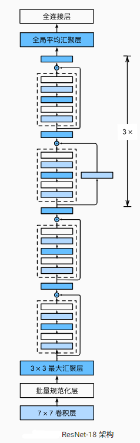

## 残差块

- 串联一个层改变函数类，希望能扩大函数类
- 残差块加入快速通道来得到 $f(x) = x + g(x)$ 的结构
  - 即使g(x) = 0,还是能得到原来的最优解

- 
  - 假设f(x)层函数不存在，使得我们可以绕过他 依然能传递前一个网络的函数x
- 

## ResNet块

- 第一个高宽减半RestNet块(步幅2)
- 后接多个高宽不变的ResNet
- 类似于VGG和GoogleNet的总体架构，但替换成了ResNet块
- 

## 总结

- 残差块使得很深的网络更容易训练
- 残差映射可以更容易地学习同一函数，例如将权重层中的参数近似为零。
- 利用残差块（residual blocks）可以训练出一个有效的深层神经网络：输入可以通过层间的残余连接更快地向前传播。

## ResNet为什么能训练深层模型，缓解梯度消失问题

- 假设y=f(x) 	$\large \frac{\partial y}{\partial w}$		$\large w = w- \eta \frac{\partial y}{\partial w}$

- $\large y' = g(f(x))$	$\large \frac{\partial y'}{\partial w} = \frac{\partial y'}{\partial y}\frac{\partial y}{\partial w} = \frac{\partial g(x)}{\partial y} \frac{\partial y}{\partial w}$

  - 假设y’的预测效果特别好（预测值和真实值差别小），那么 y‘ 的导数会很快变得特别小，因此梯度会较之前小很多，

  - 因此越到底层梯度越小

- $y'' = f(x)+g(f(x))$                    $ \large \frac{\partial y''}{\partial w} =  \frac{\partial y}{\partial w} + \frac{\partial y'}{\partial w}$

  - 假设$\large \frac{\partial y'}{\partial w}$ 很小，那么还会存在 $\large \frac{\partial y}{\partial w}$ ，因此可以缓解梯度消失问题

- 

  - 靠近数据端的w是难以训练的，
  - 因为加入了跳转，因此在算梯度时，可以直接从上层跳转下来，所以最下面的层也可以拿到比较大的梯度
  - 因此不管模型有多深，下面的层都可以拿到比较大的梯度

