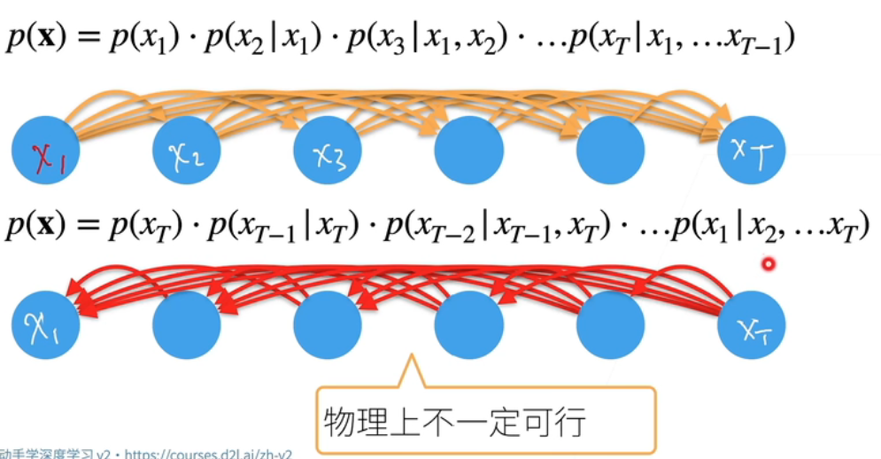
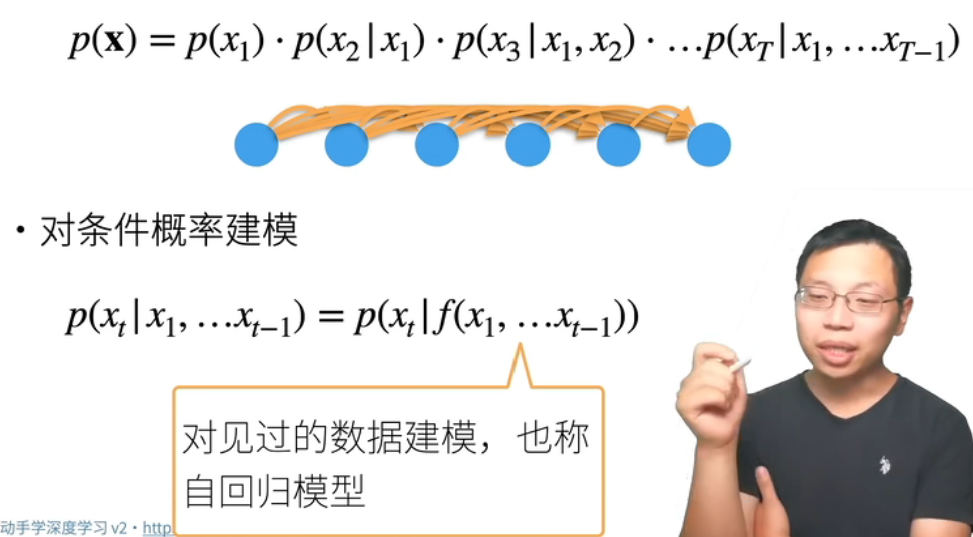
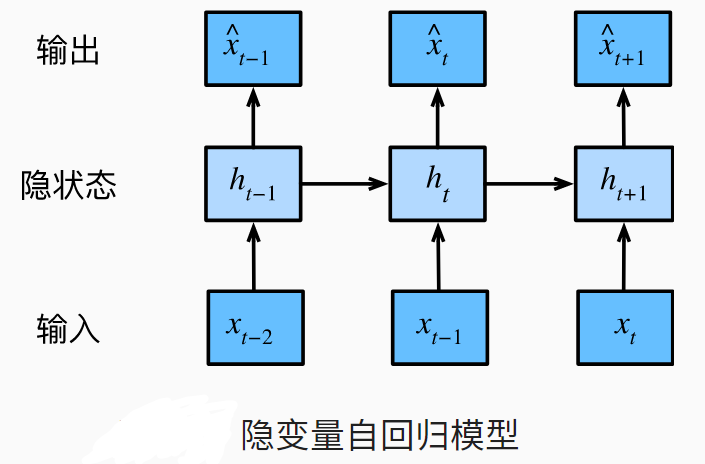
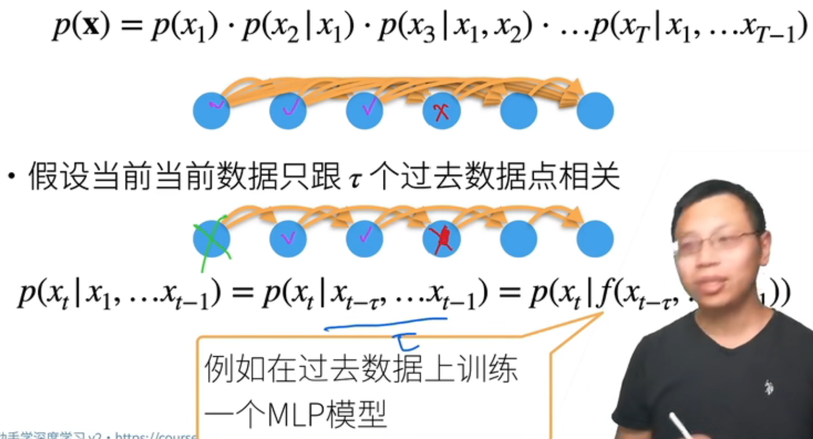
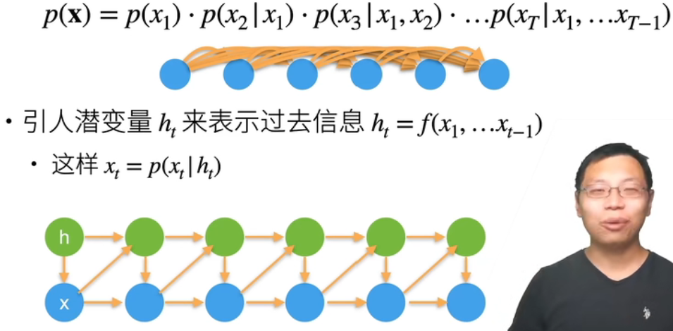

## 序列数据

- 实际数据有时序结构
- 电影评价随时间变化而变化
  - 拿奖后评分上升，直至奖项被忘记
  - 看了很多好电影后，人期望变高
  - 季节性：贺岁片、暑期档
  - 导演、演员负面报道导致评分低
- 音乐、语言、文本和视频都是连续的
- 人的互动是连续的，网上吵架
- 预测明天的估价要比填补昨天遗失的估价更困难

## 统计工具

- 在时间t观察到$x_t$， 那么得到T个不独立的随机变量$(x_1,...,x_T) ~p(x)$

- 使用条件概率展开

  - p(a,b) = p(a)p(b | a) = p(b)p(a | b)

-  

-  

- 自回归：给定一些数据，预测数据时用的是这个数据之前的数据进行预测

  -  

- ### 方案A：马尔科夫假设

  - 

- ### 方案B：潜变量模型

  - 

## 总结

- 时序模型中，当前数据跟之前观察到的数据相关
- 自回归模型使用自身过去数据来预测未来
- 马尔科夫模型假设当前只跟最近少数数据相关，从而简化模型
- 潜变量模型使用潜变量来概括历史信息