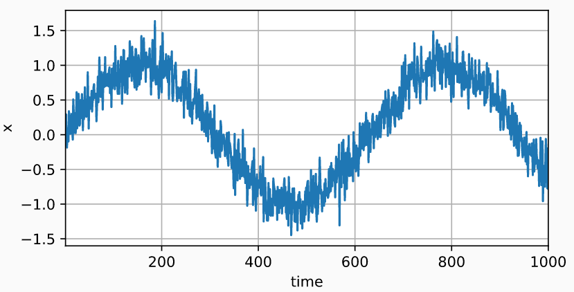
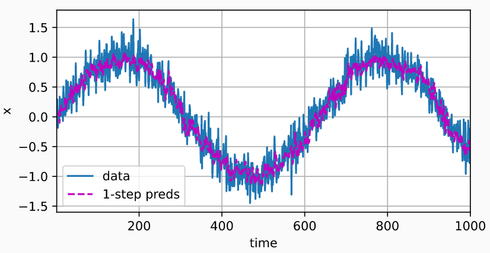
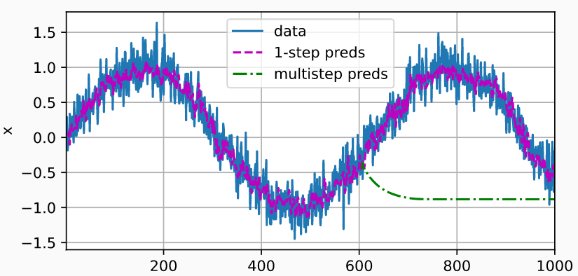
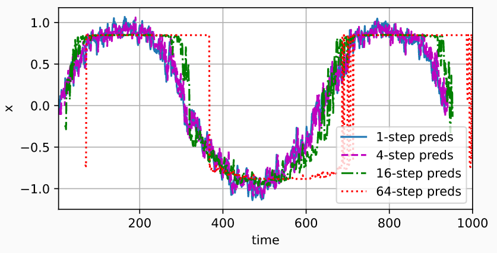

## 序列模型

- ### 使用正弦函数和一些可加性噪声来生成序列数据， 时间步为1,2,…,1000。

- ```python
  %matplotlib inline
  import torch
  from torch import nn
  from d2l import torch as d2l
  
  T = 1000  # 总共产生1000个点
  time = torch.arange(1, T + 1, dtype=torch.float32)
  x = torch.sin(0.01 * time) + torch.normal(0, 0.2, (T,))
  d2l.plot(time, [x], 'time', 'x', xlim=[1, 1000], figsize=(6, 3))
  ```

  - 结果：

- ### 使用马尔科夫假设，将数据映射为数据对 $\large y_t = x_t$ 和$\large x_t = [x_{t-\tau},...,x_{t-1}]$ 

  - ```python
    tau = 4
    features = torch.zeros((T - tau, tau))
    for i in range(tau):
        features[:, i] = x[i: T - tau + i]  # 每τ个数据作为特征
    labels = x[tau:].reshape((-1, 1)) # 第τ+1个数据作为标签
    
    batch_size, n_train = 16, 600
    # 只有前n_train个样本用于训练
    train_iter = d2l.load_array((features[:n_train], labels[:n_train]),
                                batch_size, is_train=True)
    ```

- ### 使用一个拥有两个全连接层的多层感知机

  - ```python
    # 初始化网络权重的函数
    def init_weights(m):
        if type(m) == nn.Linear:
            nn.init.xavier_uniform_(m.weight)
    
    # 一个简单的多层感知机
    def get_net():
        net = nn.Sequential(nn.Linear(4, 10),
                            nn.ReLU(),
                            nn.Linear(10, 1))
        net.apply(init_weights)
        return net
    
    # 平方损失。注意：MSELoss计算平方误差时不带系数1/2
    loss = nn.MSELoss(reduction='none')
    
    # 训练模型
    def train(net, train_iter, loss, epochs, lr):
        trainer = torch.optim.Adam(net.parameters(), lr)
        for epoch in range(epochs):
            for X, y in train_iter:
                trainer.zero_grad()
                l = loss(net(X), y)
                l.sum().backward()
                trainer.step()
            print(f'epoch {epoch + 1}, '
                  f'loss: {d2l.evaluate_loss(net, train_iter, loss):f}')
    
    net = get_net()
    train(net, train_iter, loss, 5, 0.01)
    '''
    epoch 1, loss: 0.060854
    epoch 2, loss: 0.052756
    epoch 3, loss: 0.050913
    epoch 4, loss: 0.049964
    epoch 5, loss: 0.049188
    '''
    ```

  - ### 单步预测：检查模型预测下一个时间步的能力

    - ```python
      onestep_preds = net(features)
      d2l.plot([time, time[tau:]],
               [x.detach().numpy(), onestep_preds.detach().numpy()], 'time','x', 
               legend=['data', '1-step preds'], xlim=[1, 1000], figsize=(6, 3))
      ```

    - 预测结果
    - 一个小问题：如果数据观察序列的时间步只到604， 我们需要一步一步地向前迈进：
      - $\begin{split}\hat{x}_{605} = f(x_{601}, x_{602}, x_{603}, x_{604}), \\
        \hat{x}_{606} = f(x_{602}, x_{603}, x_{604}, \hat{x}_{605}), \\
        \hat{x}_{607} = f(x_{603}, x_{604}, \hat{x}_{605}, \hat{x}_{606}),\\
        \hat{x}_{608} = f(x_{604}, \hat{x}_{605}, \hat{x}_{606}, \hat{x}_{607}),\\
        \hat{x}_{609} = f(\hat{x}_{605}, \hat{x}_{606}, \hat{x}_{607}, \hat{x}_{608}),\\
        \ldots\end{split}$

  - ### 多步预测

    - 对于直到 $x_t$ 的观测序列，其在时间步t+k处的预测输出$\large \hat x_{t+k}$ 称为k*步预测*（k-step-ahead-prediction）

    - 给定τ个点，预测未来k个点

    - 由于我们的观察已经到了$x_{604}$，它的k步预测是$\hat x_{604+k}$ 。 

    - 换句话说，我们必须使用我们自己的预测（而不是原始数据）来进行多步预测

    - ```python
      multistep_preds = torch.zeros(T)
      multistep_preds[: n_train + tau] = x[: n_train + tau]
      for i in range(n_train + tau, T):
          multistep_preds[i] = net(
              multistep_preds[i - tau:i].reshape((1, -1)))
      
      d2l.plot([time, time[tau:], time[n_train + tau:]],
               [x.detach().numpy(), onestep_preds.detach().numpy(),
                multistep_preds[n_train + tau:].detach().numpy()], 'time',
               'x', legend=['data', '1-step preds', 'multistep preds'],
               xlim=[1, 1000], figsize=(6, 3))
      ```

    - 结果

    - 由于错误的累积： 假设在步骤1之后，我们积累了一些错误$ϵ_1=\overline ϵ$。 于是，步骤2的输入被扰动了ϵ1， 结果积累的误差是依照次序的$ϵ_2=\overlineϵ+cϵ_1$， 其中c为某个常数，后面的预测误差依此类推。 因此误差可能会相当快地偏离真实的观测结果

  - ### 更仔细看一下K步预测

    - 基于k=1,4,16,64，通过对整个序列预测的计算

      - ```python
        max_steps = 64
        
        features = torch.zeros((T - tau - max_steps + 1, tau + max_steps))
        # 列i（i<tau）是来自x的观测，其时间步从（i+1）到（i+T-tau-max_steps+1）
        for i in range(tau):
            features[:, i] = x[i: i + T - tau - max_steps + 1]
        
        # 列i（i>=tau）是来自（i-tau+1）步的预测，其时间步从（i+1）到（i+T-tau-max_steps+1）
        for i in range(tau, tau + max_steps):
            features[:, i] = net(features[:, i - tau:i]).reshape(-1)
        
        steps = (1, 4, 16, 64)
        d2l.plot([time[tau + i - 1: T - max_steps + i] for i in steps],
                 [features[:, (tau + i - 1)].detach().numpy() for i in steps], 'time', 'x',
                 legend=[f'{i}-step preds' for i in steps], xlim=[5, 1000],
                 figsize=(6, 3))
        ```

        - 结果
        - 