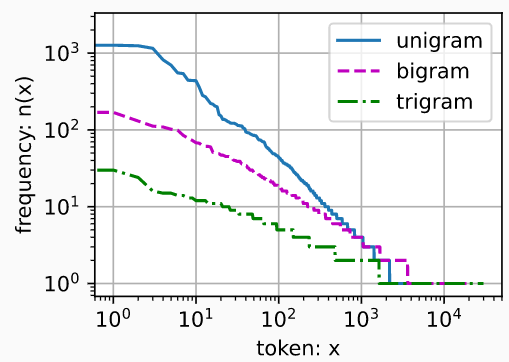

## 语言模型和数据集

- ```python
  import random
  import torch
  from d2l import torch as d2l
  
  tokens = d2l.tokenize(d2l.read_time_machine())
  # 因为每个文本行不一定是一个句子或一个段落，因此我们把所有文本行拼接到一起
  corpus = [token for line in tokens for token in line]
  vocab = d2l.Vocab(corpus)
  vocab.token_freqs[:10]
  ''' 正如我们所看到的，最流行的词看起来很无聊， 这些词通常被称为停用词（stop words），因此可以被过滤掉
  [('the', 2261),
   ('i', 1267),
   ('and', 1245),
   ('of', 1155),
   ('a', 816),
   ('to', 695),
   ('was', 552),
   ('in', 541),
   ('that', 443),
   ('my', 440)]
  '''
  
  # 最常用单词的词频对比，第10个还不到第1个的1/5。 为了更好地理解，我们可以画出的词频图：
  freqs = [freq for token, freq in vocab.token_freqs]
  d2l.plot(freqs, xlabel='token: x', ylabel='frequency: n(x)',xscale='log', yscale='log')
  ```

  -  

  - 词频以一种明确的方式迅速衰减。 将前几个单词作为例外消除后，剩余的所有单词大致遵循双对数坐标图上的一条直线。 
  - 这意味着单词的频率满足 **齐普夫定律**（Zipf’s law）， 
    - 即第i个最常用单词的频率$n_i$为：$\large n_i∝\frac{1}{i^α},$		等价于$\log n_i = -\alpha \log i + c,$		
      - α是刻画分布的指数，c是常数

- ### 二元语法的频率

  - ```python
    bigram_tokens = [pair for pair in zip(corpus[:-1], corpus[1:])]
    bigram_vocab = d2l.Vocab(bigram_tokens)
    bigram_vocab.token_freqs[:10]
    '''  在十个最频繁的词对中，有九个是由两个停用词组成的， 只有一个与“the time”有关。
    [(('of', 'the'), 309),
     (('in', 'the'), 169),
     (('i', 'had'), 130),
     (('i', 'was'), 112),
     (('and', 'the'), 109),
     (('the', 'time'), 102),
     (('it', 'was'), 99),
     (('to', 'the'), 85),
     (('as', 'i'), 78),
     (('of', 'a'), 73)]
    '''
    ```

- ### 三元语法的频率

  - ```python
    trigram_tokens = [triple for triple in zip(
        corpus[:-2], corpus[1:-1], corpus[2:])]
    trigram_vocab = d2l.Vocab(trigram_tokens)
    trigram_vocab.token_freqs[:10]
    '''
    [(('the', 'time', 'traveller'), 59),
     (('the', 'time', 'machine'), 30),
     (('the', 'medical', 'man'), 24),
     (('it', 'seemed', 'to'), 16),
     (('it', 'was', 'a'), 15),
     (('here', 'and', 'there'), 15),
     (('seemed', 'to', 'me'), 14),
     (('i', 'did', 'not'), 14),
     (('i', 'saw', 'the'), 13),
     (('i', 'began', 'to'), 13)]
    '''
    ```

- ### 三种模型中的词元频率：一元语法、二元语法和三元语法

  - ```python
    bigram_freqs = [freq for token, freq in bigram_vocab.token_freqs]
    trigram_freqs = [freq for token, freq in trigram_vocab.token_freqs]
    d2l.plot([freqs, bigram_freqs, trigram_freqs], xlabel='token: x',
             ylabel='frequency: n(x)', xscale='log', yscale='log',
             legend=['unigram', 'bigram', 'trigram']) 
    # unigram一元、bigram二元、trigram三元
    d2l.plot.show()
    ```

  - 结果： 

## 读取长序列数据

- 假设网络一次只处理具有n个时间步的子序列,n=5，并且每个时间步的词元对应于一个字符,我们可以选择任意偏移量来指示初始位置

  -  

- ### 随机采样

  - 随机地生成一个小批量数据的特征和标签以供读取。在随机采样中，每个样本都是在原始的长序列上捕获的子序列

  - 参数`batch_size`指定了每个小批量中子序列样本的数目， 参数`num_steps`是每个子序列中预定义的时间步数。

  - ```python
    def seq_data_iter_random(corpus, batch_size, num_steps):  #@save
        """使用随机抽样生成一个小批量子序列"""
        # 从随机偏移量开始对序列进行分区，随机范围包括num_steps-1
        corpus = corpus[random.randint(0, num_steps - 1):]
        # 减去1，是因为我们需要考虑最后一个后跟的标签（y与x的长度一致）
        num_subseqs = (len(corpus) - 1) // num_steps
        # 长度为num_steps的子序列的起始索引
        initial_indices = list(range(0, num_subseqs * num_steps, num_steps))
        # 在随机抽样的迭代过程中，
        # 来自两个相邻的、随机的、小批量中的子序列不一定在原始序列上相邻
        random.shuffle(initial_indices)
    
        def data(pos):
            # 返回从pos位置开始的长度为num_steps的序列
            return corpus[pos: pos + num_steps]
    
        num_batches = num_subseqs // batch_size
        for i in range(0, batch_size * num_batches, batch_size):
            # 在这里，initial_indices包含子序列的随机起始索引
            initial_indices_per_batch = initial_indices[i: i + batch_size]
            X = [data(j) for j in initial_indices_per_batch]
            Y = [data(j + 1) for j in initial_indices_per_batch]
            yield torch.tensor(X), torch.tensor(Y)
            
    # 下面我们生成一个从0到34的序列。 
    # 假设批量大小为2，时间步数为5，这意味着可以生成[(35-1)/5]向下取整 = 6 个“特征－标签”子序列对。 
    # 如果设置小批量大小为2，我们只能得到3个小批量。
    my_seq = list(range(35))
    for X, Y in seq_data_iter_random(my_seq, batch_size=2, num_steps=5):
        print('X: ', X, '\nY:', Y)
    '''
    X:  tensor([[5, 6, 7, 8, 9],  [0, 1, 2, 3, 4]])
    Y:  tensor([[6, 7, 8, 9, 10], [1, 2, 3, 4, 5]])
    
    X:  tensor([[10, 11, 12, 13, 14], [15, 16, 17, 18, 19]])
    Y:  tensor([[11, 12, 13, 14, 15],  [16, 17, 18, 19, 20]])
    
    X:  tensor([[25, 26, 27, 28, 29],  [20, 21, 22, 23, 24]])
    Y:  tensor([[26, 27, 28, 29, 30],   [21, 22, 23, 24, 25]])
    '''
    ```

- ### 顺序分区

  - 保证两个相邻的小批量中的子序列在原始序列上也是相邻的

    - ```python
      def seq_data_iter_sequential(corpus, batch_size, num_steps):  #@save
          """使用顺序分区生成一个小批量子序列"""
          # 从随机偏移量开始划分序列
          offset = random.randint(0, num_steps)
          num_tokens = ((len(corpus) - offset - 1) // batch_size) * batch_size
          Xs = torch.tensor(corpus[offset: offset + num_tokens])
          Ys = torch.tensor(corpus[offset + 1: offset + 1 + num_tokens])
          Xs, Ys = Xs.reshape(batch_size, -1), Ys.reshape(batch_size, -1)
          num_batches = Xs.shape[1] // num_steps
          for i in range(0, num_steps * num_batches, num_steps):
              X = Xs[:, i: i + num_steps]
              Y = Ys[:, i: i + num_steps]
              yield X, Y
              
      # 基于相同的设置，通过顺序分区读取每个小批量的子序列的特征X和标签Y
      for X, Y in seq_data_iter_sequential(my_seq, batch_size=2, num_steps=5):
          print('X: ', X, '\nY:', Y)
      '''
      X:  tensor([[ 5,  6,  7,  8,  9], [19, 20, 21, 22, 23]])
      Y:  tensor([[ 6,  7,  8,  9, 10], [20, 21, 22, 23, 24]])
      
      X:  tensor([[10, 11, 12, 13, 14], [24, 25, 26, 27, 28]])
      Y:  tensor([[11, 12, 13, 14, 15], [25, 26, 27, 28, 29]])
      '''
      ```

- ### 将随机采样和顺序采样函数包装到一个类里

  - ```python
    class SeqDataLoader:  #@save
        """加载序列数据的迭代器"""
        def __init__(self, batch_size, num_steps, use_random_iter, max_tokens):
            if use_random_iter:
                self.data_iter_fn = d2l.seq_data_iter_random
            else:
                self.data_iter_fn = d2l.seq_data_iter_sequential
            self.corpus, self.vocab = d2l.load_corpus_time_machine(max_tokens)
            self.batch_size, self.num_steps = batch_size, num_steps
    
        def __iter__(self):
            return self.data_iter_fn(self.corpus, self.batch_size, self.num_steps)
    ```

- 定义了一个函数`load_data_time_machine`， 它同时返回数据迭代器和词表

  - ```python
    def load_data_time_machine(batch_size, num_steps, use_random_iter=False, max_tokens=10000):
        """返回时光机器数据集的迭代器和词表"""
        data_iter = SeqDataLoader(batch_size, num_steps, use_random_iter, max_tokens)
        return data_iter, data_iter.vocab
    ```