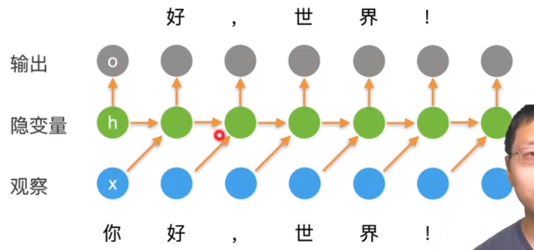

## 循环神经网络

 

- 更新隐藏状态：$\large \mathbf{h}_t = \phi( \mathbf{W}_{hh}\mathbf{H}_{t-1}   + \mathbf{X}_{t-1} \mathbf{W}_{hx} + \mathbf{b}_h).$
  - 上式去掉$\mathbf{W}_{hh}\mathbf{H}_{t-1}$ 就是MLP
- 输出：$\large o_t = \phi(W_{oh}h_t + b_o)$
- 例：

## 困惑度(perplexity)

- 衡量一个语言模型的好坏可以用平均交叉熵： $\large π = \frac{1}{n} \sum^{n}_{t=1}\limits -\log p(x_t|x_{t-1,...})$
  - p是语言模型的预测概率，$x_t$ 是真实词
- 历史原因NLP使用困惑度exp(π)来衡量，是平均每次可能选项
  - 1表示完美，无穷大是最差情况

## 梯度裁剪

- 迭代中计算这T个时间步上的梯度，在反向传播过程中产生长度为O(T)的矩阵乘法链，导致数值不稳定
- 梯度裁剪能有效预防梯度爆炸
  - 如果梯度长度超过θ，那么梯度长度θ    
    - $\large g \leftarrow min(1,\frac{θ}{||g||})g$
      - 如果 $||g|| ＞θ  ,g  = \frac{\theta}{||g||} ||g|| = \theta$
      - 如果 $||g|| ＜ θ ,g  = 1·||g|| = g $

## 更多的应用RNNS

## 总结

- 循环神经网络的输出取决于当下输入和前一个时间的隐变量
- 应用到语言模型中时，循环神经网络根据当前词预测下一次时刻词
- 通常使用困惑度来衡量模型语言的好坏

