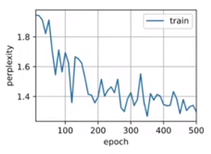

## 读取数据集

- ```python
  %matplotlib inline
  import math
  import torch
  from torch import nn
  from torch.nn import functional as F
  from d2l import torch as d2l
  
  batch_size, num_steps = 32, 35
  train_iter, vocab = d2l.load_data_time_machine(batch_size, num_steps)
  ```

## 独热编码

- 假设词表中不同词元的数目为N（即`len(vocab)`）， 词元索引的范围为0到N−1。 如果词元的索引是整数i， 那么我们将创建一个长度为N的全0向量， 并将第i处的元素设置为1。 此向量是原始词元的一个独热向量。 索引为0和2的独热向量如下所示

- ```python
  F.one_hot(torch.tensor([0, 2]), len(vocab))
  '''
  tensor([[1, 0, 0, 0, 0, 0, 0, 0, 0, 0, 0, 0, 0, 0, 0, 0, 0, 0, 0, 0, 0, 0, 0, 0,
           0, 0, 0, 0],
          [0, 0, 1, 0, 0, 0, 0, 0, 0, 0, 0, 0, 0, 0, 0, 0, 0, 0, 0, 0, 0, 0, 0, 0,
           0, 0, 0, 0]])
  '''
  # 每次采样的小批量数据形状是二维张量： （批量大小，时间步数）
  # one_hot函数将这样一个小批量数据转换成三维张量,张量的最后一个维度等于词表大小（len(vocab)）
  # 转换输入的维度，以便获得形状为 （时间步数，批量大小，词表大小）的输出
  X = torch.arange(10).reshape((2, 5))
  F.one_hot(X.T, 28).shape # torch.Size([5, 2, 28])
  ```

## 初始化模型参数

- 隐藏单元数`num_hiddens`是一个可调的超参数

- ```python
  def get_params(vocab_size, num_hiddens, device):
      num_inputs = num_outputs = vocab_size
  
      def normal(shape): # 生成均值为0，方差为1的初始化
          return torch.randn(size=shape, device=device) * 0.01 
  
      # 隐藏层参数
      W_xh = normal((num_inputs, num_hiddens))
      W_hh = normal((num_hiddens, num_hiddens)) # 上一时刻到下一时刻的隐藏变量
      b_h = torch.zeros(num_hiddens, device=device)
      # 输出层参数
      W_hq = normal((num_hiddens, num_outputs))
      b_q = torch.zeros(num_outputs, device=device)
      # 附加梯度
      params = [W_xh, W_hh, b_h, W_hq, b_q]
      for param in params:
          param.requires_grad_(True)
      return params
  ```

## 循环神经网络模型

- init_rnn_state函数的返回在初始化时的隐藏变量，是一个张量，张量全用0填充， 形状为（批量大小，隐藏单元数）

- ```python
  def init_rnn_state(batch_size, num_hiddens, device): # 定义初始隐藏状态 
      return (torch.zeros((batch_size, num_hiddens), device=device), )
  
  # 定义了如何在一个时间步内计算隐藏状态和输出
  # 循环神经网络模型通过inputs最外层的维度实现循环， 以便逐时间步更新小批量数据的隐状态H。 
  # 此外，这里使用函数作为激活函数。当元素在实数上满足均匀分布时，函数的平均值为0。
  def rnn(inputs, state, params):
      # inputs的形状：(时间步数量，批量大小，词表大小)
      W_xh, W_hh, b_h, W_hq, b_q = params
      H, = state
      outputs = []
      # X的形状：(批量大小，词表大小)
      for X in inputs:   # 按时间步进行迭代，因为时间步之前进行转置了在第一维
          H = torch.tanh(torch.mm(X, W_xh) + torch.mm(H, W_hh) + b_h)
          Y = torch.mm(H, W_hq) + b_q
          outputs.append(Y)
      return torch.cat(outputs, dim=0), (H,)
  	# 拼出来是个二维矩阵，列数还是vabsize，行数变成批量大小乘以时间步长度
  
  # 创建一个类来包装这些函数
  class RNNModelScratch: #@save
      """从零开始实现的循环神经网络模型"""
      def __init__(self, vocab_size, num_hiddens, device,
                   get_params, init_state, forward_fn):
          self.vocab_size, self.num_hiddens = vocab_size, num_hiddens
          self.params = get_params(vocab_size, num_hiddens, device)
          self.init_state, self.forward_fn = init_state, forward_fn
  
      def __call__(self, X, state):
          X = F.one_hot(X.T, self.vocab_size).type(torch.float32)
          return self.forward_fn(X, state, self.params)
  
      def begin_state(self, batch_size, device):
          return self.init_state(batch_size, self.num_hiddens, device)
  
  # 检查输出是否具有正确的形状    
  num_hiddens = 512
  net = RNNModelScratch(len(vocab), num_hiddens, d2l.try_gpu(), get_params,
                        init_rnn_state, rnn)
  state = net.begin_state(X.shape[0], d2l.try_gpu())
  Y, new_state = net(X.to(d2l.try_gpu()), state)
  Y.shape, len(new_state), new_state[0].shape # (torch.Size([10, 28]), 1, torch.Size([2, 512]))
  # 输出形状是（时间步数*批量大小，词表大小）， 而隐状态形状保持不变，即（批量大小，隐藏单元数）
  ```

## 预测

- 在循环遍历`prefix`中的开始字符时， 我们不断地将隐状态传递到下一个时间步，但是不生成任何输出。 这被称为*预热*（warm-up）

- ```python
  def predict_ch8(prefix, num_preds, net, vocab, device):  #@save
      """在prefix后面生成新字符"""
      state = net.begin_state(batch_size=1, device=device)
      outputs = [vocab[prefix[0]]]
      get_input = lambda: torch.tensor([outputs[-1]], device=device).reshape((1, 1))
      for y in prefix[1:]:  # 预热期
          _, state = net(get_input(), state)
          outputs.append(vocab[y])
      for _ in range(num_preds):  # 预测num_preds步
          y, state = net(get_input(), state)
          outputs.append(int(y.argmax(dim=1).reshape(1)))
      return ''.join([vocab.idx_to_token[i] for i in outputs])
  
  predict_ch8('time traveller ', 10, net, vocab, d2l.try_gpu()) # 'time traveller lyqmkus<unk>wq'
  ```

## 梯度裁剪

- 长度为T的序列，我们在迭代中计算这T个时间步上的梯度， 将会在反向传播过程中产生长度为O(T)的矩阵乘法链

- 当T较大时，它可能导致数值不稳定， 例如可能导致梯度爆炸或梯度消失

- $\large g \leftarrow min(1,\frac{θ}{||g||})g$ 解决

- ```python
  def grad_clipping(net, theta):  #@save
      """裁剪梯度"""
      if isinstance(net, nn.Module):
          params = [p for p in net.parameters() if p.requires_grad]
      else:
          params = net.params
      norm = torch.sqrt(sum(torch.sum((p.grad ** 2)) for p in params))
      if norm > theta:
          for param in params:
              param.grad[:] *= theta / norm
  ```

## 训练

- ```python
  #@save
  def train_epoch_ch8(net, train_iter, loss, updater, device, use_random_iter):
      """训练网络一个迭代周期（定义见第8章）"""
      state, timer = None, d2l.Timer()
      metric = d2l.Accumulator(2)  # 训练损失之和,词元数量
      for X, Y in train_iter:
          if state is None or use_random_iter:
              # 在第一次迭代或使用随机抽样时初始化state
              state = net.begin_state(batch_size=X.shape[0], device=device) 
          else:
              if isinstance(net, nn.Module) and not isinstance(state, tuple):
                  # state对于nn.GRU是个张量
                  state.detach_()  # 不改变state的值，在backward的时候都删掉
              else:
                  # state对于nn.LSTM或对于我们从零开始实现的模型是个张量
                  for s in state:
                      s.detach_()
          y = Y.T.reshape(-1)
          X, y = X.to(device), y.to(device)
          y_hat, state = net(X, state)
          l = loss(y_hat, y.long()).mean()
          if isinstance(updater, torch.optim.Optimizer):
              updater.zero_grad()
              l.backward()
              grad_clipping(net, 1)  # 对整个梯度做裁剪，长度超过1就投影
              updater.step()
          else:
              l.backward()
              grad_clipping(net, 1)
              # 因为已经调用了mean函数
              updater(batch_size=1)
          metric.add(l * y.numel(), y.numel())
      return math.exp(metric[0] / metric[1]), metric[1] / timer.stop()  # 困惑度
  ```

- 采用高级API实现

  - ```python
    #@save
    def train_ch8(net, train_iter, vocab, lr, num_epochs, device,
                  use_random_iter=False):
        """训练模型（定义见第8章）"""
        loss = nn.CrossEntropyLoss()
        animator = d2l.Animator(xlabel='epoch', ylabel='perplexity',
                                legend=['train'], xlim=[10, num_epochs])
        # 初始化
        if isinstance(net, nn.Module):
            updater = torch.optim.SGD(net.parameters(), lr)
        else:
            updater = lambda batch_size: d2l.sgd(net.params, lr, batch_size)
        predict = lambda prefix: predict_ch8(prefix, 50, net, vocab, device)
        # 训练和预测
        for epoch in range(num_epochs):
            ppl, speed = train_epoch_ch8(
                net, train_iter, loss, updater, device, use_random_iter)
            if (epoch + 1) % 10 == 0:
                print(predict('time traveller'))
                animator.add(epoch + 1, [ppl])
        print(f'困惑度 {ppl:.1f}, {speed:.1f} 词元/秒 {str(device)}')
        print(predict('time traveller'))
        print(predict('traveller'))
        
    num_epochs, lr = 500, 1
    train_ch8(net, train_iter, vocab, lr, num_epochs, d2l.try_gpu())
    '''
    困惑度 1.1, 67526.0 词元/秒 cuda:0
    time traveller the eas hous in thiselling of the three dimension
    travelleryou can show black is white by argument said filby
    '''
    
    # 随机抽样方法
    net = RNNModelScratch(len(vocab), num_hiddens, d2l.try_gpu(), get_params,
                          init_rnn_state, rnn)
    train_ch8(net, train_iter, vocab, lr, num_epochs, d2l.try_gpu(),
              use_random_iter=True)
    '''
    困惑度 1.4, 53704.9 词元/秒 cuda:0
    time travellerit s against reason said filby an argumentative pe
    traveller of cuntry trict as ou menkentwnis that said the t
    '''
    ```
    
    - 顺序结果：
    - 随机抽样结果：