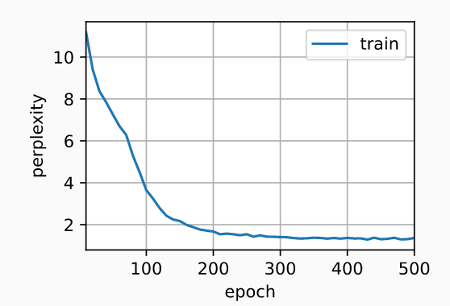

## 定义模型

- ```python
  import torch
  from torch import nn
  from torch.nn import functional as F
  from d2l import torch as d2l
  
  batch_size, num_steps = 32, 35
  train_iter, vocab = d2l.load_data_time_machine(batch_size, num_steps)
  
  # 构造一个具有256个隐藏单元的单隐藏层的循环神经网络层rnn_layer
  num_hiddens = 256
  rnn_layer = nn.RNN(len(vocab), num_hiddens)
  
  # 使用张量来初始化隐藏状态
  state = torch.zeros((1, batch_size, num_hiddens))
  state.shape # torch.Size([1, 32, 256])
  
  # 通过一个隐状态和一个输入，我们就可以用更新后的隐状态计算输出
  X = torch.rand(size=(num_steps, batch_size, len(vocab)))
  Y, state_new = rnn_layer(X, state)
  Y.shape, state_new.shape # (torch.Size([35, 32, 256]), torch.Size([1, 32, 256]))
  
  # 为一个完整的循环神经网络模型定义了一个RNNModel类  
  class RNNModel(nn.Module): # rnn_layer只包含隐藏的循环层，我们还需要创建一个单独的输出层
      """循环神经网络模型"""
      def __init__(self, rnn_layer, vocab_size, **kwargs):
          super(RNNModel, self).__init__(**kwargs)
          self.rnn = rnn_layer
          self.vocab_size = vocab_size
          self.num_hiddens = self.rnn.hidden_size
          # 如果RNN是双向的（之后将介绍），num_directions应该是2，否则应该是1
          if not self.rnn.bidirectional:
              self.num_directions = 1
              self.linear = nn.Linear(self.num_hiddens, self.vocab_size) # 构造输出层
          else:
              self.num_directions = 2
              self.linear = nn.Linear(self.num_hiddens * 2, self.vocab_size)
  
      def forward(self, inputs, state):
          X = F.one_hot(inputs.T.long(), self.vocab_size)
          X = X.to(torch.float32)
          Y, state = self.rnn(X, state)
          # 全连接层首先将Y的形状改为(时间步数*批量大小,隐藏单元数)
          # 它的输出形状是(时间步数*批量大小,词表大小)。
          output = self.linear(Y.reshape((-1, Y.shape[-1])))
          return output, state
  
      def begin_state(self, device, batch_size=1):
          if not isinstance(self.rnn, nn.LSTM):
              # nn.GRU以张量作为隐状态
              return  torch.zeros((self.num_directions * self.rnn.num_layers,
                                   batch_size, self.num_hiddens),
                                  device=device)
          else:
              # nn.LSTM以元组作为隐状态
              return (torch.zeros((
                  self.num_directions * self.rnn.num_layers,
                  batch_size, self.num_hiddens), device=device),
                      torch.zeros((
                          self.num_directions * self.rnn.num_layers,
                          batch_size, self.num_hiddens), device=device))
  ```

##  训练与预测

```python
# 基于一个具有随机权重的模型进行预测
device = d2l.try_gpu()
net = RNNModel(rnn_layer, vocab_size=len(vocab))
net = net.to(device)
d2l.predict_ch8('time traveller', 10, net, vocab, device)

num_epochs, lr = 500, 1
d2l.train_ch8(net, train_iter, vocab, lr, num_epochs, device)
# output 
'''
perplexity 1.4, 313532.6 tokens/sec on cuda:0
time traveller but sowe have geea move about ling if t anowher s
traveller methe thing to expect us to begin uponsaid filby
'''
```

 