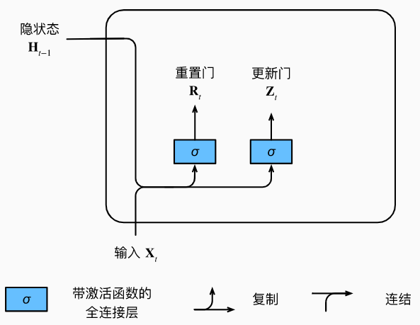
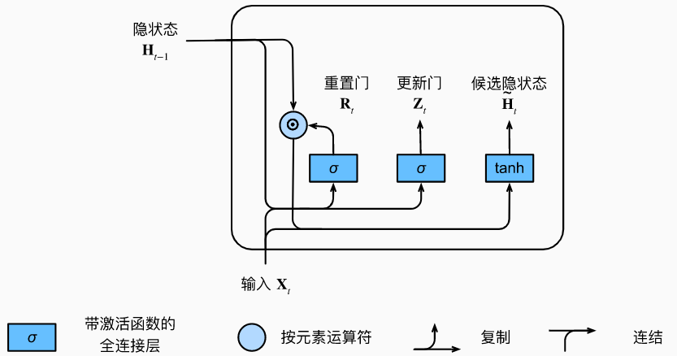
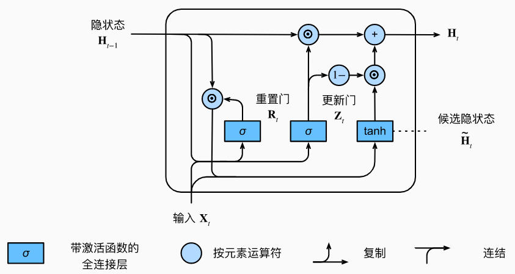

## 关注一个序列

- 不是每个观察值都是同等重要的
- 想只记住相关的观察需要：
  - 能关注的机制(更新门)
  - 能遗忘的机制(重置门)

## 门控单元

- 对于给定的时间步t，假设输入是一个小批量$X_t∈R^{n×d}$（样本个数：n，输入个数：d）， 上一个时间步的隐状态是 $H_{t−1}∈R^{n×h}$（隐藏单元个数：h）。 那么，重置门$R_t∈R^{n×h}$和 更新门$Z_t∈R^{n×h}$
-  
- $\begin{split}\begin{aligned}
  \mathbf{R}_t = \sigma(\mathbf{X}_t \mathbf{W}_{xr} + \mathbf{H}_{t-1} \mathbf{W}_{hr} + \mathbf{b}_r),\\
  \mathbf{Z}_t = \sigma(\mathbf{X}_t \mathbf{W}_{xz} + \mathbf{H}_{t-1} \mathbf{W}_{hz} + \mathbf{b}_z),
  \end{aligned}\end{split}$
  - $W_{xr},W_{xz}∈R^{d×h} 和W_{hr},W_{hz}∈R^{h×h}$是权重参数， $b_r,b_z∈R^{1×h}$是偏置参数。 
  - 请注意，在求和过程中会触发广播机制 使用sigmoid函数 将输入值转换到区间(0,1)

## 候选隐藏状态

- 重置门Rt 与常规隐状态更新机制集成， 得到在时间步t的候选隐状态
  - $\tilde{\mathbf{H}}_t = \tanh(\mathbf{X}_t \mathbf{W}_{xh} + \left(\mathbf{R}_t \odot \mathbf{H}_{t-1}\right) \mathbf{W}_{hh} + \mathbf{b}_h)$
  - $R_t$和$H_{t−1}$ 的元素相乘可以减少以往状态的影响。
    -  每当重置门$R_t$中的项接近1时， 我们恢复成一个的普通的循环神经网络。 
    - 对于重置门$R_t$中所有接近0的项， 候选隐状态是以$X_t$作为输入的多层感知机的结果。 
  - 因此，任何预先存在的隐状态都会被*重置*为默认值。
  - 运算过程

## 隐状态

- 这一步确定新的隐状态$H_t∈R^{n×h}$在多大程度上来自旧的状态$H_{t−1}$和 新的候选状态$\tilde H_t$。 更新门Zt仅需要在 $H_{t−1}$和$\tilde H_t$ 之间进行按元素的凸组合就可以实现这个目标
- $\mathbf{H}_t = \mathbf{Z}_t \odot \mathbf{H}_{t-1}  + (1 - \mathbf{Z}_t) \odot \tilde{\mathbf{H}}_t.$
- 每当更新门$Z_t$接近1时，模型就倾向只保留旧状态。 此时，来自$X_t$的信息基本上被忽略， 从而有效地跳过了依赖链条中的时间步t。 相反，当$Z_t$接近0时， 新的隐状态$H_t$就会接近候选隐状态$\tilde H_t$。
- 

## 总结

$\large \begin{split}\begin{aligned}
\mathbf{R}_t = \sigma(\mathbf{X}_t \mathbf{W}_{xr} + \mathbf{H}_{t-1} \mathbf{W}_{hr} + \mathbf{b}_r),\\
\mathbf{Z}_t = \sigma(\mathbf{X}_t \mathbf{W}_{xz} + \mathbf{H}_{t-1} \mathbf{W}_{hz} + \mathbf{b}_z),\\
\tilde{\mathbf{H}}_t = \tanh(\mathbf{X}_t \mathbf{W}_{xh} + \left(\mathbf{R}_t \odot \mathbf{H}_{t-1}\right) \mathbf{W}_{hh} + \mathbf{b}_h),\\
\mathbf{H}_t = \mathbf{Z}_t \odot \mathbf{H}_{t-1}  + (1 - \mathbf{Z}_t) \odot \tilde{\mathbf{H}}_t.
\end{aligned}\end{split}$

