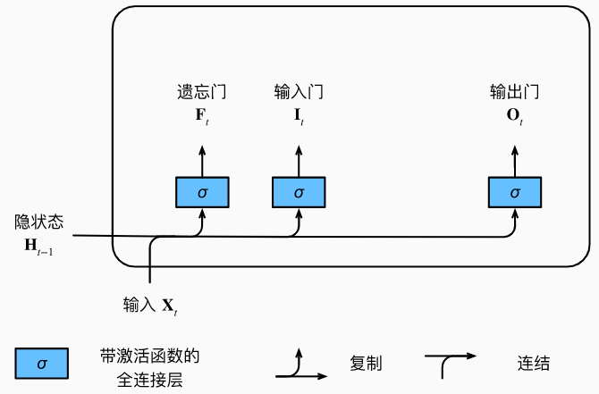
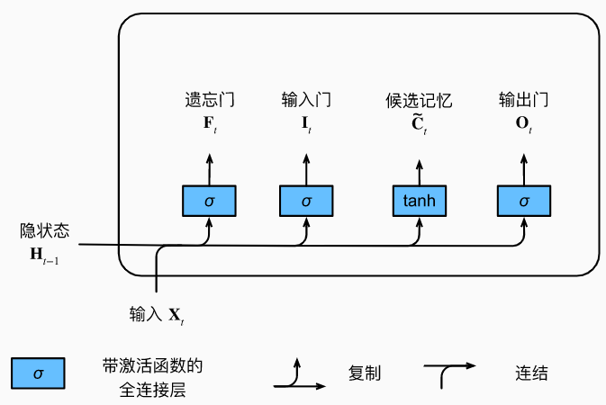
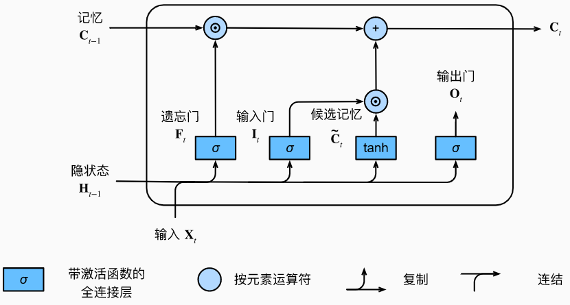
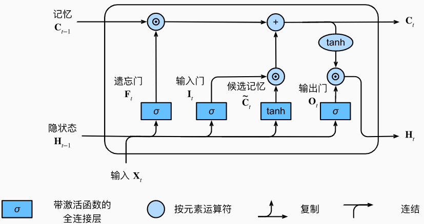

## 长短期记忆网络

- 忘记门：将值朝0减少
- 输入门：决定是不是忽略掉输入数据
- 输出门：决定是不是使用隐状态

## 门

- $\begin{split}\begin{aligned}
  \mathbf{F}_t &= \sigma(\mathbf{X}_t \mathbf{W}_{xf} + \mathbf{H}_{t-1} \mathbf{W}_{hf} + \mathbf{b}_f),\\
  \mathbf{I}_t &= \sigma(\mathbf{X}_t \mathbf{W}_{xi} + \mathbf{H}_{t-1} \mathbf{W}_{hi} + \mathbf{b}_i),\\
  \mathbf{O}_t &= \sigma(\mathbf{X}_t \mathbf{W}_{xo} + \mathbf{H}_{t-1} \mathbf{W}_{ho} + \mathbf{b}_o),
  \end{aligned}\end{split}$
-  

## 候选记忆单元

- $\tilde{\mathbf{C}}_t = \text{tanh}(\mathbf{X}_t \mathbf{W}_{xc} + \mathbf{H}_{t-1} \mathbf{W}_{hc} + \mathbf{b}_c),$  	相当于RNN的计算$H_t$,  没有使用gate ，激活函数为tanh
- 

## 记忆单元

- $\mathbf{C}_t = \mathbf{F}_t \odot \mathbf{C}_{t-1} + \mathbf{I}_t \odot \tilde{\mathbf{C}}_t.$
- 与RNN和GRU不同的是，它状态有两个变量 C、H
-  

## 隐状态

- $\mathbf{H}_t = \mathbf{O}_t \odot \tanh(\mathbf{C}_t).$
- 对记忆单元$C_t$再做一个tanh，将$C_t$值 限于[-1,1],
  - 因为$\mathbf{C}_t = \mathbf{F}_t \odot \mathbf{C}_{t-1} + \mathbf{I}_t \odot \tilde{\mathbf{C}}_t.$值可能变为[-2,2]
- $O_t$ 控制输出，判断  当前的$X_t$与过去的所有信息   是否需要，极端情况变成0 相当于重置
  - 只要输出门接近1，我们就能够有效地将所有记忆信息传递给预测部分， 
  - 而对于输出门接近0，我们只保留记忆元内的所有信息，而不需要更新隐状态

- 

## 总结

$\begin{split}\begin{aligned}
\mathbf{F}_t &= \sigma(\mathbf{X}_t \mathbf{W}_{xf} + \mathbf{H}_{t-1} \mathbf{W}_{hf} + \mathbf{b}_f),\\
\mathbf{I}_t &= \sigma(\mathbf{X}_t \mathbf{W}_{xi} + \mathbf{H}_{t-1} \mathbf{W}_{hi} + \mathbf{b}_i),\\
\mathbf{O}_t &= \sigma(\mathbf{X}_t \mathbf{W}_{xo} + \mathbf{H}_{t-1} \mathbf{W}_{ho} + \mathbf{b}_o),\\
\tilde{\mathbf{C}}_t &=\text{tanh}(\mathbf{X}_t \mathbf{W}_{xc} + \mathbf{H}_{t-1} \mathbf{W}_{hc} + \mathbf{b}_c),\\
\mathbf{C}_t &=\mathbf{F}_t \odot \mathbf{C}_{t-1} + \mathbf{I}_t \odot \tilde{\mathbf{C}}_t,\\
\mathbf{H}_t &=\mathbf{O}_t \odot \tanh(\mathbf{C}_t).
\end{aligned}\end{split}$