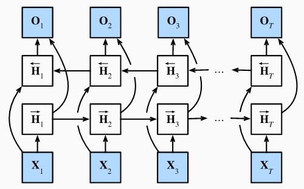

## 模型

- 一个前向RNN隐层
- 一个反向RNN隐层
- 合并两个隐状态得到输出

$\begin{split}\begin{aligned}
\overrightarrow{\mathbf{H}}_t &= \phi(\mathbf{X}_t \mathbf{W}_{xh}^{(f)} + \overrightarrow{\mathbf{H}}_{t-1} \mathbf{W}_{hh}^{(f)}  + \mathbf{b}_h^{(f)}),\\
\overleftarrow{\mathbf{H}}_t &= \phi(\mathbf{X}_t \mathbf{W}_{xh}^{(b)} + \overleftarrow{\mathbf{H}}_{t+1} \mathbf{W}_{hh}^{(b)}  + \mathbf{b}_h^{(b)}),\\
\H_t &= [\overrightarrow{\mathbf{H}}_t,\overleftarrow{\mathbf{H}}_t], [拼接两个H]\\
\mathbf{O}_t &= \mathbf{H}_t \mathbf{W}_{hq} + \mathbf{b}_q.\end{aligned}\end{split}$

