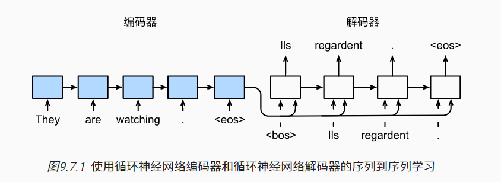
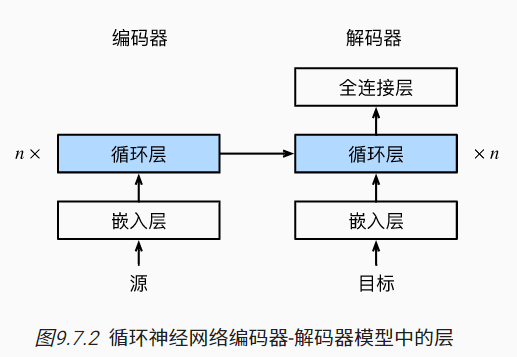

## 序列到序列学习

- 特定的“<eos>”表示序列结束词元。 一旦输出序列生成此词元，模型就会停止预测。 
- 在循环神经网络解码器的初始化时间步，有两个特定的设计决定： 
  - 首先，特定的“<bos>”表示序列开始词元，它是解码器的输入序列的第一个词元。 
  - 其次，使用循环神经网络编码器最终的隐状态来初始化解码器的隐状态。

 

- 编码器是一个RNN，读取输入句子
  - 可以使双向的
  - 解码器使用另一个RNN来输出
- **训练时解码器使用目标句子作为输入**

## Seq2Seq用的是特定的实现

 

- 编码器是没有输出的RNN
- 编码器最后时间步的隐状态用作解码器的初始隐状态

## 总结

- seq2seq从一个句子生成另一个句子
- 编码器和解码器都是RNN
- 将编码器最后事件隐状态来初始解码器隐状态来完成信息传递
- 常用BLEU来衡量生成序列的好坏

## 代码实现

- ```python
  import collections
  import math
  import torch
  from torch import nn
  from d2l import torch as d2l
  
  # 编码器--------------------------------------------------------------------------------------------------
  class Seq2SeqEncoder(d2l.Encoder):
      """用于序列到序列学习的循环神经网络编码器"""
      def __init__(self, vocab_size, embed_size, num_hiddens, num_layers,dropout=0, **kwargs):
          super(Seq2SeqEncoder, self).__init__(**kwargs)
          # 嵌入层
          self.embedding = nn.Embedding(vocab_size, embed_size)
          self.rnn = nn.GRU(embed_size, num_hiddens, num_layers, dropout=dropout)
  
      def forward(self, X, *args):
          # 输出'X'的形状：(batch_size,num_steps,embed_size)
          X = self.embedding(X)
          # 在循环神经网络模型中，第一个轴对应于时间步
          X = X.permute(1, 0, 2)
          # 如果未提及状态，则默认为0
          output, state = self.rnn(X)
          # output的形状:(num_steps,batch_size,num_hiddens)
          # state[0]的形状:(num_layers,batch_size,num_hiddens)
          return output, state
  # 实例化
  encoder = Seq2SeqEncoder(vocab_size=10, embed_size=8, num_hiddens=16,num_layers=2)
  encoder.eval()
  X = torch.zeros((4, 7), dtype=torch.long)
  output, state = encoder(X)
  output.shape # torch.Size([7, 4, 16])
  state.shape # torch.Size([2, 4, 16])
  
  # 解码器--------------------------------------------------------------------------------------------
  class Seq2SeqDecoder(d2l.Decoder):
      """用于序列到序列学习的循环神经网络解码器"""
      def __init__(self, vocab_size, embed_size, num_hiddens, num_layers,
                   dropout=0, **kwargs):
          super(Seq2SeqDecoder, self).__init__(**kwargs)
          self.embedding = nn.Embedding(vocab_size, embed_size)
          self.rnn = nn.GRU(embed_size + num_hiddens, num_hiddens, num_layers,
                            dropout=dropout)
          self.dense = nn.Linear(num_hiddens, vocab_size)
  
      def init_state(self, enc_outputs, *args):
          return enc_outputs[1]
  
      def forward(self, X, state):
          # 输出'X'的形状：(batch_size,num_steps,embed_size)
          X = self.embedding(X).permute(1, 0, 2)
          # 广播context，使其具有与X相同的num_steps
          context = state[-1].repeat(X.shape[0], 1, 1) # 最后一个hidden
          X_and_context = torch.cat((X, context), 2)
          output, state = self.rnn(X_and_context, state)
          output = self.dense(output).permute(1, 0, 2)
          # output的形状:(batch_size,num_steps,vocab_size)
          # state[0]的形状:(num_layers,batch_size,num_hiddens)
          return output, state
  # 实例化
  decoder = Seq2SeqDecoder(vocab_size=10, embed_size=8, num_hiddens=16,
                           num_layers=2)
  decoder.eval()
  state = decoder.init_state(encoder(X))
  output, state = decoder(X, state)
  output.shape, state.shape # (torch.Size([4, 7, 10]), torch.Size([2, 4, 16]))
  
  # 通过零值化屏蔽不相关的项--------------------------------------------------------------------------------------
  def sequence_mask(X, valid_len, value=0):
      """在序列中屏蔽不相关的项"""
      maxlen = X.size(1)
      mask = torch.arange((maxlen), dtype=torch.float32,
                          device=X.device)[None, :] < valid_len[:, None]
      X[~mask] = value
      return X
  
  X = torch.tensor([[1, 2, 3], [4, 5, 6]])
  sequence_mask(X, torch.tensor([1, 2])) # tensor([[1, 0, 0], [4, 5, 0]])
  
  # 通过拓展softmax交叉熵损失函数来遮蔽不相关的预测----------------------------------------------------------------
  class MaskedSoftmaxCELoss(nn.CrossEntropyLoss):
      """带遮蔽的softmax交叉熵损失函数"""
      # pred的形状：(batch_size,num_steps,vocab_size)
      # label的形状：(batch_size,num_steps)
      # valid_len的形状：(batch_size,)
      def forward(self, pred, label, valid_len):
          weights = torch.ones_like(label)
          weights = sequence_mask(weights, valid_len)
          self.reduction='none'
          unweighted_loss = super(MaskedSoftmaxCELoss, self).forward(
              pred.permute(0, 2, 1), label)
          weighted_loss = (unweighted_loss * weights).mean(dim=1)
          return weighted_loss
      
  loss = MaskedSoftmaxCELoss()
  loss(torch.ones(3, 4, 10), torch.ones((3, 4), dtype=torch.long),torch.tensor([4, 2, 0])) 
  # tensor([2.3026, 1.1513, 0.0000])
  
  # 训练
  #@save
  def train_seq2seq(net, data_iter, lr, num_epochs, tgt_vocab, device):
      """训练序列到序列模型"""
      def xavier_init_weights(m):
          if type(m) == nn.Linear:
              nn.init.xavier_uniform_(m.weight)
          if type(m) == nn.GRU:
              for param in m._flat_weights_names:
                  if "weight" in param:
                      nn.init.xavier_uniform_(m._parameters[param])
  
      net.apply(xavier_init_weights)
      net.to(device)
      optimizer = torch.optim.Adam(net.parameters(), lr=lr)
      loss = MaskedSoftmaxCELoss()
      net.train()
      animator = d2l.Animator(xlabel='epoch', ylabel='loss',
                       xlim=[10, num_epochs])
      for epoch in range(num_epochs):
          timer = d2l.Timer()
          metric = d2l.Accumulator(2)  # 训练损失总和，词元数量
          for batch in data_iter:
              optimizer.zero_grad()
              X, X_valid_len, Y, Y_valid_len = [x.to(device) for x in batch]
              bos = torch.tensor([tgt_vocab['<bos>']] * Y.shape[0],
                            device=device).reshape(-1, 1)
              dec_input = torch.cat([bos, Y[:, :-1]], 1)  # 强制教学
              Y_hat, _ = net(X, dec_input, X_valid_len)
              l = loss(Y_hat, Y, Y_valid_len)
              l.sum().backward()      # 损失函数的标量进行“反向传播”
              d2l.grad_clipping(net, 1)
              num_tokens = Y_valid_len.sum()
              optimizer.step()
              with torch.no_grad():
                  metric.add(l.sum(), num_tokens)
          if (epoch + 1) % 10 == 0:
              animator.add(epoch + 1, (metric[0] / metric[1],))
      print(f'loss {metric[0] / metric[1]:.3f}, {metric[1] / timer.stop():.1f} '
          f'tokens/sec on {str(device)}')
  ```