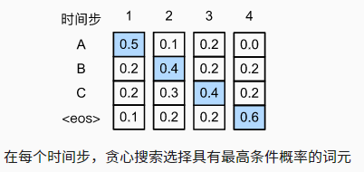
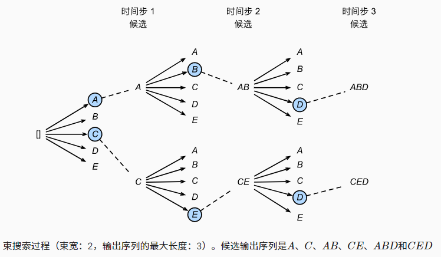

## 贪心搜索

- 对于输出序列的每一时间步t′， 我们都将基于贪心搜索从$\mathcal{Y}$中找到具有最高条件概率的词元，即：

  - $y_{t'} = \operatorname*{argmax}_{y \in \mathcal{Y}}\limits P(y \mid y_1, \ldots, y_{t'-1}, \mathbf{c})$

  一旦输出序列包含了“<eos>”或者达到其最大长度T′，则输出完成。

  

## 穷举搜索

- 穷举地列举所有可能的输出序列及其条件概率， 然后计算输出条件概率最高的一个。
- 缺点：穷举搜索计算量可能高的惊人

## 束搜索

- 保存最好的k个候选  

- 在每个时刻，对每个候选新加一项(n种可能)，在kn个选项中选出最好的k个

-  

  - 时间复杂度O(knT)
    - k =5, n = 10000,T = 10 :knT =5x10^5
  - 每个候选的最终分数是：
    - $\large \frac{1}{L^\alpha} \log P(y_1, \ldots, y_{L}\mid \mathbf{c}) = \frac{1}{L^\alpha} \sum_{t'=1}^L \log P(y_{t'} \mid y_1, \ldots, y_{t'-1}, \mathbf{c}),$
    - 通常α = 0.75

  ## 总结

  - 束搜索在每次搜索时保存k个最好的候选
    - k = 1 是贪心搜索
    - k = n 是穷举搜索

  