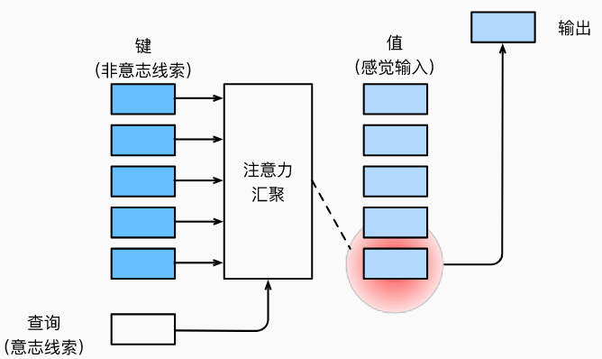
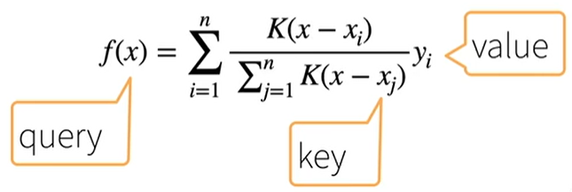

## 注意力机制

- ### 心理学：

  - 动物需要在复杂环境下有效关注值得注意的点

  - 心理学框架：人类根据随意线索和不随意线索选择注意点

- 卷积、全连接、池化层都只考虑不随意线索

- 注意力机制显式的考虑随意线索

  - 随意线索被称之为查询(query)
  - 每个输入是一个值(value)和不随意线索(key)的对
  - 通过注意力池化层来有偏向性的选择某些输入

-  

## 非参注意力池化层

- 给定数据$(x_i,y_i),i =1,...,n$
- 平均池化是最简单地方案：$\large f(x) = \frac{1}{n}\sum_i \limits y_i$
- 更好的方案是60年代提出来的 Nadaraya-watson 核回归
  -  

## Nadaraya-watson 核回归

- 使用高斯核$K(u) = \frac{1}{\sqrt{2π}}exp(-\frac{u^2}{2})$
- 那么$\large f(x) = \sum_{i=1}^n \limits \frac{exp(-\frac{1}{2}(x-x_i)^2)}{\sum_{j=1}^n \limits exp(-\frac{1}{2}(x-x_j)^2)} = \sum^n_{i=1}\limits softmax(-\frac{1}{2}(x-x_i)^2)y_i$

## 参数化的注意力机制

- 在之前的基础上引入可以学习的w
  - $\large f(x) = \sum^n_{i=1}\limits softmax(-\frac{1}{2}((x-x_i)w)^2)y_i$

## 总结

- 人通过随意线索和不随意线索选择注意点
- 注意力机制中，通过query(随意搜索)和key(不随意线索)来有偏向性的选择输入
  - 可以一般的写作$f(x) = \sum_i \limits α(x,x_i)y_i$，这里$α(x,x_i)$是注意力权重

## 注意力可视化

- ```python
  import torch
  from d2l import torch as d2l
  
  #@save
  def show_heatmaps(matrices, xlabel, ylabel, titles=None, figsize=(2.5, 2.5),
                    cmap='Reds'):
      """显示矩阵热图"""
      d2l.use_svg_display()
      num_rows, num_cols = matrices.shape[0], matrices.shape[1]
      fig, axes = d2l.plt.subplots(num_rows, num_cols, figsize=figsize,
                                   sharex=True, sharey=True, squeeze=False)
      for i, (row_axes, row_matrices) in enumerate(zip(axes, matrices)):
          for j, (ax, matrix) in enumerate(zip(row_axes, row_matrices)):
              pcm = ax.imshow(matrix.detach().numpy(), cmap=cmap)
              if i == num_rows - 1:
                  ax.set_xlabel(xlabel)
              if j == 0:
                  ax.set_ylabel(ylabel)
              if titles:
                  ax.set_title(titles[j])
      fig.colorbar(pcm, ax=axes, shrink=0.6);
  ```