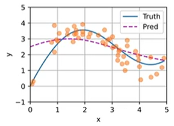
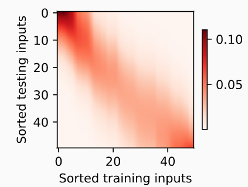
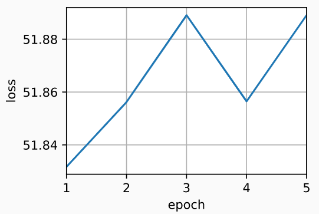
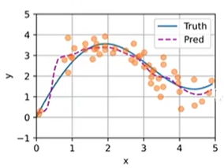
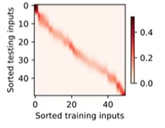

## 初始化数据

- 下面的非线性函数生成一个人工数据集， 其中加入的噪声项为ϵ：$y_i = 2\sin(x_i) + x_i^{0.8} + \epsilon,$
- 其中ϵ服从均值为0和标准差为0.5的正态分布。 我们生成了50个训练样本和50个测试样本。 
- 为了更好地可视化之后的注意力模式，我们将训练样本进行排序。

- ```python
  import torch
  from torch import nn
  from d2l import torch as d2l
  
  n_train = 50  # 训练样本数
  x_train, _ = torch.sort(torch.rand(n_train) * 5)   # 排序后的训练样本
  
  def f(x):
      return 2 * torch.sin(x) + x**0.8
  
  y_train = f(x_train) + torch.normal(0.0, 0.5, (n_train,))  # 训练样本的输出
  x_test = torch.arange(0, 5, 0.1)  # 测试样本
  y_truth = f(x_test)  # 测试样本的真实输出
  n_test = len(x_test)  # 测试样本数
  n_test
  # 下面的函数将绘制所有的训练样本（样本由圆圈表示）， 不带噪声项的真实数据生成函数（标记为“Truth”）， 
  # 以及学习得到的预测函数（标记为“Pred”）
  def plot_kernel_reg(y_hat):
      d2l.plot(x_test, [y_truth, y_hat], 'x', 'y', legend=['Truth', 'Pred'],
               xlim=[0, 5], ylim=[-1, 5])
      d2l.plt.plot(x_train, y_train, 'o', alpha=0.5);
  ```

## 平均汇聚

- ```python
  y_hat = torch.repeat_interleave(y_train.mean(), n_test)
  plot_kernel_reg(y_hat)
  ```

## 非参数注意力汇聚

- ```python
  # X_repeat的形状:(n_test,n_train),
  # 每一行都包含着相同的测试输入（例如：同样的查询）
  X_repeat = x_test.repeat_interleave(n_train).reshape((-1, n_train))
  # x_train包含着键。attention_weights的形状：(n_test,n_train),
  # 每一行都包含着要在给定的每个查询的值（y_train）之间分配的注意力权重
  attention_weights = nn.functional.softmax(-(X_repeat - x_train)**2 / 2, dim=1)
  # y_hat的每个元素都是值的加权平均值，其中的权重是注意力权重
  y_hat = torch.matmul(attention_weights, y_train)
  plot_kernel_reg(y_hat)
  d2l.plt.show()
  
  d2l.show_heatmaps(attention_weights.unsqueeze(0).unsqueeze(0),
                    xlabel='Sorted training inputs',
                    ylabel='Sorted testing inputs')
  ```

-  
- 注意力权重 

## 带参数注意力汇聚

- ```python
  # 批量矩阵乘法
  X = torch.ones((2, 1, 4))
  Y = torch.ones((2, 4, 6))
  torch.bmm(X, Y).shape # torch.Size([2, 1, 6])
  
  # 小批量矩阵乘法来计算小批量数据中的加权平均值
  weights = torch.ones((2, 10)) * 0.1
  values = torch.arange(20.0).reshape((2, 10))
  torch.bmm(weights.unsqueeze(1), values.unsqueeze(-1)) # tensor([[[ 4.5000]],[[14.5000]]])
  
  # 定义模型
  # 带参数的注意力汇聚，使用小批量矩阵乘法， 定义Nadaraya-Watson核回归的带参数版本为
  class NWKernelRegression(nn.Module):
      def __init__(self, **kwargs):
          super().__init__(**kwargs)
          self.w = nn.Parameter(torch.rand((1,), requires_grad=True))
  
      def forward(self, queries, keys, values):
          # queries和attention_weights的形状为(查询个数，“键－值”对个数)
          queries = queries.repeat_interleave(keys.shape[1]).reshape((-1, keys.shape[1]))
          self.attention_weights = nn.functional.softmax(
              -((queries - keys) * self.w)**2 / 2, dim=1)
          # values的形状为(查询个数，“键－值”对个数)
          return torch.bmm(self.attention_weights.unsqueeze(1),
                           values.unsqueeze(-1)).reshape(-1)
      
  # 训练
  # X_tile的形状:(n_train，n_train)，每一行都包含着相同的训练输入
  X_tile = x_train.repeat((n_train, 1))
  # Y_tile的形状:(n_train，n_train)，每一行都包含着相同的训练输出
  Y_tile = y_train.repeat((n_train, 1))
  # keys的形状:('n_train'，'n_train'-1)
  keys = X_tile[(1 - torch.eye(n_train)).type(torch.bool)].reshape((n_train, -1))
  # values的形状:('n_train'，'n_train'-1)
  values = Y_tile[(1 - torch.eye(n_train)).type(torch.bool)].reshape((n_train, -1))
  
  # 训练带参数的注意力汇聚模型时，使用平方损失函数和随机梯度下降
  net = NWKernelRegression()
  loss = nn.MSELoss(reduction='none')
  trainer = torch.optim.SGD(net.parameters(), lr=0.5)
  animator = d2l.Animator(xlabel='epoch', ylabel='loss', xlim=[1, 5])
  
  for epoch in range(5):
      trainer.zero_grad()
      l = loss(net(x_train, keys, values), y_train)
      l.sum().backward()
      trainer.step()
      print(f'epoch {epoch + 1}, loss {float(l.sum()):.6f}')
      animator.add(epoch + 1, float(l.sum()))
      
  # keys的形状:(n_test，n_train)，每一行包含着相同的训练输入（例如，相同的键）
  keys = x_train.repeat((n_test, 1))
  # value的形状:(n_test，n_train)
  values = y_train.repeat((n_test, 1))
  y_hat = net(x_test, keys, values).unsqueeze(1).detach()
  plot_kernel_reg(y_hat)
  
  d2l.show_heatmaps(net.attention_weights.unsqueeze(0).unsqueeze(0),
                    xlabel='Sorted training inputs',
                    ylabel='Sorted testing inputs')
  ```

  -  

    