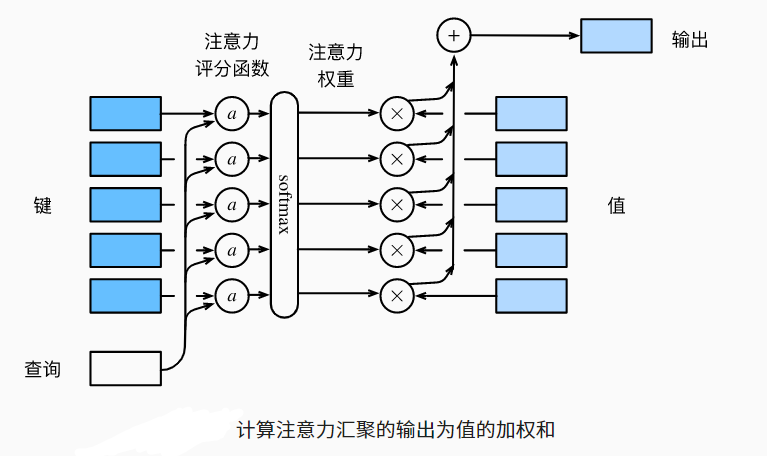

## 注意力分数

- $\large f(x) =\sum_i \limits α(x,x_i)y_i = \sum^n_{i=1}\limits softmax(-\frac{1}{2}(x-x_i)^2)y_i$
  - α：注意力权重    ，$-\frac{1}{2}(x-x_i)^2$：注意力分数
-  

## 拓展到高纬度

- 假设query q ∈$R^q$，m对key-value($k_1,v_1$)，...，这里$\large k_i∈\mathbb R^k,v_i∈\mathbb R^v$
- 注意力池化层：
  - 假设有一个查询 q∈Rq和 m个“键－值”对 $(k_1,v_1),…,(k_m,v_m)$， 其中$k_i∈\mathbb R^k，v_i∈\mathbb R^v$。 注意力汇聚函数f就被表示成值的加权和：
    - $\large f(\mathbf{q}, (\mathbf{k}_1, \mathbf{v}_1), \ldots, (\mathbf{k}_m, \mathbf{v}_m)) = \sum_{i=1}^m \alpha(\mathbf{q}, \mathbf{k}_i) \mathbf{v}_i \in \mathbb{R}^v,$
  - 其中查询q和键ki的注意力权重（标量） 是通过注意力评分函数a 将两个向量映射成标量， 再经过softmax运算得到的
    - $\large \alpha(\mathbf{q}, \mathbf{k}_i) = \mathrm{softmax}(a(\mathbf{q}, \mathbf{k}_i)) = \frac{\exp(a(\mathbf{q}, \mathbf{k}_i))}{\sum_{j=1}^m \exp(a(\mathbf{q}, \mathbf{k}_j))} \in \mathbb{R}.$

## 可加性注意力

- 查询和键是不同长度的矢量时， 我们可以使用加性注意力作为评分函数。
- 给定查询$q∈R^q$和 键$k∈R^k$， *加性注意力*（additive attention）的评分函数为
  - $a(\mathbf q, \mathbf k) = \mathbf w_v^\top \text{tanh}(\mathbf W_q\mathbf q + \mathbf W_k \mathbf k) \in \mathbb{R},$
  - 可学习的参数是$W_q∈R^{h×q}、 W_k∈R^{h×k}和 w_v∈R^h。$
- 等价于将query和key合并起来后放入到一个隐藏大小为h，输出大小为1的单隐藏层MLP

## 缩放点积注意力

- 如果query和key都是同样的长度q，$k_i∈\mathbb R ^d$，那么：
  - $a(\mathbf q, \mathbf k) = \mathbf{q}^\top \mathbf{k}  /\sqrt{d}.$
- 向量化版本
- $\mathbf Q\in\mathbb R^{n\times d},\mathbf K\in\mathbb R^{m\times d}，\mathbf V\in\mathbb R^{m\times v}$
- 注意力分数：$a(\mathbf Q, \mathbf K) = \mathbf{Q} \mathbf{K}^\top  /\sqrt{d} ∈\mathbb R^{n×m}.$
- 注意力池化：$f = softmax(a(\mathbf Q, \mathbf K) )V∈\mathbb R^{n×m}$

## 总结

- 注意力分数是query和key的相似度，注意力权重时分数的softmax结果
- 两种常见的分数计算
  - 将query和key合并起来进入一个单输出但隐藏层的MLP
  - 直接将query和key做内积