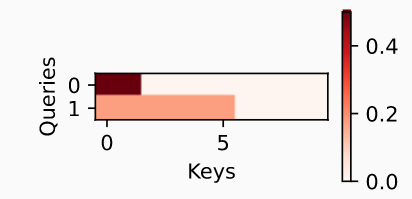

## 遮蔽softmax操作

```python
import math
import torch
from torch import nn
from d2l import torch as d2l

# softmax操作用于输出一个概率分布作为注意力权重。 在某些情况下，并非所有的值都应该被纳入到注意力汇聚中 
def masked_softmax(X, valid_lens):  # valid_lens为有效长度
    """通过在最后一个轴上掩蔽元素来执行softmax操作"""
    # X:3D张量，valid_lens:1D或2D张量
    if valid_lens is None:
        return nn.functional.softmax(X, dim=-1)
    else:
        shape = X.shape
        if valid_lens.dim() == 1:
            valid_lens = torch.repeat_interleave(valid_lens, shape[1])
        else:
            valid_lens = valid_lens.reshape(-1)
        # 最后一轴上被掩蔽的元素使用一个非常大的负值替换，从而其softmax输出为0
        X = d2l.sequence_mask(X.reshape(-1, shape[-1]), valid_lens, value=-1e6)
        return nn.functional.softmax(X.reshape(shape), dim=-1)

# 演示函数例子
# 由两个矩阵表示的样本， 这两个样本的有效长度分别为和。 经过掩蔽softmax操作，超出有效长度的值都被掩蔽为0
masked_softmax(torch.rand(2, 2, 4), torch.tensor([2, 3]))
"""
tensor([[[0.3412, 0.6588, 0.0000, 0.0000],
         [0.4643, 0.5357, 0.0000, 0.0000]],

        [[0.1967, 0.3512, 0.4522, 0.0000],
         [0.3580, 0.3092, 0.3328, 0.0000]]])
"""
# 也可以使用二维张量，为矩阵样本中的每一行指定有效长度
masked_softmax(torch.rand(2, 2, 4), torch.tensor([[1, 3], [2, 4]]))
"""
tensor([[[1.0000, 0.0000, 0.0000, 0.0000],
         [0.4687, 0.2627, 0.2685, 0.0000]],

        [[0.5340, 0.4660, 0.0000, 0.0000],
         [0.2238, 0.1898, 0.2050, 0.3813]]])
 """
```

## 加性注意力

- 评分函数：$a(\mathbf q, \mathbf k) = \mathbf w_v^\top \text{tanh}(\mathbf W_q\mathbf q + \mathbf W_k \mathbf k) \in \mathbb{R},$

- ```python
  class AdditiveAttention(nn.Module):
      """加性注意力"""
      def __init__(self, key_size, query_size, num_hiddens, dropout, **kwargs):
          super(AdditiveAttention, self).__init__(**kwargs)
          self.W_k = nn.Linear(key_size, num_hiddens, bias=False)
          self.W_q = nn.Linear(query_size, num_hiddens, bias=False)
          self.w_v = nn.Linear(num_hiddens, 1, bias=False)
          self.dropout = nn.Dropout(dropout)
  
      def forward(self, queries, keys, values, valid_lens): # valid_lens:对于每个query，应该考虑前多少个key，value对
          queries, keys = self.W_q(queries), self.W_k(keys)
          # 在维度扩展后，
          # queries的形状：(batch_size，query的个数，1，num_hidden)
          # key的形状：(batch_size，1，“key-value”对的个数，num_hiddens)
          # 使用广播方式进行求和
          features = queries.unsqueeze(2) + keys.unsqueeze(1) # .unsqueeze(n)：在第n维后加一个维度进去
          # 加起来之后 (batch_size，query的个数，“key-value”对的个数，num_hiddens)
          features = torch.tanh(features)
          # self.w_v仅有一个输出，因此从形状中移除最后那个维度。
          # scores的形状：(batch_size，查询的个数，“键-值”对的个数)
          scores = self.w_v(features).squeeze(-1)
          self.attention_weights = masked_softmax(scores, valid_lens)
          # values的形状：(batch_size，“键－值”对的个数，值的维度)
          return torch.bmm(self.dropout(self.attention_weights), values)
        
  # 示例	
  # 查询、键和值的形状为（批量大小，步数或词元序列长度，特征大小）， 
  # 实际输出为(2,1,20)、(2,10,2)和(2,10,4)。 注意力汇聚输出的形状为（批量大小，查询的步数，值的维度）
  queries, keys = torch.normal(0, 1, (2, 1, 20)), torch.ones((2, 10, 2))
  # values的小批量，两个值矩阵是相同的
  values = torch.arange(40, dtype=torch.float32).reshape(1, 10, 4).repeat(2, 1, 1)
  valid_lens = torch.tensor([2, 6])
  
  attention = AdditiveAttention(key_size=2, query_size=20, num_hiddens=8, dropout=0.1)
  attention.eval()
  attention(queries, keys, values, valid_lens)  
  # tensor([[[ 2.0000,  3.0000,  4.0000,  5.0000]],
  # 		 [[10.0000, 11.0000, 12.0000, 13.0000]]], grad_fn=<BmmBackward0>)
  
  d2l.show_heatmaps(attention.attention_weights.reshape((1, 1, 2, 10)),
                    xlabel='Keys', ylabel='Queries')
  ```
  
  -  

## 缩放点积注意力

- 评分函数：$a(\mathbf q, \mathbf k) = \mathbf{q}^\top \mathbf{k}  /\sqrt{d}.$

- ```python
  #@save
  class DotProductAttention(nn.Module):
      """缩放点积注意力"""
      def __init__(self, dropout, **kwargs):
          super(DotProductAttention, self).__init__(**kwargs)
          self.dropout = nn.Dropout(dropout)
  
      # queries的形状：(batch_size，查询的个数，d)
      # keys的形状：(batch_size，“键－值”对的个数，d)
      # values的形状：(batch_size，“键－值”对的个数，值的维度)
      # valid_lens的形状:(batch_size，)或者(batch_size，查询的个数)
      def forward(self, queries, keys, values, valid_lens=None):
          d = queries.shape[-1]
          # 设置transpose_b=True为了交换keys的最后两个维度
          scores = torch.bmm(queries, keys.transpose(1,2)) / math.sqrt(d)
          self.attention_weights = masked_softmax(scores, valid_lens)
          return torch.bmm(self.dropout(self.attention_weights), values)
  # 示例
  queries = torch.normal(0, 1, (2, 1, 2))
  attention = DotProductAttention(dropout=0.5)
  attention.eval()
  attention(queries, keys, values, valid_lens)
  d2l.show_heatmaps(attention.attention_weights.reshape((1, 1, 2, 10)), xlabel='Keys', ylabel='Queries')
  ```

  - 