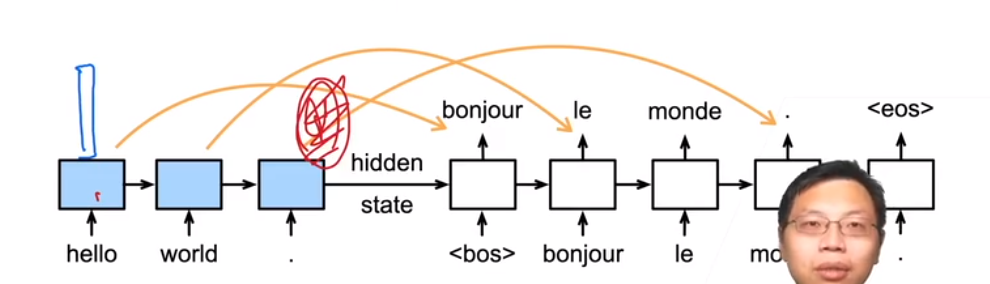
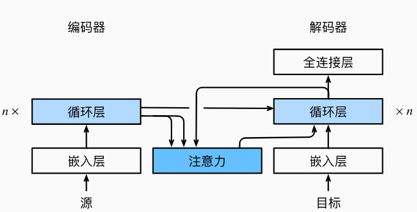

## 动机

- 机器翻译中，每个生成的词可能想关于源句子中不同的词

  - 想要在翻译对应词时，注意力关注在原句子中对应的部分

  

- seq2seq模型中不能对此直接建模

## 加入注意力

-  
- 编码器对每次词的输出做key和value（它们是一样的）
- 解码器RNN对上一个词的输出是query
- 注意力的输出和下一个词的词嵌入合并进入RNN

## 总结

- seq2seq中通过隐状态在编码器和解码器中传递信息
- 注意力机制可以根据 解码器RNN的输出 来匹配到 合适的编码器RNN的输出 来更有效的传递信息

## Bahdanau 注意力代码实现	

- ```python
  import torch
  from torch import nn
  from d2l import torch as d2l
  
  # 定义注意力解码器接口
  class AttentionDecoder(d2l.Decoder):
      """带有注意力机制解码器的基本接口"""
      def __init__(self, **kwargs):
          super(AttentionDecoder, self).__init__(**kwargs)
  
      @property
      def attention_weights(self):
          raise NotImplementedError
          
  # 带有Bahdanau注意力的循环神经网络解码器
  # 初始化解码器的状态，需要下面的输入：
  # 编码器在所有时间步的最终层隐状态，将作为注意力的键和值；
  #上一时间步的编码器全层隐状态，将作为初始化解码器的隐状态；
  #编码器有效长度（排除在注意力池中填充词元）。
  class Seq2SeqAttentionDecoder(AttentionDecoder):
      def __init__(self, vocab_size, embed_size, num_hiddens, num_layers,
                   dropout=0, **kwargs):
          super(Seq2SeqAttentionDecoder, self).__init__(**kwargs)
          self.attention = d2l.AdditiveAttention(
              num_hiddens, num_hiddens, num_hiddens, dropout)
          self.embedding = nn.Embedding(vocab_size, embed_size)
          self.rnn = nn.GRU(
              embed_size + num_hiddens, num_hiddens, num_layers,
              dropout=dropout)
          self.dense = nn.Linear(num_hiddens, vocab_size)
  
      def init_state(self, enc_outputs, enc_valid_lens, *args):
          # outputs的形状为(batch_size，num_steps，num_hiddens).
          # hidden_state的形状为(num_layers，batch_size，num_hiddens)
          outputs, hidden_state = enc_outputs
          return (outputs.permute(1, 0, 2), hidden_state, enc_valid_lens)
  
      def forward(self, X, state):
          # enc_outputs的形状为(batch_size,num_steps,num_hiddens).
          # hidden_state的形状为(num_layers,batch_size,
          # num_hiddens)
          enc_outputs, hidden_state, enc_valid_lens = state
          # 输出X的形状为(num_steps,batch_size,embed_size)
          X = self.embedding(X).permute(1, 0, 2)
          outputs, self._attention_weights = [], []
          for x in X:
              # query的形状为(batch_size,1,num_hiddens)
              query = torch.unsqueeze(hidden_state[-1], dim=1)
              # context的形状为(batch_size,1,num_hiddens)
              context = self.attention(
                  query, enc_outputs, enc_outputs, enc_valid_lens)
              # 在特征维度上连结
              x = torch.cat((context, torch.unsqueeze(x, dim=1)), dim=-1)
              # 将x变形为(1,batch_size,embed_size+num_hiddens)
              out, hidden_state = self.rnn(x.permute(1, 0, 2), hidden_state)
              outputs.append(out)
              self._attention_weights.append(self.attention.attention_weights)
          # 全连接层变换后，outputs的形状为
          # (num_steps,batch_size,vocab_size)
          outputs = self.dense(torch.cat(outputs, dim=0))
          return outputs.permute(1, 0, 2), [enc_outputs, hidden_state,
                                            enc_valid_lens]
  
      @property
      def attention_weights(self):
          return self._attention_weights
  ```