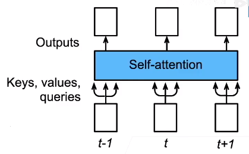
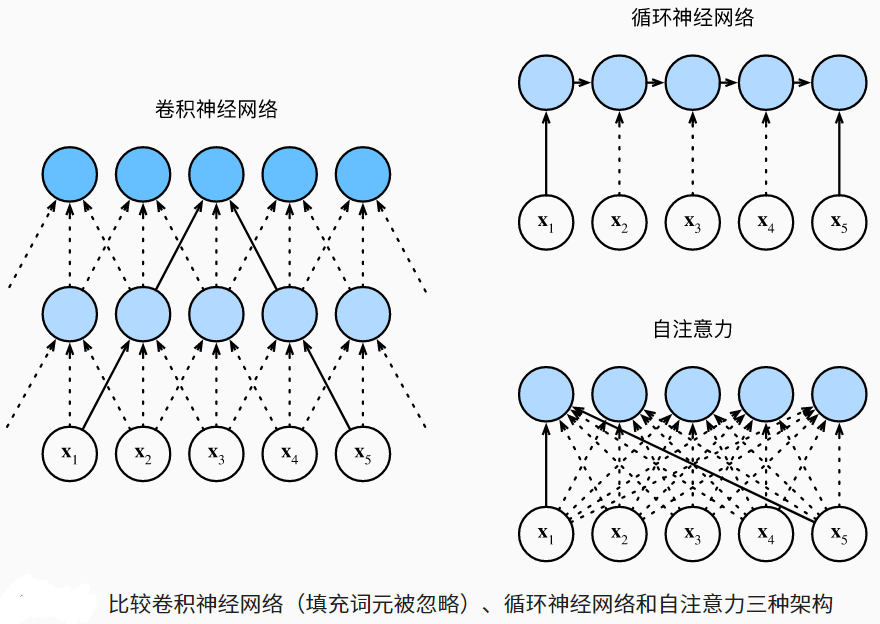
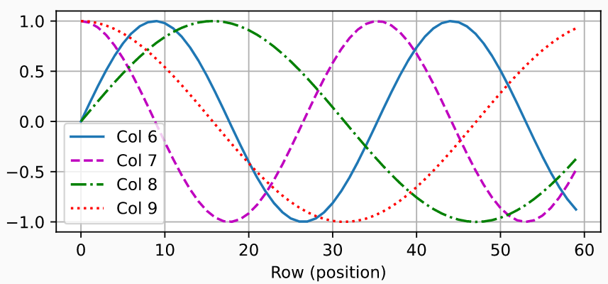

## 自注意力

- 给定一个由词元组成的输入序列$x_1,…,x_n$， 其中任意$x_i∈\mathbb R^d$（1≤i≤n）
- 自注意力池化层将$x_i$ 当做key，value，query来对序列抽取特征
- 
- 该序列的自注意力输出为一个长度相同的序列$y_1,…,y_n$，其中：
  - $\mathbf{y}_i = f(\mathbf{x}_i, (\mathbf{x}_1, \mathbf{x}_1), \ldots, (\mathbf{x}_n, \mathbf{x}_n)) \in \mathbb{R}^d$

## 比较卷积神经网络、循环神经网络和自注意力

|            | CNN     | RNN    | 自注意力 |
| ---------- | ------- | ------ | -------- |
| 计算复杂度 | O(knd²) | O(nd²) | O(n² d)  |
| 并行度     | O(n)    | O(1)   | O(n)     |
| 最长路径   | O(n/k)  | O(n)   | O(1)     |

- k是kernel大小，n是输入x的个数，d是每个x的维度（长度）

## 位置编码

- 跟CNN/RNN不同，自注意力没有记录位置信息
- **位置编码将位置信息注入到输入里**
  - 假设长度为n的序列是$X∈\mathbb R^{n×d}$，name使用位置编码矩阵$P∈\mathbb R^{n×d}$来输出X+P作为自编码输入
- 矩阵第i行、第2j列和2j+1列上的P元素为
  - $\begin{split}\begin{aligned} p_{i, 2j} &= \sin\left(\frac{i}{10000^{2j/d}}\right),\\p_{i, 2j+1} &= \cos\left(\frac{i}{10000^{2j/d}}\right).\end{aligned}\end{split}$
  - 行代表词元在序列中的位置，列代表位置编码的不同维度。 在下面的例子中，我们可以看到位置嵌入矩阵的第6列和第7列的频率高于第8列和第9列。 第6列和第7列之间的偏移量（第8列和第9列相同）是由于正弦函数和余弦函数的交替。
  - 位置编码效果 

## 绝对位置信息

- 计算机使用的二进制编码

## 相对位置信息

- 对于任何确定的位置偏移δ，位置i+δ处 的位置编码可以线性投影位置i处的位置编码来表示
- 记$\omega_j = 1/10000^{2j/d}$,那么
  - $\begin{split}\begin{aligned}
    &\begin{bmatrix} \cos(\delta \omega_j) & \sin(\delta \omega_j) \\  -\sin(\delta \omega_j) & \cos(\delta \omega_j) \\ \end{bmatrix}
    \begin{bmatrix} p_{i, 2j} \\  p_{i, 2j+1} \\ \end{bmatrix}\\
    =&\begin{bmatrix} \cos(\delta \omega_j) \sin(i \omega_j) + \sin(\delta \omega_j) \cos(i \omega_j) \\  -\sin(\delta \omega_j) \sin(i \omega_j) + \cos(\delta \omega_j) \cos(i \omega_j) \\ \end{bmatrix}\\
    =&\begin{bmatrix} \sin\left((i+\delta) \omega_j\right) \\  \cos\left((i+\delta) \omega_j\right) \\ \end{bmatrix}\\
    =&
    \begin{bmatrix} p_{i+\delta, 2j} \\  p_{i+\delta, 2j+1} \\ \end{bmatrix},
    \end{aligned}\end{split}$
    - 投影矩阵跟 i 无关 

## 总结

- 自注意力池化层将$x_i$当做key，value，query来对序列抽取特征
- 完全并行，最长序列为1，但对长序列计算复杂度高
- 位置编码在输入中加入位置信息，使得自注意力能够记忆位置信息

## 代码实现

- 位置编码

  - ```python
    #@save
    class PositionalEncoding(nn.Module):
        """位置编码"""
        def __init__(self, num_hiddens, dropout, max_len=1000):
            super(PositionalEncoding, self).__init__()
            self.dropout = nn.Dropout(dropout)
            # 创建一个足够长的P
            self.P = torch.zeros((1, max_len, num_hiddens))
            X = torch.arange(max_len, dtype=torch.float32).reshape(
                -1, 1) / torch.pow(10000, torch.arange(
                0, num_hiddens, 2, dtype=torch.float32) / num_hiddens)
            self.P[:, :, 0::2] = torch.sin(X)
            self.P[:, :, 1::2] = torch.cos(X)
    
        def forward(self, X):
            X = X + self.P[:, :X.shape[1], :].to(X.device)
            return self.dropout(X)
    ```