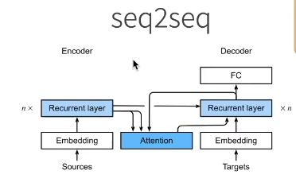
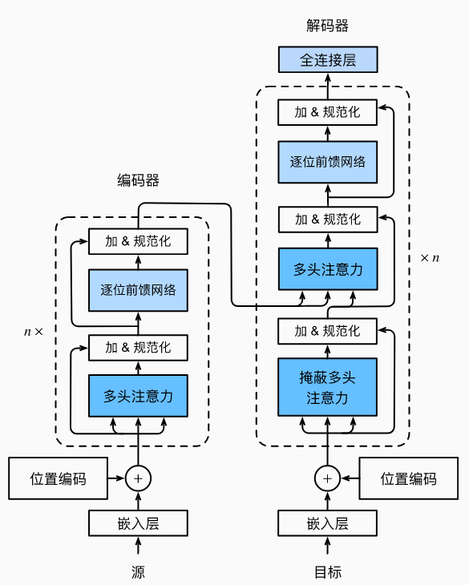
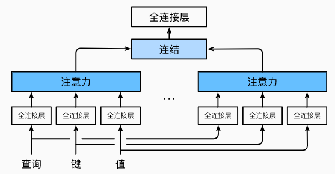
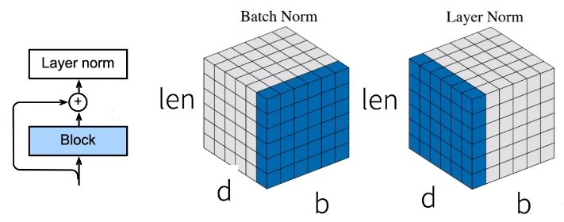
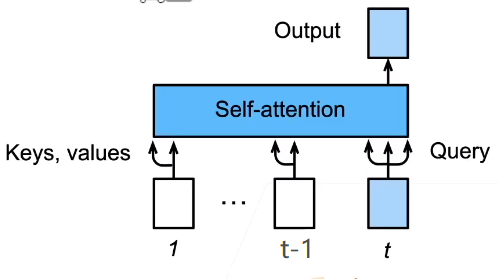

## 架构

- 基于编码器-解码器架构来处理序列对
- 跟使用注意力的seq2seq不同，Transformer是纯基于注意力
-  

## 多头注意力

- 对同一key，value，query，希望抽取不同的信息
  - 如短距离关系和长距离关系
- 多头注意力使用h个独立的注意力池化
  - 合并各个头(head)输出得到最终输出
-  
  - 给定查询$\mathbf{q} \in \mathbb{R}^{d_q}$、 键$\mathbf{k} \in \mathbb{R}^{d_k}$和 值$\mathbf{v} \in \mathbb{R}^{d_v}$，
  - 头i的可学习参数$\mathbf W_i^{(q)}\in\mathbb R^{p_q\times d_q},\mathbf W_i^{(k)}\in\mathbb R^{p_k\times d_k},\mathbf W_i^{(v)}\in\mathbb R^{p_v\times d_v}$ 
  - 每个注意力头$h_i$（i=1,…,h）的计算方法为：$\mathbf{h}_i = f(\mathbf W_i^{(q)}\mathbf q, \mathbf W_i^{(k)}\mathbf k,\mathbf W_i^{(v)}\mathbf v) \in \mathbb R^{p_v},$
  - 输出的可学习参数$\mathbf W_o\in\mathbb R^{p_o\times h p_v}$ 
  - 多头注意力的输出：$\begin{split}\mathbf W_o \begin{bmatrix}\mathbf h_1\\\vdots\\\mathbf h_h\end{bmatrix} \in \mathbb{R}^{p_o}.\end{split}$

## 有掩码的多头注意力

- 解码器对序列中一个元素输出时，不应该考虑该元素之后的元素
- 可以通过掩码来实现
  - 计算$x_i$输出时，假设当前序列长度为i

## 基于位置的前馈网络

- 将输出形状由(b,n,d)，变成(bn,d)
- 作用两个全连接层
- 输出形状由(bn,d)变化回(b,n,d)
- 等价于两层核窗口为1的一维卷积层

## 层归一化（Layer Norm）

- 批量归一化对每个特征/通道里元素进行归一化
  - 不适合序列长度会变的NLP应用
- 层归一化对每个样本里的元素进行归一化
-  

## 信息传递

- 编码器中的输出$y_1,...,y_n$
- 将其作为解码中第i个Transformer块中多头注意力的key和value
  - 它的query来自目标序列
- 意味着编码器和解码器中块的个数和输出维度都是一样的

## 预测

- 预测第t+1个输出时
- 解码器中输入前t个预测值
  - 在自注意力中，前t个预测值作为key和value
  - 第t个预测值还作为query
-   

